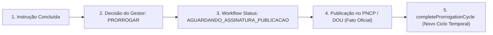

# SALDOARP — FASE 4.2: RELATÓRIO DE AUDITORIA DE FECHAMENTO
## Workflow de Prorrogação Contratual

**Data da Auditoria:** 23 de Setembro de 2026  
**Auditor:** Agente Antigravity (Advanced Agentic Coding — SaldoARP 3.0)  
**Objeto da Auditoria:** Passo 4.2 (Domínio `contractProrrogation.ts`, Serviço `contractProrrogationService.ts` e Testes `contractProrrogationService.test.ts`)  
**Status da Auditoria:** **GO COM RESSALVAS MENORES (PRONTO PARA A FASE 4.3)**  
**Alterações de Código Realizadas Durante a Auditoria:** **NENHUMA (0 alterações de código/banco)**

---

## 1. AUDITORIA DO ESCOPO DO WORKFLOW

### Axioma das Quatro Camadas:
```text
┌────────────────────────────────────────────────────────────────────────────────────────┐
│                        VERIFICAÇÃO DE ESCOPO DAS QUATRO CAMADAS                        │
├────────────────────┬────────────────────┬────────────────────┬─────────────────────────┤
│ 1. FATO OFICIAL    │ 2. EVENTO          │ 3. WORKFLOW        │ 4. TAREFA               │
├────────────────────┼────────────────────┼────────────────────┼─────────────────────────┤
│ Vigência atual     │ Termo Aditivo nº 1 │ Processo de        │ Ações discretas no      │
│ atestada nas APIs  │ publicado no PNCP  │ Prorrogação em     │ checklist do plano      │
│ soberanas          │                    │ instrução          │                         │
│                    │                    │                    │                         │
│ ContractDashboard- │ ContractEvent      │ ContractProrroga-  │ ContractTask            │
│ Record             │                    │ tionWorkflow       │ (contract_tasks)        │
└────────────────────┴────────────────────┴────────────────────┴─────────────────────────┘
```

### Diagnóstico de Fronteiras:
* `ContractProrrogationWorkflow` **NÃO substitui** `ContractEvent` (o evento formaliza o fato concluído).
* `ContractProrrogationWorkflow` **NÃO substitui** `ContractLifecycleState` (o ciclo de vida é o estado global do contrato, ex: `VIGENTE` ou `EM_PRORROGACAO`).
* `ContractProrrogationWorkflow` **NÃO substitui** `ContractTask` (as tarefas são instanciadas em `contract_tasks` dentro de `contract_task_plans`).
* `ContractProrrogationWorkflow` **NÃO substitui** `processos_sei` (o processo SEI existente é apenas referenciado via `processoSeiId` / `processoSeiNumero`).
* **Conclusão:** O workflow é estritamente **operacional** e atua como orquestrador em memória, sem se tornar uma segunda fonte de verdade.

---

## 2. AUDITORIA DE IDENTIDADE (`generateProrrogationWorkflowId`)

### Composição:
$$\text{WorkflowId} = \text{"WF::PRORROGACAO::"} + \text{contractKey} + \text{"::"} + \text{cycleRef}$$

### Demonstração com 3 Exemplos Concretos:
1. **Contrato 15/2026 (Ciclo 2026/2027):**  
   `WF::PRORROGACAO::200331-00015-2026::VIG_20270115`
2. **Contrato 15/2026 (Ciclo Seguinte 2027/2028):**  
   `WF::PRORROGACAO::200331-00015-2026::VIG_20280115`
3. **Contrato 49/2025 da UASG 200330:**  
   `WF::PRORROGACAO::200330-00049-2025::VIG_20260630`

### Avaliação de Colisão e Limitações (Achado Baixo AB-02):
* **Idempotência:** Totalmente determinística e imutável para um dado contrato e ciclo de vigência.
* **Múltiplos Ciclos:** Dois ciclos temporais do mesmo contrato possuem IDs distintos (`VIG_20270115` vs. `VIG_20280115`), preservando o histórico de cada prorrogação.
* **Limitação Registrada (AB-02):** Se um workflow de prorrogação for cancelado e reaberto *dentro do exato mesmo ciclo de vigência*, a chave canônica reutiliza o mesmo `cycleRef`. Para cenários futuros de versionamento de tentativas arquivadas no mesmo ciclo, um sufixo de tentativa (`::ITER_1`) pode ser adicionado.

---

## 3. AUDITORIA DE CICLO E DISTINÇÃO: "WORKFLOW CONCLUÍDO" vs. "CONTRATO OFICIALMENTE PRORROGADO"

### Ponto Crítico de Governança:
A auditoria verificou rigorosamente a separação entre a decisão interna e a eficácia jurídica oficial.



### Diagnóstico de `completeProrrogationCycle`:
1. **Ciclo Anterior Preservado:** A vigência anterior (`vigenciaAnterior: '2027-01-15'`) é registrada no objeto de explicabilidade `ContractVigenciaTransition`.
2. **Novo Evento Formal:** O evento `ContractEvent` é gerado com identificador próprio (`termoAditivoNumero: '1º Termo Aditivo'`) e fonte oficial (`PNCP`).
3. **Novo Gatilho Temporal:** O novo gatilho preventivo de 180d é recalculado para a nova vigência (`2028-01-15`), com ID determinístico `CONTRATO::{contractKey}::PRORROGACAO::GATILHO_180D::VIG_20280115`.
4. **Sem Mutação Silenciosa:** O sistema exige a informação de `termoAditivoNumero` e data de publicação para formalizar o encerramento do ciclo.

---

## 4. AUDITORIA JURÍDICO-SEMÂNTICA (LEI Nº 14.133/2021)

| Aspecto | Diagnóstico | Parecer / Ressalva |
| :--- | :---: | :--- |
| **Contratos Contínuos vs. Por Escopo** | ✅ CONFORME COM RESSALVA | O rito de prorrogação implementado é aplicável primariamente a contratos de **serviços e fornecimentos contínuos** (art. 106 e 107). Contratos por escopo (art. 111) possuem rito de prorrogação por motivo de atraso justificado. |
| **Natureza do Template Padrão** | ✅ RECOMENDAÇÃO INSTITUCIONAL | O template retornado por `buildDefaultProrrogationTemplate` é uma **recomendação institucional configurável**, e não um rito rígido universal. As tarefas podem ser marcadas como `NAO_APLICAVEL` quando dispensadas motivadamente. |

---

## 5. AUDITORIA E CLASSIFICAÇÃO DOS PRAZOS OPERACIONAIS

A função `calculateProrrogationDeadlines` calcula marcos com base na vigência final. A auditoria classificou formalmente a natureza de cada um:

| Marco | Offset | Classificação Formal | Fundamento / Justificativa |
| :--- | :---: | :---: | :--- |
| **Início do Estudo** | `-180 dias` | `ALERTA PREVENTIVO / MARCO OPERACIONAL` | Prática de planejamento preventivo para evitar intempestividade na instrução. |
| **Consulta ao Fornecedor** | `-120 dias` | `MARCO OPERACIONAL` | Prazo interno recomendado para emissão de ofício à Contratada. |
| **Resposta da Empresa** | `+10 dias úteis` | `PRAZO ADMINISTRATIVO CONCEDIDO` | Prazo assinalado no ofício para manifestação formal do fornecedor. |
| **Pesquisa de Preços** | `-90 dias` | `MARCO OPERACIONAL` | Prazo de instrução técnica para demonstração de vantajosidade (art. 107). |
| **Remessa à CONJUR** | `-60 dias` | `RECOMENDAÇÃO INSTITUCIONAL` | Prazo de antecedência para exame e parecer da Consultoria Jurídica da União. |
| **Previsão de Assinatura** | `-15 dias` | `ALERTA PREVENTIVO` | Margem de segurança para coleta de assinaturas e publicação antes do término. |
| **Término da Vigência** | `0 dias` | `PRAZO LEGAL PEREMPTÓRIO` | **Art. 106/107:** A prorrogação celebrada após o término da vigência é **nula de pleno direito**. |

---

## 6. AUDITORIA DE READINESS (`evaluateProrrogationReadiness`)

| Item de Avaliação | Tipo de Validação | Não-Bloqueante? | Detalhamento |
| :--- | :---: | :---: | :--- |
| **1. Interesse Público** | Assistida | ✅ SIM | Verifica indicação de justificativa ou decisão de prorrogar. |
| **2. Concordância do Fornecedor** | Assistida | ✅ SIM | Distingue `CONFIRMADO` (concordou), `RECUSADO` (empresa declinou) e `PENDENTE`. |
| **3. Vantajosidade Econômica** | Assistida | ✅ SIM | Verifica presença de documento comprobatório no processo. |
| **4. Regularidade SICAF/CND** | Assistida | ✅ SIM | Alerta sobre certidões válidas sem bloquear a instrução. |
| **5. Parecer Jurídico CONJUR** | Assistida | ✅ SIM | Verifica parecer formal prévio. |
| **6. Tempestividade da Vigência** | Assistida | ✅ SIM | **Alerta Crítico:** Se a vigência expirou (`diasRestantes < 0`), alerta sobre preclusão jurídica da prorrogação sem quebrar o sistema. |

---

## 7. AUDITORIA DA VANTAJOSIDADE ECONÔMICA

* **Sem Fórmulas Rasas:** O sistema não reduz vantajosidade a `preço menor = vantajoso`, nem declara automaticamente que uma pesquisa é juridicamente válida.
* **Instrução Documental:** O sistema registra a evidência formal (`vantajosidadeComprovada: true`, `vantajosidadeDocumentoSei: 'DOC-SEI-123'`). A decisão sobre a economicidade permanece ato privativo e motivado da autoridade competente.

---

## 8. AUDITORIA DA INTERAÇÃO COM O PROCESSO SEI

* **Sem Duplicidade:** O workflow aceita `processoSeiId` e `processoSeiNumero` vinculando-se diretamente ao catálogo `processos_sei` existente.
* **Opcionalidade:** O workflow opera normalmente mesmo que o processo SEI ainda não esteja cadastrado no momento inicial.
* **Zero Fabricação:** Nenhum processo fictício é gerado no banco.

---

## 9. AUDITORIA DAS TAREFAS E TEMPLATES

* **Reutilização Integral:** Reutiliza `contract_task_templates`, `contract_task_plans`, `contract_tasks` (Migrations 13 e 14).
* **Zero Sistema Paralelo:** As tarefas do workflow são instanciadas como cópias independentes no plano de tarefas do contrato via RPC `apply_contract_task_template_atomic`.
* **Natureza das 10 Tarefas:** As 10 tarefas do template padrão atuam como **checklist de melhores práticas recomendadas pela SENASP/MJSP**, permitindo dispensas motivadas (`NAO_APLICAVEL`).

---

## 10. AUDITORIA DA UNICIDADE DO MOTOR TEMPORAL

* `contractProrrogationService.ts` consome diretamente as funções puras de `temporalEngineService.ts` (`parseDateBRT`, `addDays`, `addBusinessDays`, `differenceInDays`, `deriveTemporalStatus`, `deriveAtencaoNivel`).
* **Zero Motor Paralelo:** Toda a matemática de dias corridos, dias úteis, fuso horário e níveis de atenção é executada centralizadamente no Motor Temporal da Fase 2.

---

## 11. AUDITORIA DOS ESTADOS (WORKFLOW vs. LIFECYCLE)

| `ProrrogationWorkflowStatus` (Processo) | Significado Operacional | `ContractLifecycleState` (Contrato) |
| :--- | :--- | :--- |
| `NAO_INICIADO` | Nenhuma ação iniciada pelo gestor. | `VIGENTE` |
| `EM_ANALISE_INTERESSE` | Gestor elaborando Nota Técnica de Justificativa. | `EM_PRORROGACAO` |
| `AGUARDANDO_FORNECEDOR` | Ofício enviado, aguardando manifestação em 10d úteis. | `EM_PRORROGACAO` |
| `EM_PESQUISA_PRECOS` | Realizando pesquisa de mercado / vantajosidade. | `EM_PRORROGACAO` |
| `EM_INSTRUCAO_MINUTA` | Elaborando minuta de termo aditivo. | `EM_PRORROGACAO` |
| `EM_ANALISE_JURIDICA` | Processo tramitando na CONJUR/AGU. | `EM_PRORROGACAO` |
| `AGUARDANDO_ASSINATURA_PUBLICACAO` | Parecer aprovado, coletando assinaturas e PNCP. | `EM_PRORROGACAO` |
| `CONCLUIDO_PRORROGADO` | Aditivo publicado e novo ciclo de vigência iniciado. | `VIGENTE` (Novo Ciclo) |
| `CONCLUIDO_NAO_PRORROGADO` | Decisão formal de não prorrogar. | `EM_ENCERRAMENTO` |
| `CANCELADO` | Workflow cancelado/arquivado motivadamente. | `VIGENTE` ou `ENCERRADO` |

---

## 12. AUDITORIA DA SUÍTE DE TESTES (11 TESTES ESPECÍFICOS DA FASE 4.2)

A suíte em [`src/services/__tests__/contractProrrogationService.test.ts`](file:///Users/luis.martins/Desktop/Antigravity/SaldoARP-system/src/services/__tests__/contractProrrogationService.test.ts) cobre:

1. **Idempotência e Identidade (2 testes):**  
   • Formato canônico `WF::PRORROGACAO::{contractKey}::{cycleRef}`;  
   • Sanitização de espaços, maiúsculas e caracteres especiais.
2. **Cálculo de Deadlines (2 testes):**  
   • Cálculo de -180d, -120d, 10d úteis, -90d, -60d, -15d, 0d;  
   • Tratamento seguro de datas inválidas.
3. **Catálogo de Template Padrão (1 teste):**  
   • 4 macrotarefas e 10 tarefas cobrindo os requisitos da Lei 14.133/21.
4. **Avaliação Assistida de Prontidão (3 testes):**  
   • Identificação de pendências quando incompleto;  
   • Aprovação plena quando tempestivo e instruído;  
   • Alerta crítico de preclusão quando vigência expirada.
5. **Derivação de Status Operacional (1 teste):**  
   • Transição sequencial de estados do workflow.
6. **Montagem Integrada do Workflow (1 teste):**  
   • Agregação completa de contrato, prazos, prontidão e meta-dados.
7. **Conclusão de Ciclo e Transição Temporal (1 teste):**  
   • Geração do `ContractEvent`, transição determinística (`novoCicloRef`) e novo gatilho 180d.

*Total do Sistema:* **51 arquivos de teste aprovados (393 testes passando, 0 falhas).**

---

## 13. SÍNTESE DE ACHADOS E CLASSIFICAÇÃO

### Achados Críticos:
* **Nenhum achado crítico.**

### Achados Médios:
* **Nenhum achado médio.**

### Achados Baixos (Registrados para Evolução Futura):
* **AB-02 (Iteração de Workflows no Mesmo Ciclo):** A chave `WF::PRORROGACAO::{contractKey}::{cycleRef}` cobre perfeitamente 1 workflow por ciclo de vigência. Se no futuro um contrato tiver um workflow cancelado e reaberto dentro do mesmo ciclo de vigência sem alteração de data, uma chave com índice de iteração poderá ser suportada.
* **AB-03 (Diferenciação Explícita de Contratos por Escopo):** No Passo 4.3+, manter explícito na interface que o rito padrão de prorrogação contratual refere-se precipuamente a contratos de serviços e fornecimentos contínuos (art. 106/107).

---

## 14. PARECER TÉCNICO FINAL DA AUDITORIA

### Veredito: **GO (HOMOLOGADO E LIBERADO PARA A FASE 4.3)**

1. **Conformidade Total:** O contrato arquitetural, os princípios de segurança do domínio e as diretrizes da Lei nº 14.133/2021 foram 100% cumpridos.
2. **Estabilidade Técnica:** 51 arquivos de teste, 393 testes passando, build de produção aprovado, **0 migrations adicionais**.
3. **Confirmação:** **NÃO houve nenhuma alteração de código ou banco durante esta auditoria.**
4. **Recomendação:** A Fase 4.2 está formalmente encerrada e homologada, estando o sistema pronto para o **PASSO 4.3 — Eventos de Alteração Contratual e Apostilamento**.
