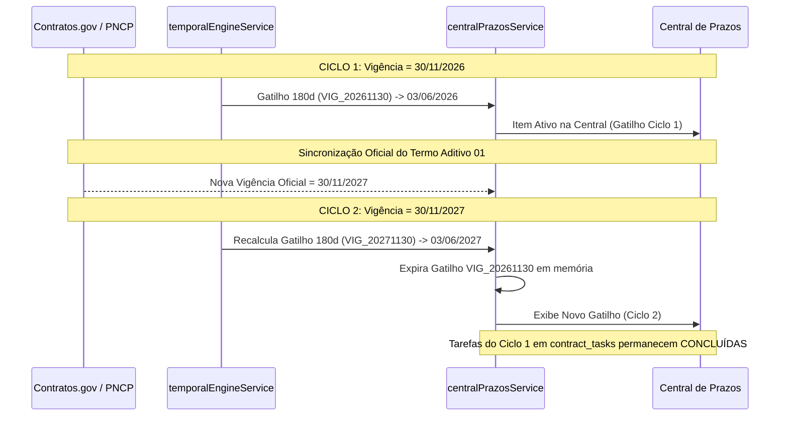

# SALDOARP — FASE 4: DIAGNÓSTICO E PLANO TÉCNICO REVISADO
## Gestão de Eventos e Ciclos Contratuais

**Status:** Diagnóstico e Plano Técnico Revisado (Aguardando Aprovação Formal)  
**Data:** 23 de Setembro de 2026  
**Sistema:** SaldoARP 3.0 (SENASP / MJSP)  
**Ambiente:** Supabase PostgreSQL + React 18 TypeScript + Vite + TailwindCSS  
**Baseline Testes:** 49 arquivos de teste / 363 testes unitários e de integração (100% aprovados)

---

# PRINCÍPIOS DE SEGURANÇA DO DOMÍNIO

Antes de qualquer especificação funcional ou técnica, a arquitetura da Fase 4 subordina-se rigorosamente aos seguintes axiomas de segurança conceitual e contábil-administrativa:

```
┌────────────────────────────────────────────────────────────────────────────────────────┐
│                        SETE AXIOMAS DE SEGURANÇA DO DOMÍNIO                            │
├────────────────────────────┬───────────────────────────────────────────────────────────┤
│ 1. FATO OFICIAL ≠ EVENTO   │ Fato Oficial é o estado registrado na fonte soberana      │
│                            │ (ex: vigência=30/11/2027). Evento é o ato formalizado ou  │
│                            │ ocorrido que motivou o fato (ex: Aditivo 1 publicado).    │
├────────────────────────────┼───────────────────────────────────────────────────────────┤
│ 2. EVENTO ≠ WORKFLOW       │ Evento é um fato formal pontual ocorrido. Workflow é o    │
│                            │ processo operacional/administrativo para instruir uma ação│
│                            │ (ex: Processo de Prorrogação em instrução).               │
├────────────────────────────┼───────────────────────────────────────────────────────────┤
│ 3. WORKFLOW ≠ TAREFA       │ Workflow é a esteira/processo macro de governança. Tarefa │
│                            │ é a ação humana discreta com responsável e prazo          │
│                            │ (ex: "Elaborar Nota Técnica de Justificativa").           │
├────────────────────────────┼───────────────────────────────────────────────────────────┤
│ 4. REGRA OPERACIONAL ≠     │ Regras operacionais (-180d, -60d, etc.) são práticas de   │
│    REGRA JURÍDICA          │ planejamento preventivo interno, e não obrigações legais  │
│                            │ compulsórias nem requisitos universais de validade.       │
├────────────────────────────┼───────────────────────────────────────────────────────────┤
│ 5. ESTADO ATUAL ≠          │ O estado corrente do contrato reflete o momento presente, │
│    HISTÓRICO               │ mas o sistema deve ser capaz de explicar e reconstruir a  │
│                            │ linha do tempo e as vigências/valores anteriores.         │
├────────────────────────────┼───────────────────────────────────────────────────────────┤
│ 6. GATILHO ≠ DECISÃO       │ O gatilho temporal é um alerta preventivo em memória. A   │
│                            │ decisão administrativa de prorrogar, repactuar ou extinguir│
│                            │ é ato humano privativo da autoridade competente.          │
├────────────────────────────┼───────────────────────────────────────────────────────────┤
│ 7. ALERTA ≠ BLOQUEIO       │ Limites legais (ex: 25% do art. 125) atuam como verificação│
│    JURÍDICO                │ assistida e alerta de conformidade, nunca como bloqueio   │
│                            │ cego que substitua a fundamentação jurídica do caso.      │
└────────────────────────────┴───────────────────────────────────────────────────────────┘
```

---

## 1. OBJETIVO DA FASE 4

A Fase 3 estabeleceu com sucesso o **Motor Temporal** e a **Central de Prazos e Tarefas**, respondendo com precisão: *"O que está vencendo, quando vence, quem é o responsável e por quê?"*.

A **FASE 4** eleva o SaldoARP a um sistema de **Apoio à Gestão de Eventos e Ciclos de Vida Contratuais**, estruturado sob a premissa de:
> **"Assistência, Não Decisão Jurídica: Apoiar o gestor com cálculos, alertas de conformidade, organização de workflows, explicabilidade histórica e sugestão de tarefas, preservando a autoridade e discricionariedade humana."**

### Macro-Fluxo Institucional
```text
DADO OFICIAL (Contratos.gov / PNCP)
      ↓
MARCO/FATO OFICIAL (Vigência Fim, Data-Base Anual)
      ↓
GATILHO TEMPORAL PREVENTIVO (ex: -180d, -60d em Memória)
      ↓
WORKFLOW OPERACIONAL (Instrução, Avaliação de Vantajosidade, Processo SEI)
      ↓
TAREFAS HUMANAS DISCRETAS (Elaboração de NT, Consulta Fornecedor em contract_tasks)
      ↓
EVENTO CONTRATUAL FORMALIZADO (Termo Aditivo, Apostilamento assinado)
      ↓
PUBLICAÇÃO OFICIAL (PNCP / DOU / Contratos.gov.br)
      ↓
SINCRONIZAÇÃO OFICIAL & NOVO FATO (Nova Vigência Fim, Novo Valor)
      ↓
REINICIALIZAÇÃO DO NOVO CICLO TEMPORAL (Novo Gatilho com Ciclo Determinístico)
```

---

## 2. A ARQUITETURA DE QUATRO CAMADAS DISTINTAS

Para evitar acoplamentos conceituais e confusões entre processos e dados, o SaldoARP estrutura a Fase 4 em 4 camadas bem delimitadas:

```
┌────────────────────────────────────────────────────────────────────────────────────────┐
│                        AS QUATRO CAMADAS DISTINTAS DO DOMÍNIO                          │
├────────────────────┬────────────────────┬────────────────────┬─────────────────────────┤
│ 1. FATO OFICIAL    │ 2. EVENTO          │ 3. WORKFLOW        │ 4. TAREFA               │
├────────────────────┼────────────────────┼────────────────────┼─────────────────────────┤
│ O que a fonte      │ O fato formalizado │ O processo         │ A ação humana           │
│ oficial soberana   │ ou ocorrido no     │ operacional em     │ individual atribuída    │
│ atesta no presente │ mundo jurídico     │ andamento          │ a um operador           │
│                    │                    │                    │                         │
│ Exemplo:           │ Exemplo:           │ Exemplo:           │ Exemplo:                │
│ "Vigência atual =  │ "Termo Aditivo nº 1│ "Processo de       │ "Elaborar Nota Técnica  │
│ 30/11/2027"        │ publicado em       │ Prorrogação        │ de Justificativa até    │
│ (Contratos.gov.br) │ 15/09/2026 (PNCP)" │ 2026/2027 em       │ 15/08/2026"             │
│                    │                    │ instrução"         │ (`contract_tasks`)      │
└────────────────────┴────────────────────┴────────────────────┴─────────────────────────┘
```

### Relação Dinâmica entre as Quatro Camadas:
1. Um **Fato Oficial** (ex: término de vigência em 30/11/2026) gera um **Gatilho Temporal Preventivo** em memória (-180d).
2. O Gestor inicia um **Workflow** de Prorrogação para conduzir a instrução administrativa.
3. O Workflow instancia um conjunto de **Tarefas Humanas** em `contract_tasks` (Checklist de Prorrogação).
4. A conclusão do processo formaliza um **Evento** (Termo Aditivo nº 1 assinado no SEI e publicado no PNCP).
5. O Evento é sincronizado e atualiza o **Fato Oficial** (nova vigência em 30/11/2027).
6. A nova vigência encerra o ciclo do workflow anterior e dispara um **Novo Ciclo Temporal** no motor.

---

## 3. SEPARAÇÃO ESTRITA: EVENTO vs. WORKFLOW

O SaldoARP **NÃO** trata Evento e Workflow como sinônimos:

| Dimensão | Evento Contratual | Workflow Operacional |
| :--- | :--- | :--- |
| **Definição** | Fato ocorrido, marco histórico ou ato formalizado pontual. | Processo de trabalho com etapas, prazos, documentos e tramitação. |
| **Temporalidade** | Ponto discreto no tempo (`timestamp` / `data_publicacao`). | Intervalo de tempo com início, andamento, revisões e conclusão. |
| **Natureza** | Declaratória / Registral (ex: Termo Aditivo 01, Apostilamento 03). | Executiva / Instrutória (ex: Avaliar Vantajosidade, Remessa CONJUR). |
| **Origem** | Atos oficiais (PNCP/DOU) ou registros administrativos internos. | Práticas operacionais e rotinas administrativas da equipe. |

### Relações Possíveis entre Eventos e Workflows:
* **Evento inicia um Workflow:** A publicação de nova Convenção Coletiva de Trabalho (Evento) inicia um Workflow de Repactuação Salarial.
* **Evento atualiza um Workflow:** A emissão de um Parecer Jurídico pela CONJUR (Evento) atualiza o status do Workflow de Prorrogação para "Minuta Aprovada".
* **Evento conclui um Workflow:** A publicação do Termo Aditivo no PNCP (Evento) finaliza com sucesso o Workflow de Prorrogação.
* **Evento isolado sem Workflow:** Um apostilamento para correção de dotação orçamentária pode ser registrado como Evento sem necessidade de abrir um workflow complexo.

---

## 4. PRESERVAÇÃO E EXPLICABILIDADE DO HISTÓRICO DE VIGÊNCIA

A atualização de vigência **NUNCA** pode ser uma simples sobrescrita de coluna sem rastreabilidade.

### Cenário Exemplo:
* **Vigência Original:** `30/11/2026` (Contrato Inicial)
* **Ato Formal:** Termo Aditivo nº 1 publicado em `15/09/2026`
* **Nova Vigência:** `30/11/2027`

### Como o SaldoARP Garante a Explicabilidade Completa:
O sistema responde com clareza aos 6 quesitos de rastreabilidade:
1. **Qual era a vigência anterior?** `30/11/2026` (armazenada no histórico temporal e nos snapshots de auditoria).
2. **Qual evento produziu a alteração?** `Termo Aditivo nº 1` (identificado via PNCP / Contratos.gov.br).
3. **Quando o evento foi formalizado/publicado?** `15/09/2026` (`dataPublicacaoPncp` / `dataAssinatura`).
4. **Qual é a nova vigência?** `30/11/2027` (`dataVigenciaFim`).
5. **Qual fonte oficial confirmou o novo estado?** `PNCP (Portal Nacional de Contratações Públicas)`.
6. **Qual novo ciclo temporal foi criado?** `CONTRATO::{contractKey}::PRORROGACAO::GATILHO_180D::VIG_20271130`.

### Diagnóstico de Infraestrutura para a Fase 4:
* **Capacidade Atual:** O histórico de aditivos do PNCP (`historicoPrecos`, termos aditivos nas APIs) + metadados de linhagem (`sourceUpdatedAt`, `lastSyncedAt`) + triggers de auditoria em `audit_logs` **já atendem à rastreabilidade necessária** para a primeira versão da Fase 4.
* **Sem Necessidade Imediata de Nova Tabela:** Não é necessário criar tabela dedicada de histórico de vigências neste momento. A evolução para tabela própria (`contract_timeline_events`) só será proposta no futuro se a granularidade das APIs oficiais for insuficiente.

---

## 5. REAJUSTE CONTRATUAL: DIRETRIZ CONTRA REGRAS UNIVERSAIS

> [!WARNING]
> **Reajuste Não é Regra Universal de "12 Meses":** A periodicidade e o cabimento do reajuste contratual dependem dos termos contratuais e do edital, e não de uma regra cega fixa no código.

### A Cadeia Canônica de Avaliação do Reajuste:
```text
CONTRATO ESPECÍFICO
      ↓
DADOS DA CLÁUSULA CONTRATUAL (Índice pactuado, Data-base da proposta)
      ↓
REGRA APLICÁVEL AO INSTRUMENTO (Reajuste em Sentido Estrito vs. Repactuação)
      ↓
MARCO TEMPORAL (Aniversário da Proposta / Último Reajuste)
      ↓
GATILHO OPERACIONAL INFORMADO
```

### Distinção Legal Obrigatória (Lei 14.133/2021):
* **Reajustamento em Sentido Estrito (art. 6º, LVIII):** Aplicação de índice de preços geral ou setorial previsto no edital para bens e serviços sem mão de obra exclusiva. Formalizado por **Apostilamento**.
* **Repactuação (art. 6º, LIX):** Demonstração analítica da variação dos custos dos componentes de mão de obra exclusiva, condicionada a nova CCT/ACT. Formalizada por **Termo Aditivo**.

### Lacuna de Dados Identificada e Tratamento:
* **Situação Atual:** As APIs federais (`Contratos.gov.br` e `PNCP`) nem sempre disponibilizam os metadados brutos das cláusulas de reajuste (ex: nome do índice IPCA/INPC ou data-base original da proposta).
* **Diretriz:** O SaldoARP **NÃO inventará índices ou regras**. Quando a data-base não estiver cadastrada no instrumento, o sistema emitirá aviso informativo de "Requer Definição Manual da Data-Base de Reajuste pelo Gestor", permitindo o registro assistido sem suposições automáticas.

---

## 6. LIMITES DE ADITAMENTO (ART. 125 LEI 14.133/21): ALERTA ASSISTIDO, NÃO BLOQUEIO JURÍDICO

> [!IMPORTANT]
> **Verificação Assistida, Não Bloqueio Cego:** O percentual de 25% (ou 50% para reformas) atua como um **indicador de conformidade orientativo**, e não como uma trava de sistema que invalide a operação.

### Critérios de Análise Assistida:
1. **Acréscimos vs. Supressões:** Calculados isoladamente sobre o valor inicial atualizado do contrato (vedada a compensação entre acréscimos e supressões).
2. **Hipótese de Reforma de Edifício ou Equipamento:** O teto legal sobe para até 50% exclusivamente para acréscimos (art. 125).
3. **Consenso em Supressões:** Supressões resultantes de acordo celebrado entre as partes contratantes podem exceder o limite legal de 25% (art. 126).
4. **Comportamento no Sistema:**
   * Se $\text{Acréscimo} \le 25\% \implies$ Badge Verde: *"Dentro do limite legal ordinário (art. 125)"*.
   * Se $25\% < \text{Acréscimo} \le 50\% \implies$ Badge Amarelo: *"Atenção: Válido apenas para reformas de edifício/equipamento ou hipóteses específicas"*.
   * Se $\text{Acréscimo} > 50\% \implies$ Badge Vermelho: *"Alerta de Conformidade: Ultrapassa o teto ordinário da Lei 14.133/21. Exige justificativa excepcional e fundamentação jurídica nos autos"*.
   * **O sistema NÃO bloqueia o salvamento:** Permite o registro mediante justificativa informada pelo operador.

---

## 7. TRANSIÇÃO DETERMINÍSTICA DE CICLOS TEMPORAIS

Quando um evento oficial altera a data-base de vigência ou marco temporal de um contrato:



### Invariantes de Ciclo:
* **Recálculo em Tempo Real:** O estado atual reflete imediatamente o novo marco oficial.
* **Sem Gatilhos Obsoletos:** Gatilhos em memória vinculados à data antiga deixam de ser gerados.
* **Identidade Estável:** Chave determinística canônica baseada no `cicloRef` garante ausência total de duplicidades.
* **Preservação Histórica:** Tarefas concluídas no ciclo anterior continuam salvas em `contract_tasks` com status `CONCLUIDA`, data e responsável registrados.

---

## 8. MODELO MÍNIMO E REUTILIZAÇÃO DAS ESTRUTURAS EXISTENTES

### Auditoria de Reutilização:
| Necessidade da Fase 4 | Estrutura Existente Reutilizada | Necessidade de Nova Tabela? |
| :--- | :--- | :---: |
| **Gestor Responsável** | `contract_managers` (Migration 13) | **NÃO** |
| **Checklists de Workflows** | `contract_task_templates` / `template_tasks` (Migration 13) | **NÃO** |
| **Instanciação de Tarefas** | `contract_task_plans` / `contract_tasks` (Migration 13) | **NÃO** |
| **Processo Administrativo** | `processos_sei` (Migration 10) | **NÃO** |
| **Auditoria e Logs** | `audit_logs` + `trg_audit_log_capture` (Migration 03/13) | **NÃO** |
| **Cálculo de Deadlines** | `temporalEngineService` (Fase 2) | **NÃO** |
| **Agregação da Central** | `centralPrazosService` (Fase 3) | **NÃO** |

### Critério Estrito para Futuras Alterações de Schema:
Qualquer proposta de nova tabela no futuro deverá cumprir cumulativamente os 4 requisitos:
1. Demonstrar qual informação de negócio não pode ser representada nas estruturas acima;
2. Demonstrar por que a informação não pode ser derivada das APIs oficiais ou de `contract_tasks`;
3. Apresentar a menor alteração de schema possível com compatibilidade retroativa estrita;
4. Justificar os ganhos operacionais mensuráveis para a SENASP/MJSP.

---

## 9. ROADMAP REVISADO DE IMPLEMENTAÇÃO INCREMENTAL

Para garantir estabilidade máxima e controle estrito, a implementação da Fase 4 seguirá estritamente a seguinte ordem sequencial:

```
┌────────────────────────────────────────────────────────────────────────┐
│ PASSO 4.1: Modelo de Domínio e Serviço de Eventos Contratuais          │
│ • Criação de src/types/contractEvents.ts                              │
│ • Implementação de src/services/contractEventService.ts (funções puras)│
│ • Testes unitários com 100% de cobertura                               │
├────────────────────────────────────────────────────────────────────────┤
│ PASSO 4.2: Workflow de Prorrogação Contratual                          │
│ • Template padrão de Prorrogação (ETP, Vantajosidade, CONJUR, Pub)    │
│ • Modal assistido de instrução de prorrogação                          │
│ • Transição de ciclos e testes de ponta a ponta                        │
├────────────────────────────────────────────────────────────────────────┤
│ PASSO 4.3: Eventos de Alteração Contratual e Apostilamento             │
│ • Linha do tempo visual de aditivos e apostilamentos (PNCP)           │
│ • Validação assistida de limites (art. 125) sem bloqueio cego          │
│ • Registro assistido de apostilamentos                                 │
├────────────────────────────────────────────────────────────────────────┤
│ PASSO 4.4: Reajuste e Repactuação                                      │
│ • Tratamento de data-base de proposta e cláusulas contratuais          │
│ • Distinção entre índice de preços e repactuação de mão de obra        │
│ • Checklists operacionais vinculados a processos SEI                   │
├────────────────────────────────────────────────────────────────────────┤
│ PASSO 4.5: Encerramento Contratual e Consolidação                       │
│ • Checklist integrado de liquidação, garantias e desmobilização        │
│ • Integração completa com Central de Prazos e Cockpit da Home          │
│ • Auditoria final de regressão (363+ testes passando e build 100%)     │
└────────────────────────────────────────────────────────────────────────┘
```

---

## 10. MATRIZ DE RISCOS E MITIGAÇÕES REVISADA

| Risco Identificado | Severidade | Probabilidade | Mitigação Arquitetural |
| :--- | :---: | :---: | :--- |
| **1. Confundir regra operacional com imposição jurídica** | Alta | Baixa | Documentação explícita e rótulos de UI identificando gatilhos como planejamento interno preventivo. |
| **2. Bloqueio indevido de aditivos acima de 25%** | Média | Baixa | Limites atuam como badges de conformidade e alertas assistidos, sem travar o salvamento. |
| **3. Presunção incorreta de reajuste a cada 12 meses** | Média | Baixa | Gatilho condicionado aos dados cadastrados da cláusula e data-base real do contrato. |
| **4. Sobrescrita destrutiva de histórico de vigência** | Alta | Baixa | Rastreabilidade mantida via PNCP + metadados de sincronização + auditoria nativa. |
| **5. Duplicação de gatilhos na renovação de contrato** | Média | Baixa | Chave lógica determinística (`cicloRef`) no motor de prazos. |

---

## 11. PARECER TÉCNICO FINAL REVISADO

### Veredito: **GO COM CONDIÇÕES**

O plano técnico revisado atende integralmente a todas as diretrizes institucionais:
1. Estabelece a separação categórica entre **Fato Oficial**, **Evento**, **Workflow** e **Tarefa**;
2. Assegura o princípio da **"Assistência, Não Decisão Jurídica"**;
3. Elimina qualquer bloqueio cego de 25% e veda presunções automáticas de reajuste anual genérico;
4. Garante a explicabilidade do histórico de vigência e a transição limpa de ciclos temporais;
5. Reutiliza 100% das estruturas de banco existentes, com **ZERO migrations adicionais**;
6. Estrutura o roadmap incremental em 5 etapas controladas (4.1 a 4.5).

**Próximo Passo:** Aguardar a autorização formal do usuário para iniciar o **Passo 4.1 (Modelo de Domínio e Serviço de Eventos Contratuais)**.
