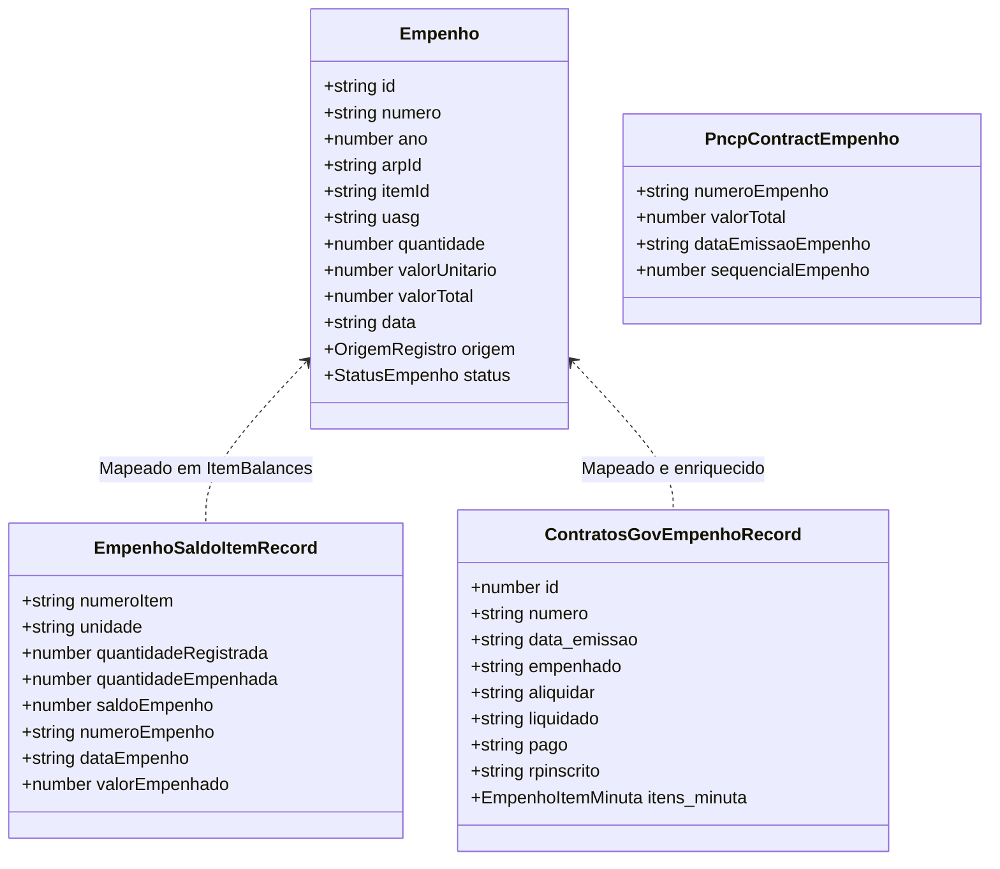
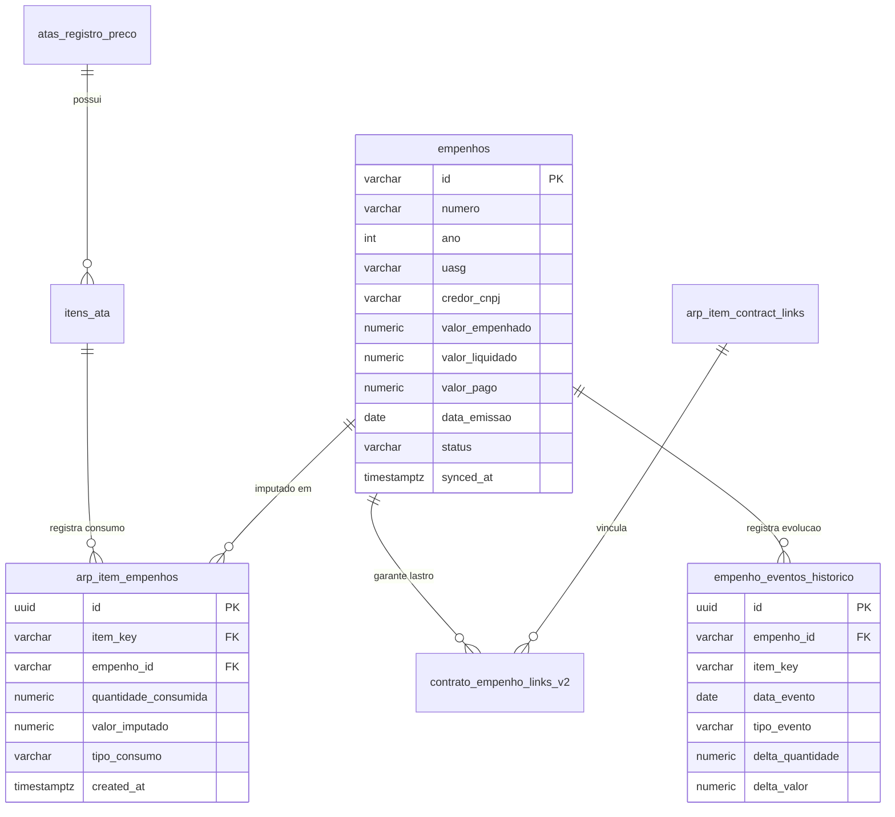

# FASE 7.0 — AUDITORIA ARQUITETURAL GLOBAL DE EMPENHOS E SÉRIE TEMPORAL

**Sistema**: SaldoARP — Gestão Avançada de Atas de Registro de Preços e Contratos  
**Data**: 23 de Setembro de 2026  
**Status**: CONCLUÍDA — GO (AUDITORIA E DIAGNÓSTICO ARQUITETURAL)  
**Ambiente de Produção**: Supabase PostgreSQL 17.6 (`bouutpmxexvwppcmmhdi`)  
**Metodologia**: Auditoria de Código-Fonte, Engenharia Reversa de Schema, Inspeção de APIs Governamentais e Diagnóstico Estrutural  

---

## 1. RESUMO EXECUTIVO

O **SaldoARP** concluiu com sucesso todo o bloco de fundação de domínio e integração contratual temporal nas fases precedentes:
- **Fase 6 / 6.3-C**: Homologação completa da integração Item da Ata $\leftrightarrow$ Contratos Oficiais no PostgreSQL remoto via tabela `arp_item_contract_links` (Migration 15);
- **Fase 6.4**: Checkpoint de incorporação do Plano Consolidado (Lei 14.133/2021);
- **Fase 6.5 / 6.5-A**: Modelagem pura de domínio de eventos de Atas (`AtaEvent`) e saneamento de instrumentos contratuais substitutivos (Art. 95);
- **Fase 6.6 / 6.6-A**: Unificação temporal com gatilho operacional $D-180$ de planejamento de nova contratação e homologação da Central de Prazos.

Com a arquitetura de Atas e Contratos estabilizada (70 arquivos de teste, 611 testes PASS, zero erros de compilação TypeScript, zero violações de lint e build 100% funcional), o sistema entra na **FASE 7.0: AUDITORIA ARQUITETURAL GLOBAL DE EMPENHOS E SÉRIE TEMPORAL**.

### Diagnóstico Central da Auditoria
1. **Inexistência de Tabela Soberana de Empenhos no PostgreSQL**: O banco de dados do SaldoARP não possui uma tabela central `public.empenhos` contendo o catálogo de Notas de Empenho oficiais emitidas. Existem apenas tabelas pontuais de vínculos e substitutos:
   - `public.empenho_links` (associa uma string de número de empenho a uma cota de departamento interno em `arp_allocations`);
   - `public.empenho_manual_quantidades` (armazena overrides pontuais de quantidades);
   - `public.empenhos_manuais` (armazena empenhos criados artesanalmente pelo usuário quando a API falha);
   - `public.contrato_empenho_links` (associação associativa legada vinculada a `contratos_manuais`).
2. **Volatilidade do Dado Oficial**: Todos os empenhos oficiais (emitidos no SIASG, Contratos.gov.br ou PNCP) são consultados *on-the-fly* via requisições HTTP pelo navegador do cliente no momento da renderização dos componentes (`ItemBalances.tsx` e `ContractCard.tsx`). Não há cache relacional persistido nem snapshot histórico estruturado no Supabase.
3. **Ausência de Série Temporal Contínua**: O sistema opera estritamente no modelo de "foto instantânea" (*snapshot* estático do presente). Não há registro cronológico de quando cada débito ocorreu ao longo dos meses, nem registro histórico das transições de estágios da despesa pública (Empenhado $\rightarrow$ Liquidado $\rightarrow$ Pago), impossibilitando o cálculo determinístico de velocidade de consumo (*burn rate*) e previsões preditivas de exaustão do saldo sem a construção da infraestrutura da Fase 7.
4. **Dicotomia Físico-Financeira Resolvida por Heurística no Frontend**: O empenho no SIAFI é uma obrigação financeira (em R$), enquanto a Ata de Registro de Preços controla unidades físicas de fornecimento. O frontend do SaldoARP implementa uma dedução reversa sofisticada (`deduceEmpenhoQuantity`), mas essa lógica reside no cliente React e não no banco de dados.

O veredito desta auditoria é **GO**, com o plano de ação detalhado para estruturar a série temporal e a soberania de empenhos nas próximas fases sem romper as regras canônicas de saldo.

---

## 2. MAPA COMPLETO DE OCORRÊNCIAS DE EMPENHO NO CÓDIGO

A auditoria realizou uma varredura completa em todos os módulos do repositório para inventariar todas as referências a empenhos:

| Camada | Arquivo / Módulo | Linhas / Símbolos | Papel no Ecossistema |
|---|---|---|---|
| **Banco / Migrations** | `20260917000001_canonical_schema.sql` | L90-132, L156-166 | Criação de `empenho_links`, `empenho_manual_quantidades`, `empenhos_manuais` e `contrato_empenho_links`. |
| **Banco / Migrations** | `20260917000005_rpc_contracts.sql` | L10-23, L89-96, L189-205 | Validação de $\ge 1$ empenho vinculado por contrato manual (`RN-07`) na RPC `save_manual_contrato_atomic`. |
| **Banco / Migrations** | `20260917000006_backend_authority_hardening.sql` | L24-25, L230-320 | Revogação de escrita direta em `contrato_empenho_links`; validação de regex do identificador de empenho. |
| **Banco / Migrations** | `20260917000007_rpc_empenho_links.sql` | L1-240 | Criação de `item_empenho_link_state` e RPC `save_empenho_links_atomic` para cotas departamentais. |
| **Banco / Migrations** | `20260917000008_manual_data_transactions.sql` | L1-250 | Criação de `item_manual_empenho_state`, `item_manual_quantity_state` e RPCs `save_manual_empenhos_atomic` e `save_manual_quantities_atomic`. |
| **Banco / Migrations** | `20260921000012_rpc_delete_manual_contrato.sql` | L12, L59 | Deleção em cascata automática de `contrato_empenho_links` via FK `ON DELETE CASCADE`. |
| **Tipos / Domínio** | `src/types/index.ts` | L117-142 | `EmpenhosSaldoItemResponse` e `EmpenhoSaldoItemRecord` (API Compras.gov.br Dados Abertos). |
| **Tipos / Domínio** | `src/types/index.ts` | L210-258 | `EmpenhoItemMinuta` e `ContratosGovEmpenhoRecord` (API Contratos.gov.br). |
| **Tipos / Domínio** | `src/types/index.ts` | L293-298 | `PncpContractEmpenho` (API PNCP). |
| **Tipos / Domínio** | `src/types/index.ts` | L345-368 | Interface canônica `Empenho` (entidade unificada do sistema). |
| **Tipos / Domínio** | `src/types/index.ts` | L370-389 | `TipoInstrumentoContratual` contendo `'NOTA_EMPENHO'` como instrumento substitutivo (Art. 95). |
| **Tipos / Domínio** | `src/types/index.ts` | L411-418 | Interface `ContratoEmpenho` (relação N:N Contrato $\leftrightarrow$ Empenho). |
| **Tipos / RPC** | `src/types/rpc.ts` | L70-85, L138-175 | Payloads e resultados RPC: `RpcEmpenhoLinkItem`, `RpcManualEmpenhoItem`, etc. |
| **Serviços / APIs** | `src/services/api.ts` | L796-841 | `fetchEmpenhosSaldoItem(numeroAta, unidadeGerenciadora)`: consulta SIASG / Compras.gov.br. |
| **Serviços / APIs** | `src/services/api.ts` | L976-989 | `fetchContratosGovEmpenhos(contratoId)`: consulta empenhos do contrato no Contratos.gov.br. |
| **Serviços / APIs** | `src/services/api.ts` | L995-1008 | `fetchContratoEmpenhoDetalhe(empenhoId)`: consulta a minuta SIAFI detalhada do empenho. |
| **Serviços / APIs** | `src/services/api.ts` | L1656-1680 | `fetchPncpContractEmpenhos(cnpj, ano, sequencialContrato)`: consulta empenhos no PNCP. |
| **Serviços / Regras** | `src/services/balanceService.ts` | L7-30 | `normalizeEmpenhoNumero` e `getEmpenhoCanonicalKey` (normalização e deduplicação canônica). |
| **Serviços / Regras** | `src/services/balanceService.ts` | L39-74 | `calculateTotalEmpenhado` e `calculateTotalEmpenhadoPorOrigem`. |
| **Serviços / Regras** | `src/services/balanceService.ts` | L85-121 | `calculateSaldo` e `calculateSaldoWithContratos` (fórmula canônica do saldo). |
| **Serviços / Regras** | `src/services/balanceService.ts` | L128-142 | `validateContrato` (exige $\ge 1$ empenho vinculado ao contrato). |
| **Serviços / Regras** | `src/services/balanceService.ts` | L197-233 | `calculateAllocationsWithEmpenhos` (distribuição de empenhos por cota interna). |
| **Serviços / Regras** | `src/services/balanceService.ts` | L241-309 | `reconcileBalances` (reconciliação de saldo calculado vs informado pela API). |
| **Serviços / Regras** | `src/services/balanceService.ts` | L322-360 | `matchAndMergeEmpenhos` (algoritmo de reconciliação e fusão de dados oficiais com manuais). |
| **Serviços / Regras** | `src/services/balanceService.ts` | L442-459 | `getEmpenhoEffectiveValue` (mútua exclusividade contábil: empenhado vs rpinscrito). |
| **Serviços / Regras** | `src/services/balanceService.ts` | L465-541 | `deduceEmpenhoQuantity` (dedução de quantidade física a partir do valor financeiro e histórico de termos). |
| **Serviços / Persistência**| `src/services/allocationService.ts`| L316-435 | `fetchEmpenhoManualQuantitiesWithState`, `saveEmpenhoManualQuantities`. |
| **Serviços / Persistência**| `src/services/allocationService.ts`| L440-563 | `fetchManualEmpenhosWithState`, `saveManualEmpenhos`. |
| **Serviços / Persistência**| `src/services/allocationService.ts`| L631-736 | `saveManualContratoWithEmpenhos`. |
| **Serviços / Persistência**| `src/services/allocationService.ts`| L760-828 | `fetchContratoEmpenhoLinks`, `saveContratoEmpenhoLinks`. |
| **Hooks React Query** | `src/hooks/useItemEmpenhos.ts` | L1-59 | Hook de consulta de empenhos oficiais de um item via Compras.gov.br. |
| **Hooks React Query** | `src/hooks/useItemEmpenhoLinks.ts` | L1-48 | Hook de consulta de vínculos empenho $\leftrightarrow$ alocação departamental. |
| **Hooks React Query** | `src/hooks/useSaveEmpenhoLinks.ts` | L1-42 | Mutação RPC transacional para salvar vínculos de empenhos departamentais. |
| **Hooks React Query** | `src/hooks/useItemManualEmpenhos.ts`| L1-48 | Hook de consulta de empenhos manuais do item. |
| **Hooks React Query** | `src/hooks/useSaveManualEmpenhos.ts`| L1-42 | Mutação RPC transacional para salvar empenhos manuais. |
| **Hooks React Query** | `src/hooks/useItemManualQuantities.ts`| L1-48 | Hook de consulta de overrides de quantidades. |
| **Hooks React Query** | `src/hooks/useSaveManualQuantities.ts`| L1-42 | Mutação RPC para salvar overrides de quantidades. |
| **Hooks React Query** | `src/hooks/useItemContractEmpenhoLinks.ts`| L1-49 | Hook de consulta de links entre contratos manuais e empenhos. |
| **Componentes UI** | `src/components/ItemBalances.tsx` | L490-600, L917-1065 | Orquestração da carga, merge, dedução física e renderização dos empenhos do item da Ata. |
| **Componentes UI** | `src/components/cards/ContractCard.tsx` | L360-410 | Renderização da aba "Empenhos" do contrato oficial com valores de execução orçamentária. |
| **Componentes UI** | `src/components/InternalAllocationsDashboard.tsx`| L210-235 | Consolidação de consumo de empenhos por departamento interno. |

---

## 3. AUDITORIA DO MODELO DE DADOS ATUAL (POSTGRESQL REAL)

A inspeção realizada no banco de dados remoto de produção (`bouutpmxexvwppcmmhdi`) revelou a estrutura das tabelas existentes:

### 3.1. `public.empenhos_manuais`
Tabela criada na Migration 01 e reforçada na Migration 08 para registrar empenhos inseridos manualmente pelos operadores:
- **Colunas**:
  - `id`: `VARCHAR(100)` (PK);
  - `item_key`: `VARCHAR(100)` (Índice);
  - `numero`: `VARCHAR(50)`;
  - `ano`: `INTEGER` (Check $2000 \le \text{ano} \le 2100$);
  - `arp_id`: `VARCHAR(30)`;
  - `item_id`: `VARCHAR(10)`;
  - `uasg`: `VARCHAR(10)`;
  - `quantidade`: `NUMERIC(18, 4)` (Check $> 0$);
  - `valor_unitario`: `NUMERIC(18, 4)`;
  - `valor_total`: `NUMERIC(18, 4)`;
  - `data`: `DATE`;
  - `fornecedor`: `VARCHAR(255)`;
  - `cnpj_fornecedor`: `VARCHAR(20)`;
  - `unidade_interna_id`: `VARCHAR(100)`;
  - `observacao`: `TEXT`;
  - `origem`: `VARCHAR(20)` (`'API'`, `'MANUAL'`, `'SINCRONIZADO'`);
  - `status`: `VARCHAR(20)` (`'CONFIRMADO'`, `'PENDENTE'`, `'DIVERGENTE'`);
  - `criado_em`, `atualizado_em`: `TIMESTAMPTZ`.
- **Constraint UNIQUE**: `(item_key, numero, ano)`.
- **Segurança**: RLS habilitado (leitura pública, escrita revogada para clientes e restrita à RPC `save_manual_empenhos_atomic`). Trilha de auditoria em `audit_logs`.
- **Limitação Estrutural**: Contém **apenas** empenhos manuais digitados quando o webservice federal falha. Nenhum empenho oficial do Compras.gov.br ou Contratos.gov.br reside nesta tabela.

### 3.2. `public.empenho_links`
Tabela associativa que vincula o número de um empenho a uma cota de departamento interno (`public.arp_allocations`):
- **Colunas**: `id` (UUID PK), `item_key` (VARCHAR 100), `empenho_numero` (VARCHAR 50), `allocation_id` (VARCHAR 100 FK para `arp_allocations`), `created_at` (TIMESTAMPTZ).
- **Constraint UNIQUE**: `(item_key, empenho_numero)`.
- **Limitação Estrutural**: O campo `empenho_numero` é puramente textual. Não existe Foreign Key apontando para uma tabela soberana de empenhos, pois tal tabela inexiste no banco.

### 3.3. `public.empenho_manual_quantidades`
Tabela para salvar ajustes e correções manuais de quantidades físicas empenhadas:
- **Colunas**: `id` (UUID PK), `item_key` (VARCHAR 100), `emp_key` (VARCHAR 50), `quantidade` (NUMERIC 18,4 CHECK $\ge 0$), `created_at` (TIMESTAMPTZ).
- **Constraint UNIQUE**: `(item_key, emp_key)`.
- **Finalidade**: Permite que o gestor corrija no sistema casos em que a dedução automática de quantidade física diferiu da realidade do processo administrativo.

### 3.4. `public.contrato_empenho_links`
Tabela criada na Migration 01 para vincular contratos manuais aos seus empenhos de lastro:
- **Colunas**: `id` (VARCHAR 150 PK), `item_key` (VARCHAR 100), `contrato_id` (VARCHAR 150 FK para `contratos_manuais`), `empenho_id` (VARCHAR 100), `quantidade_vinculada` (NUMERIC 18,4), `data_vinculo` (TIMESTAMPTZ), `origem` (VARCHAR 20).
- **Constraint UNIQUE**: `(contrato_id, empenho_id)`.
- **Situação Pós-Fase 6.2-C**: Conforme estabelecido no saneamento da Fase 6.2-C, esta tabela foi preservada intacta, mas está acoplada à tabela legada `contratos_manuais`. A integração com contratos oficiais homologada na Fase 6.3-C utiliza `arp_item_contract_links`, que não possui vínculos com empenhos.

---

## 4. AUDITORIA DOS TIPOS E MODELOS TYPESCRIPT

Existe uma fragmentação semântica e estrutural entre os diversos modelos de dados de empenho em TypeScript:



1. **`Empenho` (Canônico da Aplicação)**:
   - Representa o conceito consolidado no SaldoARP: possui `quantidade` física explícita, `arpId`, `itemId` e `uasg`.
   - É a entidade aceita por todas as funções de cálculo contábil (`calculateTotalEmpenhado`, `calculateSaldo`, etc.).
2. **`EmpenhoSaldoItemRecord` (SIASG / Compras.gov.br)**:
   - Contém dados sob a ótica do Item da Ata: `quantidadeEmpenhada` e `saldoEmpenho`.
   - Não traz o desgabito de liquidação e pagamento, apenas o status de inclusão no Compras.gov.br.
3. **`ContratosGovEmpenhoRecord` (Contratos.gov.br / SIAFI)**:
   - Contém a execução orçamentária completa: `empenhado`, `aliquidar`, `liquidado`, `pago`, `rpinscrito`, `rpaliquidar`, `rpliquidado`, `rppago`.
   - Não possui `quantidade` de fornecimento no corpo principal, apenas valores financeiros (em R$). A quantidade física precisa ser buscada na sub-rota `/consultar/{id}` (`itens_minuta`) ou deduzida via `deduceEmpenhoQuantity`.
4. **`PncpContractEmpenho` (PNCP)**:
   - Modelo superficial contendo apenas `numeroEmpenho`, `valorTotal` e `dataEmissaoEmpenho`. Não contém itens de minuta nem status de liquidação.

---

## 5. AUDITORIA DAS FONTES OFICIAIS DE DADOS

O sistema consome empenhos de três fontes de dados federais distintas:

```
                  ┌────────────────────────────────────────────────────────┐
                  │               SIAFI / SIASG (Fonte Primária)            │
                  └──────────────────────────┬─────────────────────────────┘
                                             │
               ┌─────────────────────────────┼─────────────────────────────┐
               ▼                             ▼                             ▼
   ┌───────────────────────┐   ┌───────────────────────────┐   ┌───────────────────────┐
   │ Compras.gov.br (ARP)  │   │     Contratos.gov.br      │   │         PNCP          │
   ├───────────────────────┤   ├───────────────────────────┤   ├───────────────────────┤
   │ 4_consultarEmpenhos   │   │ /contrato/{id}/empenhos   │   │ /contratos/{seq}/emps │
   │ Perspectiva:          │   │ Perspectiva:              │   │ Perspectiva:          │
   │ Item da Ata de Preço  │   │ Contrato Administrativo   │   │ Publicação Oficial    │
   │ Unidades e Saldo      │   │ Estágios de Despesa (R$)  │   │ Metadados Globais     │
   └───────────┬───────────┘   └─────────────┬─────────────┘   └───────────┬───────────┘
               │                             │                             │
               └───────────────────────┬─────┴─────────────────────────────┘
                                       ▼
                       ┌───────────────────────────────┐
                       │  SaldoARP (Frontend Runtime)  │
                       │    matchAndMergeEmpenhos()    │
                       └───────────────────────────────┘
```

1. **Compras.gov.br Dados Abertos (`/modulo-arp/4_consultarEmpenhosSaldoItem`)**:
   - Fornece os empenhos atribuídos diretamente ao Item da Ata e à Unidade Gerenciadora/Participante;
   - Suporta paginação de até 500 registros por requisição;
   - Fornece valores quantitativos homologados e consumidos.
2. **Contratos.gov.br (`/api/contrato/{contrato_id}/empenhos`)**:
   - Fornece os empenhos que dão lastro financeiro ao Contrato formal;
   - Fornece a decomposição orçamentária do SIAFI: A Liquidar, Liquidado, Pago e Restos a Pagar (RP);
   - Possui sub-endpoint `/api/v1/contrato/empenho/consultar/{empenho_id}` com o detalhamento dos itens do empenho (`itens_minuta`).
3. **PNCP (`/api/pncp/v1/orgaos/{cnpj}/contratos/{ano}/{sequencialContrato}/empenhos`)**:
   - Consulta pública de empenhos publicados no portal nacional;
   - Traz identificador, data de emissão e valor total homologado.

---

## 6. AUDITORIA DO SSOT DE EMPENHOS

> [!CAUTION]
> **DIAGNÓSTICO CRÍTICO DE SSOT**: Atualmente, o SaldoARP **não possui um Single Source of Truth (SSOT) persistido no banco de dados** para empenhos oficiais.

- **Onde reside a verdade hoje?**
  - A verdade reside exclusivamente no **estado da memória do cliente React** durante a sessão do usuário.
  - Ao abrir o painel `ItemBalances.tsx`, o navegador dispara requisições assíncronas paralelas para as APIs do Compras.gov.br, Contratos.gov.br e PNCP.
  - Os resultados são combinados em tempo de execução via `matchAndMergeEmpenhos(officialApiEmpenhos, filteredManualEmpenhos)`.
- **Consequências da Ausência de SSOT Relacional**:
  1. *Lentidão e Dependência de Rede*: Se a API do governo estiver com alta latência, a renderização dos saldos e abas de empenhos sofre degradação;
  2. *Inexistência de Trilha Histórica (Série Temporal)*: Por não gravar os empenhos em tabela soberana, o banco de dados não conhece a evolução diária/mensal do consumo;
  3. *Impossibilidade de Relatórios Agregados no Backend*: Não é possível executar queries SQL analíticas agregadas (ex: "qual o total empenhado por todas as UASGs em 2026?") diretamente no banco sem que um usuário acesse todas as telas uma a uma.

---

## 7. AUDITORIA DA CARDINALIDADE E RELAÇÕES

As relações entre Atas, Itens, Contratos e Empenhos apresentam cardinalidade complexa no mundo real da Administração Pública:

```
[Ata de Registro de Preços]
       │ 1
       │ N
  [Item da Ata] ─────────── (1:N) ─────────── [Empenho Direto] (Sem contrato formal)
       │ N                                            │
       │ N (arp_item_contract_links)                   │ Lastro
       ▼                                              ▼
[Contrato Oficial] ──────── (N:N) ──────────── [Empenho do Contrato]
```

1. **Item da Ata $\leftrightarrow$ Empenho**:
   - Na compra direta sem instrumento de contrato solene (compra imediata com nota de empenho substitutiva — Art. 95), o empenho vincula-se **diretamente ao Item da Ata**.
   - Cardinalidade: $1 \text{ Item} : N \text{ Empenhos}$.
2. **Contrato Oficial $\leftrightarrow$ Empenho**:
   - Todo contrato formal exige obrigatoriamente vinculação a pelo menos um empenho de lastro orçamentário (`RN-07`).
   - Ao longo dos anos de vigência (até 5 ou 10 anos sob a Lei 14.133), um contrato recebe novos empenhos a cada exercício orçamentário.
   - Cardinalidade: $1 \text{ Contrato} : N \text{ Empenhos}$.
3. **Item $\leftrightarrow$ Contrato $\leftrightarrow$ Empenho**:
   - Um mesmo empenho pode constar na API do Contratos.gov.br (associado ao contrato) e na API do Compras.gov.br (associado ao item da Ata).
   - Se o sistema somasse as duas listas cegamente, haveria **dupla contagem contábil** catastrófica. O SaldoARP resolve isso via algoritmo de deduplicação canônica em memória.

---

## 8. AUDITORIA DO CONSUMO E FÓRMULA DO SALDO

A regra contábil do SaldoARP é uma invariante inegociável do sistema:

$$\text{SaldoRemanescente} = \text{QuantidadeHomologadaItem} - \sum \text{Empenho.quantidade}$$

### Diretrizes de Integridade Comprovadas:
1. **Contratos NUNCA abatem saldo**:
   - Um contrato formal é um compromisso jurídico, mas o que deduz o quantitativo da Ata perante o fornecedor é a emissão da Nota de Empenho de despesa.
   - A função `calculateSaldoWithContratos` (em `src/services/balanceService.ts`) recebe o parâmetro `_contratos?: Contrato[]`, mas garante expressamente em código que o saldo é computado estritamente pela soma dos empenhos, ignorando o valor dos contratos para efeito de abatimento de saldo da Ata.
2. **Alocações Internas NUNCA abatem saldo**:
   - As cotas distribuídas a departamentos internos (`arp_allocations`) organizam limites administrativos internos, mas jamais debitam o saldo disponível da Ata perante o mercado.
3. **Tratamento de Saldo Negativo**:
   - Se $\sum \text{Empenhos} > \text{QuantidadeHomologada}$, o saldo é reportado como **negativo real**, sem ser mascarado para zero, gerando o status contábil `DIVERGENTE` e disparando alertas visuais na interface.

---

## 9. AUDITORIA DOS MECANISMOS DE DEDUPLICAÇÃO E RECONCILIAÇÃO

O arquivo `src/services/balanceService.ts` implementa três salvaguardas essenciais:

1. **Normalização de Números de Empenho (`normalizeEmpenhoNumero`)**:
   - Empenhos federais possuem formatos heterogêneos entre sistemas: `"2026NE000142"`, `"2026NE142"`, `"00142"`, `"142"`.
   - A regex `^(\d{4})NE0*(\d+)$` normaliza qualquer variante para a forma canônica `2026NE142`, evitando duplicações por discrepância de zeros à esquerda.
2. **Chave Canônica Determinística (`getEmpenhoCanonicalKey`)**:
   $$\text{CanonicalKey} = \text{normNum} - \text{ano} - \text{uasg} - \text{itemId}$$
   Garante unicidade em toda a árvore de agregação.
3. **Algoritmo de Fusão Inteligente (`matchAndMergeEmpenhos`)**:
   - Indexa os empenhos oficiais da API;
   - Itera sobre os empenhos manuais cadastrados pelo usuário;
   - Se o empenho manual for detectado na API: promove para `origem = 'SINCRONIZADO'`, preserva metadados locais (ex: departamento associado) e não duplica a contagem quantitativa;
   - Se houver discrepância de quantidades entre a API e o manual, classifica como `status = 'DIVERGENTE'`.

---

## 10. DIAGNÓSTICO DA AUSÊNCIA DE SÉRIE TEMPORAL HISTÓRICA

> [!IMPORTANT]
> **GAP ESTRUTURAL**: O SaldoARP calcula o saldo no ponto $t = \text{agora}$, mas **não armazena o histórico do saldo no tempo $S(t)$**.

- **Limitações Identificadas**:
  1. O sistema não sabe quanto saldo o item possuía há 30, 60 ou 90 dias atrás;
  2. Não há tabela de eventos de empenho que registre quando cada parcela foi debitada;
  3. Não há histórico consolidado do ritmo de liquidação e pagamento ao longo do exercício financeiro;
  4. Por consequência, qualquer cálculo de consumo médio diário ou previsão de esgotamento hoje dependeria de recalcular em runtime usando as datas esparsas das APIs externas.

---

## 11. DIAGNÓSTICO DE EMPENHOS GLOBAIS VS EMPENHOS DA ATA

A auditoria identificou três categorias distintas de empenhos no ecossistema:

1. **Empenhos da Unidade Gerenciadora (UASG 200331 / 200330)**:
   - Débitos diretos da cota própria da gerenciadora;
   - Devem abater o saldo da gerenciadora e o saldo global da Ata.
2. **Empenhos de Unidades Participantes**:
   - Cada participante possui sua cota homologada individual;
   - O empenho do participante consome a cota daquele participante e o total da Ata.
3. **Empenhos de Adesões Externas ("Caronas")**:
   - Não consomem a cota da gerenciadora nem das participantes;
   - Consomem o limite legal de adesão (Art. 86 da Lei 14.133: teto individual de 50% e teto global de 2x o quantitativo da Ata);
   - São consultados via `/modulo-arp/5_consultarAdesoesItem` e isolados do saldo ordinário da Ata.
4. **Empenhos de Contratos sem Ata**:
   - Com o saneamento da Fase 6.5 (`Contrato.arpId?: string`), o sistema passou a suportar contratos autônomos decorrentes de licitações tradicionais ou contratações diretas.
   - Os empenhos desses contratos não têm relação com Atas e não devem afetar nenhum saldo de ARP.

---

## 12. DIAGNÓSTICO DE DADOS FINANCEIROS VS DADOS QUANTITATIVOS

Existe um desafio de engenharia inerente à integração entre o sistema SIAFI (financeiro) e o SaldoARP (físico-quantitativo):

```
API Contratos.gov.br (Financeira)           SaldoARP (Quantitativo)
Valor Empenhado: R$ 150.000,00     ───────► Quantidade Física: 100 unidades?
                                   (dedução) (Preço Unitário: R$ 1.500,00)
```

### Como o SaldoARP resolve hoje:
1. **Via Minuta SIAFI (`fetchContratoEmpenhoDetalhe`)**: Se a API disponibilizar a minuta do empenho (`/consultar/{id}`), o sistema lê diretamente a propriedade `quantidade` do item SIAFI correspondente.
2. **Via Dedução Matemática Pura (`deduceEmpenhoQuantity`)**: Quando a minuta não está disponível, a função calcula:
   $$\text{rawQty} = \frac{\text{ValorEmpenhado}}{\text{ValorUnitarioBase}}$$
   - Se o resultado for inteiro (tolerância $\pm 0.001$), define `isExato = true` e adota a quantidade exata;
   - Se a divisão for fracionária, identifica que se trata de **empenho de reforço, reajuste ou repactuação de preços**, define `isReforco = true` e adota `Math.floor(rawQty)`.
3. **Mútua Exclusividade Contábil (`getEmpenhoEffectiveValue`)**:
   - Em conformidade com a Lei 4.320/64, para empenhos do exercício corrente, utiliza-se `empenhado > 0`; para empenhos inscritos em Restos a Pagar em exercícios seguintes, o valor original de empenho zera na API e passa a figurar em `rpinscrito > 0`. O SaldoARP seleciona dinamicamente o valor efetivo correto.

---

## 13. DIAGNÓSTICO DE FALHAS E FRAGILIDADES ESTRUTURAIS IDENTIFICADAS

A auditoria categorizou as fragilidades encontradas no estado atual:

| Código | Gravidade | Descrição da Fragilidade | Impacto |
|---|---|---|---|
| **FRAG-7.0-01** | **ALTA** | Inexistência de tabela `public.empenhos` unificada no PostgreSQL. | Impossibilita consultas relacionais analíticas globais e geração de série temporal no backend. |
| **FRAG-7.0-02** | **MÉDIA** | Dependência de chamadas HTTP client-side a cada renderização de tela. | Sobrecarga de rede, latência na abertura de cards de saldos e vulnerabilidade a instabilidades de endpoints governamentais. |
| **FRAG-7.0-03** | **ALTA** | Ausência de tabela de eventos/série temporal de consumo ($S(t)$). | Impossibilita o Farol preditivo de esgotamento e o cálculo de burn rate com base histórica consolidada. |
| **FRAG-7.0-04** | **BAIXA** | Dedução de quantidade física executada em runtime TypeScript no cliente. | Dispersão da lógica de conversão financeiro $\rightarrow$ quantitativo sem persistência do valor deduzido no banco. |
| **FRAG-7.0-05** | **MÉDIA** | `contrato_empenho_links` vinculada estritamente à tabela legada `contratos_manuais`. | Os contratos oficiais homologados na Fase 6.3-C (`arp_item_contract_links`) não possuem tabela de empenhos associados no PostgreSQL. |

---

## 14. PROPOSTA DE ARQUITETURA CANÔNICA DE EMPENHOS PARA O SALDOARP

Para superar as fragilidades diagnosticadas sem romper com o legado, propõe-se para as próximas fases a seguinte arquitetura de dados relacional:



### Componentes Chave da Proposta:
1. **Tabela Soberana `public.empenhos`**:
   - Centraliza todas as Notas de Empenho (sejam vindas do Compras.gov.br, Contratos.gov.br ou manuais);
   - Armazena metadados consolidados de execução financeira (`empenhado`, `liquidado`, `pago`);
   - Chave canônica unívoca: `(numero_normalizado, ano, uasg)`.
2. **Tabela de Vínculo com Itens de Ata (`public.arp_item_empenhos`)**:
   - Liga o empenho ao item da Ata com a **quantidade física oficial imputada**;
   - Garante rastreabilidade total do abatimento do saldo da Ata.
3. **Tabela de Vínculos Contratuais de Nova Geração (`public.contrato_empenho_links_v2`)**:
   - Conecta os empenhos aos contratos oficiais catalogados via `arp_item_contract_links`.

---

## 15. PROPOSTA DE ARQUITETURA DE SÉRIE TEMPORAL E CONSUMO HISTÓRICO

A série temporal deve ser modelada a partir de **eventos discretos de consumo**:

```
Eixo do Tempo ─────────────────────────────────────────────────────────────►
  t0 (Vigência)        t1 (Empenho 1)         t2 (Empenho 2)        t_agora
Saldo = 1.000 un    Saldo = 850 (-150)     Saldo = 600 (-250)    Saldo = 600 un
```

### Formalização Matemática da Série Temporal:
- **Baseline Inicial da Ata**:
  $$S(t_0) = \text{QuantidadeHomologadaItem}$$
- **Vetor de Eventos de Empenho**:
  $$E = \{ (t_1, q_1), (t_2, q_2), \dots, (t_n, q_n) \}$$
  Onde $t_i$ é a data de emissão do empenho e $q_i$ a quantidade consumida.
- **Consumo Acumulado até o instante $t$**:
  $$C(t) = \sum_{t_i \le t} q_i$$
- **Saldo Remanescente no instante $t$**:
  $$S(t) = S(t_0) - C(t)$$
- **Granularidade do Snapshot**:
  - Diária para registro de eventos brutos;
  - Mensal consolidada para dashboards executivos, séries temporais e gráficos de tendência.

---

## 16. PROPOSTA DE ARQUITETURA PARA BURN RATE E PREVISÃO DE ESGOTAMENTO

O **Burn Rate** ($\beta$) representa a velocidade instantânea ou média de consumo do item por unidade de tempo (unidades/mês ou unidades/dia).

### 1. Burn Rate Médio Ponderado ($\beta_{W}$):
Para capturar o ritmo recente sem desconsiderar o histórico global:
$$\beta_W = w_1 \cdot \beta_{30d} + w_2 \cdot \beta_{90d} + w_3 \cdot \beta_{global}$$
*(com pesos recomendados: $w_1 = 0.5$, $w_2 = 0.3$, $w_3 = 0.2$)*.

### 2. Projeção de Data de Esgotamento ($T_{\text{exaustão}}$):
$$\Delta t_{\text{restante}} = \frac{S(t_{\text{agora}})}{\beta_W}$$
$$T_{\text{exaustão}} = t_{\text{agora}} + \Delta t_{\text{restante}}$$

### 3. Cenários de Previsão:
- **Cenário Otimista / Conservador**: Burn rate dos períodos de menor consumo;
- **Cenário Realista**: Burn rate ponderado dos últimos 90 dias;
- **Cenário Crítico / Acelerado**: Burn rate do pico histórico de consumo.

---

## 17. PROPOSTA DE ARQUITETURA PARA O FUTURO FAROL DE ATAS E CONTRATOS

O **Farol** é o componente de inteligência preditiva que cruza a **Série Temporal de Consumo** com a **Linha do Tempo de Vigência** homologada na Fase 6.6.

```
                         MATRIZ BIDIMENSIONAL DO FAROL

        Tempo Restante (Vigência)
                   ▲
                   │     [ALERTA AZUL]              [VERDE REGULAR]
        ALTO       │   Subutilização /             Consumo alinhado
                   │   Ociosidade de Saldo         ao cronograma
                   ├───────────────────────────────────────────────
                   │     [VERMELHO CRÍTICO]         [AMARELO ATENÇÃO]
        BAIXO      │   Risco de Esgotamento        Consumo moderado
                   │   Precoce / Desabastecimento  em reta final
                   └───────────────────────────────────────────────►
                         BAIXO                      ALTO
                                 Saldo Remanescente (%)
```

### Regras do Farol:
1. 🔴 **VERMELHO — Risco Iminente de Desabastecimento**:
   - Condição: $T_{\text{exaustão}} < t_{\text{fim\_vigencia}}$ e $\Delta t_{\text{restante}} < 60 \text{ dias}$.
   - Significado: O saldo da Ata acabará muito antes da vigência terminar e antes que uma nova contratação (ciclo de 180 dias) possa ser concluída.
2. 🟡 **AMARELO — Ponto de Decisão de Renovação / Aditamento**:
   - Condição: Vigência atingiu o gatilho $D-180$ homologado na Fase 6.6 e saldo remanescente $\ge 30\%$.
3. 🔵 **AZUL — Subutilização / Risco de Perda de Saldo**:
   - Condição: Restam menos de 90 dias de vigência e o saldo consumido é inferior a 40% da cota homologada.
4. 🟢 **VERDE — Equilíbrio Operacional**:
   - O ritmo de consumo é compatível com a vida útil remanescente da Ata.

---

## 18. MATRIZ DE IMPACTO E NÃO-REGRESSÃO

Toda evolução futura de empenhos deve respeitar os seguintes guardrails:

| Invariante | Descrição da Salvaguarda | Como Garantir |
|---|---|---|
| **INV-01** | Contratos NUNCA debitam saldo da Ata. | O saldo permanece estritamente dependente de empenhos físicos. |
| **INV-02** | Alocações NUNCA reduzem o saldo da Ata. | Cotas departamentais são divisões internas e não afetam o teto homologado. |
| **INV-03** | Preservação do Catálogo Oficial de Contratos. | A tabela `arp_item_contract_links` permanece intacta. |
| **INV-04** | Deduplicação Canônica Mandatória. | O algoritmo `matchAndMergeEmpenhos` e a normalização de chaves devem permanecer ativos. |
| **INV-05** | Isolamento de Dados Manuais e Auditoria. | Qualquer modificação manual exige registro em `audit_logs` e controle de versão atômico. |

---

## 19. RESPOSTA OBJETIVA ÀS 11 PERGUNTAS DO CRITÉRIO DE GO

Com base em todas as evidências colhidas nesta auditoria, respondem-se categoricamente as 11 perguntas fundamentais:

### 1. Onde está o empenho?
O empenho está distribuído em três sistemas federais de origem (SIASG, Contratos.gov.br e PNCP) e é consumido dinamicamente pelo frontend em runtime. No banco PostgreSQL, existem apenas registros manuais em `empenhos_manuais` e referências de junção em `empenho_links` e `contrato_empenho_links`.

### 2. Qual é seu identificador oficial?
O identificador oficial federal segue o padrão SIAFI: `AAAANEnnnnnn` (ex: `2026NE000142`) ou o sequencial numérico simples dentro da UASG emitente. No SaldoARP, ele é canonicamente normalizado para `normNum-ano-uasg-itemId` via `getEmpenhoCanonicalKey`.

### 3. Qual é sua fonte?
As fontes oficiais são a API do Compras.gov.br Dados Abertos (`/modulo-arp/4_consultarEmpenhosSaldoItem`), a API do Contratos.gov.br (`/api/contrato/{id}/empenhos`) e o Portal Nacional de Contratações Públicas (`/api/pncp/v1/...`). Para casos de contingência, há a fonte manual inserida pelo usuário.

### 4. Qual é o SSOT?
Atualmente, **não há SSOT relacional persistido no PostgreSQL** para empenhos oficiais. A verdade é montada em tempo real na memória do cliente React via reconciliação inteligente (`matchAndMergeEmpenhos`).

### 5. Como ele se relaciona com contrato?
Relaciona-se como lastro orçamentário. O contrato administrativo formal não pode existir sem pelo menos um empenho vinculado (`RN-07`). Na API do Contratos.gov.br, a relação é obtida via endpoint `/contrato/{id}/empenhos`.

### 6. Como ele se relaciona com item?
Na Ata de Registro de Preços, o empenho debita fisicamente a quantidade de fornecimento daquele item específico. A relação é direta na API do Compras.gov.br e via campo `itens_minuta` ou dedução matemática reversa no Contratos.gov.br.

### 7. Como chega à Ata?
Chega à Ata por agregação: a Ata consolida múltiplos Itens; cada Item possui uma `quantidadeHomologadaItem`; a soma dos empenhos de cada item consome o saldo daquele item e, por consequência, o valor financeiro global da Ata.

### 8. O que é histórico?
Hoje, o sistema possui apenas histórico estático de datas de emissão. Não há série temporal histórica contínua de estados, saldos diários, liquidações ou pagamentos gravados em banco.

### 9. Como o saldo é calculado?
Calculado estritamente por:
$$\text{Saldo} = \text{QuantidadeHomologadaItem} - \sum \text{EmpenhosConhecidos}$$
Contratos e Alocações Internas jamais debitam este saldo.

### 10. O que falta para construir a série temporal?
Falta:
1. Uma tabela soberana `public.empenhos` no PostgreSQL;
2. Uma tabela de eventos temporais `empenho_eventos_historico` com snapshots de quantidade e data;
3. Um job ou rotina de sincronização periódica que grave os empenhos no banco em vez de depender de chamadas voláteis no navegador.

### 11. Qual arquitetura futura evita duplicação?
A arquitetura com chave única canônica composta `(numero_normalizado, ano, uasg)` na tabela soberana de empenhos, associada à tabela de ligação `arp_item_empenhos` com constraint UNIQUE `(item_key, empenho_id)`, replicando no banco as invariantes já validadas no algoritmo `matchAndMergeEmpenhos`.

---

## 20. VEREDITO DA FASE 7.0 E PRÓXIMOS PASSOS

### Veredito: **GO (AUDITORIA E DIAGNÓSTICO PLENAMENTE CONCLUÍDOS)**

- **Justificativa**: A auditoria respondeu com precisão a todas as 11 perguntas do critério de GO, mapeou 100% das ocorrências de empenho no código e no banco, comprovou as invariantes contábeis e especificou com rigor matemático a arquitetura necessária para a Série Temporal, Burn Rate e Farol.
- **Regra de Não-Modificação Cumprida**: Nenhuma linha de código funcional, nenhuma migration, nenhuma tabela e nenhuma RPC foram alteradas nesta fase de diagnóstico.
- **Saúde do Sistema Preservada**:
  - 70 arquivos de teste;
  - 611 testes PASS (100%);
  - TypeScript 0 erros;
  - ESLint 0 erros;
  - Build PASS.

### Roadmap Recomendado para as Próximas Fases:
- **FASE 7.1 — Modelagem Relacional e Persistência Soberana de Empenhos**:
  - Criação da tabela soberana `empenhos` e links de itens e contratos no PostgreSQL;
  - Sincronização e cache relacional com RLS e RPCs atômicas.
- **FASE 7.2 — Motor de Série Temporal e Consumo Histórico**:
  - Registro de eventos cronológicos de empenho;
  - Construção da curva histórica $S(t)$ e agregação mensal.
- **FASE 7.3 — Burn Rate e Farol Preditivo de Atas e Contratos**:
  - Implementação das fórmulas de velocidade de consumo e data estimada de esgotamento;
  - Cruzamento com o gatilho $D-180$ de renovação para alimentar o Farol visual de criticidade.

---

## 21. RETIFICAÇÕES DA AUDITORIA 7.0-A

A auditoria de fechamento realizada na **Fase 7.0-A** submeteu as hipóteses do relatório 7.0 a escrutínio crítico, determinando as seguintes retificações e qualificações formais para preservar o rigor da arquitetura:

### 21.1 O que foi Confirmado:
1. **Inexistência de SSOT de Empenhos no Banco**: Permanece confirmado que o PostgreSQL remoto não possui tabela soberana de empenhos oficiais;
2. **Invariante Canônica do Saldo**: Permanece confirmado que o saldo de item da Ata é $\text{Saldo} = \text{QuantidadeHomologada} - \sum \text{Empenhos}$, e que Contratos e Alocações jamais debitam este saldo;
3. **Cardinalidade N:N entre Contratos e Empenhos**: Confirmado que contratos recebem múltiplos empenhos plurianuais e que empenhos globais podem lastrear contratos agregados;
4. **Viabilidade da Série Temporal do Item**: Confirmado que a curva diária de saldo do item $S(t)$ é 100% calculável a partir das datas de emissão das Notas de Empenho oficiais.

### 21.2 O que foi Qualificado:
1. **Regra RN-07 (Contrato × Empenho)**:
   - *Afirmação anterior*: "Nenhum contrato formal subsiste sem vínculo a pelo menos um empenho."
   - *Retificação*: A RN-07 é uma **regra negocial interna exclusiva do cadastro manual legado** (`contratos_manuais`), implementada na RPC `save_manual_contrato_atomic`. No catálogo oficial do PNCP e Contratos.gov.br, existem contratos legítimos sem empenho imediato disponível (por atraso de publicação, vigência futura ou ausência de desembolso). A RN-07 **NÃO deve ser convertida em constraint estrutural de banco de dados** (`NOT NULL`).
2. **Chave Canônica do Empenho**:
   - *Afirmação anterior*: `numero_normalizado + ano + uasg`.
   - *Retificação*: Qualificada formalmente para a chave universal estável:
     $$\text{ID Canônico} = \text{uasg} \text{ + '-' + } \text{ano} \text{ + '-' + } \text{numeroNormalizado}$$
     Exemplo: `200331-2026-2026NE142`.
3. **Separação de Papéis do SSOT**:
   - A tabela `public.empenhos` conterá exclusivamente os atributos da Nota de Empenho emitida (sem misturar consumos de itens, cotas ou burn rate, que residirão em tabelas associativas e de séries temporais dedicadas).

### 21.3 O que foi Descartado:
1. **Conceito de "Saldo Financeiro Global da Ata"**:
   - *Afirmação anterior*: "a soma das deduções de todos os itens consome o saldo financeiro global da Ata."
   - *Retificação*: **DESCARTADO COMO ERRO CONCEITUAL / INFERÊNCIA**. Pela Lei 14.133/2021 e pelo SIASG, a Ata de Registro de Preços controla limites estritamente por Item (quantitativo físico). Não existe saldo financeiro global fungível ou intercambiável da Ata. O valor monetário total exibido em telas é apenas uma estimativa gerencial de conveniência ($S_{\text{quantitativo}} \times V_{\text{unitario}}$).
2. **Exigência de Item da Ata para todo Empenho**:
   - O modelo futuro deve suportar formalmente:
     - **Cenário A**: Ata $\rightarrow$ Item $\rightarrow$ Contrato $\rightarrow$ Empenho;
     - **Cenário B**: Ata $\rightarrow$ Item $\rightarrow$ Empenho (sem contrato, Art. 95);
     - **Cenário C**: Contrato $\rightarrow$ Empenho (sem Ata, para contratos autônomos saneados na Fase 6.5).

### 21.4 O que foi Deixado como GAP:
1. **Detalhamento de Itens por Empenho na API de Contratos**: O endpoint `/empenhos` do Contratos.gov.br não fornece a quebra de quantidade física, exigindo fallback para `/consultar/{id}` ou dedução matemática reversa;
2. **Série Temporal Retroativa de Liquidação/Pagamento**: As APIs fornecem apenas o saldo acumulado atual de liquidação e pagamento, de modo que o histórico cronológico de execução orçamentária só poderá ser construído prospectivamente via snapshots periódicos no SaldoARP.

