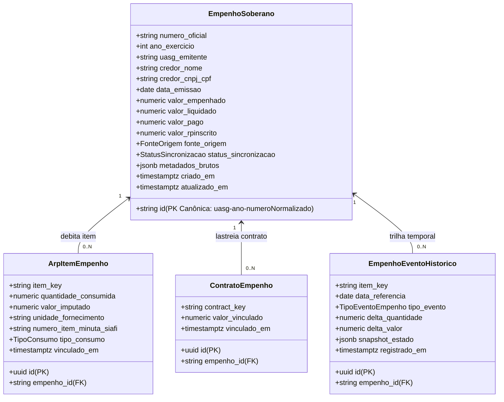

# FASE 7.1 — PLANEJAMENTO DA PERSISTÊNCIA SOBERANA DE EMPENHOS

**Sistema**: SaldoARP — Gestão Avançada de Atas de Registro de Preços e Contratos  
**Data**: 23 de Setembro de 2026  
**Status**: CONCLUÍDO — GO (PLANEJAMENTO E MODELAGEM TÉCNICA)  
**Ambiente Alvo**: Supabase PostgreSQL 17.6 (`bouutpmxexvwppcmmhdi`)  
**Metodologia**: Engenharia de Software Orientada a Domínio (DDD), Arquitetura Relacional ANSI SQL e Segregação de Responsabilidades  

---

## 1. OBJETIVO

O objetivo desta fase é produzir o **desenho técnico definitivo, relacional e ontológico da persistência soberana de Notas de Empenho** no SaldoARP, estabelecendo as fundações estruturais para as Fases 7.2 (Série Temporal) e 7.3 (Burn Rate e Farol), **sem executar nenhuma alteração de código ou banco de dados nesta etapa**.

A arquitetura projetada visa solucionar de forma definitiva:
1. A **ausência de uma entidade soberana de empenhos** no banco de dados;
2. A **volatilidade dos dados oficiais**, que hoje residem apenas em memória no navegador;
3. O **acoplamento inadequado de tabelas de vínculos** a contratos manuais legados;
4. A **necessidade de suporte pleno aos 3 cenários operacionais** da Administração Pública (Ata $\rightarrow$ Item $\rightarrow$ Contrato $\rightarrow$ Empenho; Ata $\rightarrow$ Item $\rightarrow$ Empenho direto; e Contrato autônomo $\rightarrow$ Empenho sem Ata);
5. A **preservação estrita da invariante canônica de saldo quantitativo** da Ata de Registro de Preços.

---

## 2. ESTADO ATUAL

### 2.1 Baseline Técnico
O sistema encontra-se no estado homologado após as Fases 6.6-A, 7.0 e 7.0-A:
- **70 arquivos de teste**, **611 testes PASS (100%)**;
- **TypeScript 0 erros**, **ESLint 0 erros**, **Build PASS**;
- PostgreSQL 17.6 remoto com 17 tabelas ativas;
- Integração oficial Item $\leftrightarrow$ Contrato operacional em `arp_item_contract_links` (Migration 15);
- Domínio puro de Atas (`AtaEvent`) e Central de Prazos integrada com gatilho $D-180$.

### 2.2 Diagnóstico Operacional de Empenhos
Atualmente, as consultas de empenhos do item e dos contratos são disparadas pelo cliente React em runtime via `fetchEmpenhosSaldoItem` (Compras.gov.br), `fetchContratosGovEmpenhos` (Contratos.gov.br) e `fetchPncpContractEmpenhos` (PNCP). Os dados retornados são combinados em memória via `matchAndMergeEmpenhos`, sem persistência relacional soberana.

---

## 3. AUDITORIA COMPLETA DAS ESTRUTURAS LEGADAS

Inspecionou-se integralmente o schema e os dados reais das tabelas legadas no PostgreSQL de produção (`bouutpmxexvwppcmmhdi`):

```text
                               INSPEÇÃO EM BANCO REAL
┌────────────────────────────────┬───────────────┬───────────────────────────────┐
│ Tabela Legada                  │ Linhas Reais  │ Papel Atual                   │
├────────────────────────────────┼───────────────┼───────────────────────────────┤
│ empenhos_manuais               │ 0             │ Cadastro manual contingencial │
│ empenho_links                  │ 0             │ Vínculo cota departamental    │
│ contrato_empenho_links         │ 0             │ Vínculo contrato manual (N:N) │
│ empenho_manual_quantidades     │ 0             │ Overrides de quantidade       │
│ item_empenho_link_state        │ 0             │ Controle de concorrência      │
│ item_manual_empenho_state      │ 0             │ Controle de concorrência      │
│ item_manual_quantity_state     │ 0             │ Controle de concorrência      │
└────────────────────────────────┴───────────────┴───────────────────────────────┘
```

### 3.1 `public.empenhos_manuais`
- **Finalidade Original**: Armazenar empenhos digitados manualmente pelo usuário quando a API falha.
- **Colunas**: `id (VARCHAR 100 PK)`, `item_key`, `numero`, `ano`, `arp_id`, `item_id`, `uasg`, `quantidade`, `valor_unitario`, `valor_total`, `data`, `fornecedor`, `cnpj_fornecedor`, `unidade_interna_id`, `observacao`, `origem`, `status`, `criado_em`, `atualizado_em`.
- **Constraints**: UNIQUE `uq_manual_emp (item_key, numero, ano)`. Check $2000 \le \text{ano} \le 2100$. Check $\text{quantidade} > 0$.
- **RLS e RPCs**: Leitura pública autenticada; escrita client-side revogada; manipulada pela RPC `save_manual_empenhos_atomic`.
- **Classificação**: Representa uma entidade provisória mista (mistura dados do empenho com a cota do item da ata). **Não é SSOT**.
- **Destino**: **Migração para `public.empenhos` com `fonte_origem = 'MANUAL'`** e posterior depreciação da tabela.

### 3.2 `public.empenho_links`
- **Finalidade Original**: Vincular o número de um empenho a uma alocação interna departamental (`arp_allocations.id`).
- **Colunas**: `id (UUID PK)`, `item_key (VARCHAR 100)`, `empenho_numero (VARCHAR 50)`, `allocation_id (VARCHAR 100 FK para arp_allocations ON DELETE CASCADE)`, `created_at`.
- **Constraints**: UNIQUE `uq_link_item_empenho (item_key, empenho_numero)`.
- **RLS e RPCs**: Leitura pública; escrita via RPC `save_empenho_links_atomic`.
- **Classificação**: Relacionamento puro associativo de cotas internas. O campo `empenho_numero` é uma string solta sem FK.
- **Destino**: **Preservar temporariamente**. Na transição, apontará sua referência de número para a nova chave canônica de empenho.

### 3.3 `public.contrato_empenho_links`
- **Finalidade Original**: Vincular contratos a empenhos (regra `RN-07`).
- **Colunas**: `id (VARCHAR 150 PK)`, `item_key`, `contrato_id (VARCHAR 150 FK para contratos_manuais)`, `empenho_id (VARCHAR 100 sem FK)`, `quantidade_vinculada`, `data_vinculo`, `origem`.
- **Constraints**: UNIQUE `uq_contrato_empenho (contrato_id, empenho_id)`.
- **RLS e RPCs**: Leitura pública; mutação via RPC `save_manual_contrato_atomic`.
- **Classificação**: Tabela de relacionamento acoplada à tabela legada `contratos_manuais`.
- **Destino**: **Manter read-only para contratos manuais legados**. A nova relação Contrato Oficial $\leftrightarrow$ Empenho será gerida pela tabela `public.contrato_empenhos`.

---

## 4. O MODELO SOBERANO EM 3 CAMADAS (SEM SEGUNDO SSOT)

Para impedir a criação de dois cadastros concorrentes ("empenhos oficiais" vs "empenhos manuais"), a arquitetura adota o **Princípio do Registro Único Soberano**:



### Regras de Ouro da Camada Soberana:
1. **SSOT Único**: `public.empenhos` é a **única** tabela de empenhos do sistema;
2. **Empenhos Manuais São Cidadãos de Primeira Classe com Flag**: Empenhos inseridos manualmente entram diretamente em `public.empenhos` com `fonte_origem = 'MANUAL'`;
3. **Reconciliação Automática**: Quando o webservice do governo disponibilizar a nota de empenho oficial correspondente, a linha manual é promovida para `fonte_origem = 'SINCRONIZADO'` e seus dados orçamentários são atualizados sem alterar o ID nem duplicar registros.

---

## 5. IDENTIDADE CANÔNICA DO EMPENHO

A chave canônica determinística atende aos requisitos de estabilidade federal:

$$\text{CanonicalKey} = \text{uasg} \text{ + '-' + } \text{ano} \text{ + '-' + } \text{normalizeEmpenhoNumero(numero)}$$

### Validação da Chave:
- **Exemplo**: UASG `200331`, Exercício `2026`, Número `2026NE000142` $\longrightarrow$ `200331-2026-2026NE142`;
- **Determinística**: Não depende de timestamps, UUIDs aleatórios nem de ordem de inserção;
- **Idempotente**: Duas leituras da mesma nota em APIs diferentes geram exatamente a mesma string;
- **Isolada de Contexto**: Não embute `arp_id`, `contrato_id` nem `item_id`. O empenho existe por si mesmo no SIAFI;
- **Imune a Discrepâncias Sintáticas**: Trata indistintamente `"000142"`, `"2026NE000142"` e `"2026NE142"`.

---

## 6. FATOS OFICIAIS × DADOS DERIVADOS

A tabela `public.empenhos` armazenará estritamente **fatos contábeis e oficiais**:

| Categoria | Campos Permitidos em `public.empenhos` | Onde Devem Ficar os Campos Proibidos |
|---|---|---|
| **Fatos Oficiais (Permitidos)** | `id`, `numero_oficial`, `ano_exercicio`, `uasg_emitente`, `credor_nome`, `credor_cnpj_cpf`, `data_emissao`, `valor_empenhado`, `valor_liquidado`, `valor_pago`, `valor_rpinscrito`, `fonte_origem`, `url_consulta_oficial`, `metadados_brutos`. | Na própria tabela `public.empenhos`. |
| **Consumo Físico de Item (Proibido)** | `quantidade_consumida`, `saldo_remanescente_item`. | Na tabela associativa `public.arp_item_empenhos`. |
| **Vínculos com Contrato (Proibido)** | `contract_key`, `contrato_id`. | Na tabela associativa `public.contrato_empenhos`. |
| **Cálculos Preditivos (Proibido)** | `burn_rate`, `dias_para_esgotamento`, `status_farol`. | Computados em runtime ou tabelas analíticas na Fase 7.3. |

---

## 7. FONTES OFICIAIS E ESTRATÉGIA DE RECONCILIAÇÃO

O modelo unifica os 3 provedores governamentais com a inserção manual em um único ciclo de vida:

```
[Compras.gov.br]  ───┐
[Contratos.gov.br]───┼──► [Normalizador] ──► [Upsert Idempotente] ──► public.empenhos
[PNCP]            ───┤         │                 (merge de campos)        (SSOT)
[Entrada Manual]  ───┘         ▼
                        Chave Canônica
```

### Regras de Precedência na Reconciliação:
1. **Dados Orçamentários Financeiros**: Contratos.gov.br e SIAFI têm precedência absoluta sobre Compras.gov.br;
2. **Minuta e Quantidade de Item**: Se a minuta SIAFI estiver disponível em Contratos.gov.br, seus itens são associados em `arp_item_empenhos`; caso contrário, utiliza-se a quantidade retornada por Compras.gov.br;
3. **Dados Manuais**: Sobrescritos por dados oficiais, exceto anotações e vínculos operacionais criados pelo usuário (ex: alocação interna).

---

## 8. RELACIONAMENTO CONTRATO × EMPENHO (`public.contrato_empenhos`)

Projetada como tabela associativa N:N soberana:

### Especificação Relacional:
```sql
CREATE TABLE IF NOT EXISTS public.contrato_empenhos (
  id UUID PRIMARY KEY DEFAULT gen_random_uuid(),
  contract_key VARCHAR(150) NOT NULL, -- Chave Canônica: {uasg}-{numero}-{ano}
  empenho_id VARCHAR(100) NOT NULL REFERENCES public.empenhos(id) ON DELETE CASCADE,
  valor_vinculado NUMERIC(18, 4),
  vinculado_em TIMESTAMPTZ NOT NULL DEFAULT NOW(),
  vinculado_por UUID REFERENCES auth.users(id),
  CONSTRAINT uq_contrato_empenho_soberano UNIQUE (contract_key, empenho_id)
);
```

### Propriedades Mandatórias:
- Usa `contract_key` (formato canônico universal já adotado na Fase 6);
- Suporta contratos com ou sem Ata (`Contrato.arpId` opcional);
- Suporta múltiplos empenhos por contrato (exercícios plurianuais);
- **Não exige** empenho prévio para que o contrato exista no catálogo.

---

## 9. RELACIONAMENTO ITEM × EMPENHO (`public.arp_item_empenhos`)

Projetada como tabela associativa N:N de débito quantitativo:

### Especificação Relacional:
```sql
CREATE TABLE IF NOT EXISTS public.arp_item_empenhos (
  id UUID PRIMARY KEY DEFAULT gen_random_uuid(),
  item_key VARCHAR(100) NOT NULL, -- Chave Canônica: {numeroAta}-{uasg}-{Pad5(itemNum)}
  empenho_id VARCHAR(100) NOT NULL REFERENCES public.empenhos(id) ON DELETE CASCADE,
  quantidade_consumida NUMERIC(18, 4) NOT NULL CHECK (quantidade_consumida >= 0),
  valor_imputado NUMERIC(18, 4),
  numero_item_minuta VARCHAR(10),
  tipo_consumo VARCHAR(20) NOT NULL DEFAULT 'ORDINARIO' CHECK (tipo_consumo IN ('ORDINARIO', 'REFORCO', 'AJUSTE_MANUAL')),
  observacoes TEXT,
  criado_em TIMESTAMPTZ NOT NULL DEFAULT NOW(),
  CONSTRAINT uq_item_empenho_soberano UNIQUE (item_key, empenho_id)
);
```

### Independência Semântica:
- `quantidade_consumida` e `valor_imputado` são colunas **completamente independentes**;
- Não há triggers multiplicando quantidade por preço unitário no banco.

---

## 10. SUPORTE AOS 3 CENÁRIOS OPERACIONAIS

A modelagem proposta atende de forma limpa aos três cenários auditados:

| Cenário Administrativo | Como o Modelo Representa | Tabelas Utilizadas |
|---|---|---|
| **Cenário A: Contrato decorrente de Ata** | O item gera o contrato em `arp_item_contract_links`; o empenho vincula-se ao contrato em `contrato_empenhos` e ao item em `arp_item_empenhos`. | `arp_item_contract_links` + `contrato_empenhos` + `arp_item_empenhos` |
| **Cenário B: Compra direta sem termo de contrato (Art. 95)** | O empenho liga-se **diretamente** ao item da Ata em `arp_item_empenhos`. O campo `contract_key` inexiste. | `arp_item_empenhos` isolada (Zero referências a contrato) |
| **Cenário C: Contrato autônomo sem Ata** | O contrato oficial vincula-se ao empenho em `contrato_empenhos`. O campo `item_key` inexiste. | `contrato_empenhos` isolada (Zero referências a Ata ou Item) |

---

## 11. HISTÓRICO E SÉRIE TEMPORAL (`public.empenho_eventos_historico`)

A tabela de eventos registra a evolução temporal discreta:

### Especificação Relacional:
```sql
CREATE TABLE IF NOT EXISTS public.empenho_eventos_historico (
  id UUID PRIMARY KEY DEFAULT gen_random_uuid(),
  empenho_id VARCHAR(100) NOT NULL REFERENCES public.empenhos(id) ON DELETE CASCADE,
  item_key VARCHAR(100), -- Opcional: preenchido quando o evento refere-se a consumo de item de Ata
  contract_key VARCHAR(150), -- Opcional: preenchido quando o evento refere-se a execução contratual
  data_evento DATE NOT NULL,
  tipo_evento VARCHAR(30) NOT NULL CHECK (tipo_evento IN (
    'EMISSAO_INICIAL',
    'REFORCO',
    'ANULACAO_PARCIAL',
    'CANCELAMENTO_TOTAL',
    'LIQUIDACAO_SNAPSHOT',
    'PAGAMENTO_SNAPSHOT',
    'AJUSTE_AUDITORIA'
  )),
  delta_quantidade NUMERIC(18, 4) NOT NULL DEFAULT 0,
  delta_valor NUMERIC(18, 4) NOT NULL DEFAULT 0,
  saldo_pos_evento NUMERIC(18, 4),
  metadados JSONB,
  registrado_em TIMESTAMPTZ NOT NULL DEFAULT NOW()
);
```

### Princípio da Imutabilidade do Histórico:
- A tabela `empenho_eventos_historico` é **append-only** (somente INSERT, sem UPDATE nem DELETE);
- As consultas de série temporal agregam somas cumulativas ordenadas por `data_evento ASC`.

---

## 12. IMUTABILIDADE × MUTABILIDADE DE ATRIBUTOS

| Nível | Atributos | Regra de Negócio |
|---|---|---|
| **Identidade Imutável** | `id`, `numero_oficial`, `ano_exercicio`, `uasg_emitente` | Não podem ser alterados após inserção. Se a UASG ou número mudarem, trata-se de outro empenho. |
| **Fatos Atualizáveis (Estado Atual)** | `valor_empenhado`, `valor_liquidado`, `valor_pago`, `valor_rpinscrito`, `credor_nome`, `status_sincronizacao` | Atualizados via rotina de sincronização oficial conforme evolução no SIAFI. |
| **Eventos Históricos Imutáveis** | Registros em `empenho_eventos_historico` | Proibida edição ou exclusão; garantem auditoria contábil. |

---

## 13. POLÍTICA DE SEGURANÇA (RLS E RBAC)

Alinhada ao padrão corporativo do SaldoARP:

1. **Leitura (`SELECT`)**:
   - Pública autenticada (`TO public USING (true)`) para todas as tabelas de empenhos e vínculos;
2. **Escrita (`INSERT/UPDATE/DELETE`)**:
   - **Revogada** para clientes via PostgREST direto;
   - Realizada exclusivamente por RPCs transacionais com verificação de papéis:
     ```sql
     IF NOT (public.has_role('gestor') OR public.has_role('admin')) THEN
       RAISE EXCEPTION 'UNAUTHORIZED' USING ERRCODE = '42501';
     END IF;
     ```

---

## 14. TRILHA DE AUDITORIA COMPLETA

Todas as novas tabelas serão equipadas com o trigger institucional de auditoria do SaldoARP:

```sql
CREATE TRIGGER trg_audit_empenhos
AFTER INSERT OR UPDATE OR DELETE ON public.empenhos
FOR EACH ROW EXECUTE FUNCTION public.trg_audit_log_capture();

CREATE TRIGGER trg_audit_arp_item_empenhos
AFTER INSERT OR UPDATE OR DELETE ON public.arp_item_empenhos
FOR EACH ROW EXECUTE FUNCTION public.trg_audit_log_capture();

CREATE TRIGGER trg_audit_contrato_empenhos
AFTER INSERT OR UPDATE OR DELETE ON public.contrato_empenhos
FOR EACH ROW EXECUTE FUNCTION public.trg_audit_log_capture();
```

Garante que qualquer alteração de valor ou quantidade fique gravada em `public.audit_logs` com usuário autenticado, timestamp e payload anterior/novo.

---

## 15. FLUXO DE INGESTÃO E UPSERT IDEMPOTENTE

A rotina futura de persistência operará sob o seguinte pipeline determinístico:

```text
[API Governamental]
        ↓
1. Extração de Identificadores Brutos (uasg, ano, numero)
        ↓
2. Normalização Sintática: normalizeEmpenhoNumero(numero)
        ↓
3. Montagem da Chave Canônica: {uasg}-{ano}-{normNum}
        ↓
4. Upsert Atômico na RPC:
   INSERT INTO public.empenhos (...) VALUES (...)
   ON CONFLICT (id) DO UPDATE SET
     valor_empenhado = EXCLUDED.valor_empenhado,
     valor_liquidado = EXCLUDED.valor_liquidado,
     valor_pago = EXCLUDED.valor_pago,
     atualizado_em = NOW();
        ↓
5. Associação ao Item ou Contrato:
   INSERT INTO public.arp_item_empenhos (...)
   ON CONFLICT (item_key, empenho_id) DO UPDATE SET
     quantidade_consumida = EXCLUDED.quantidade_consumida;
        ↓
6. Registro de Snapshot Histórico em empenho_eventos_historico
```

---

## 16. COMPATIBILIDADE COM `matchAndMergeEmpenhos`

A função `matchAndMergeEmpenhos` presente em `src/services/balanceService.ts` permanecerá ativa como camada de apresentação no frontend:

- **O que continuará no frontend**: Comparação entre o cache local/memória e o retorno das queries do React Query para renderização instantânea sem bloquear a UI;
- **O que passa para o banco**: A deduplicação definitiva e a promoção de empenhos manuais para sincronizados com garantia ACID;
- **Transição suave**: Nenhuma alteração disruptiva em `balanceService.ts` será necessária durante a primeira migração.

---

## 17. PRESERVAÇÃO ESTRITA DA FÓRMULA DE SALDO

A nova arquitetura garante por construção que a regra de saldo permaneça intacta:

$$\text{SaldoQuantitativoItem} = \text{QuantidadeHomologadaItem} - \sum_{\text{arp\_item\_empenhos}} \text{quantidade\_consumida}$$

- **Salvaguardas Ativas**:
  1. A tabela `contrato_empenhos` **não participa** da query de saldo da Ata;
  2. O campo `arp_item_contract_links` **não abate** saldo;
  3. Apenas linhas registradas em `arp_item_empenhos` são debitadas;
  4. Deduplicações garantidas pela chave UNIQUE `(item_key, empenho_id)`.

---

## 18. ESTRATÉGIA DE MIGRAÇÃO DOS DADOS LEGADOS

Como comprovado na Seção 3, as tabelas legadas em produção possuem atualmente **zero registros** (`count = 0`).

### Plano de Transição Controlada:
1. **Fase 1 (Criação Paralela na Fase 7.2)**: Criar as novas tabelas (`empenhos`, `arp_item_empenhos`, `contrato_empenhos`) sem tocar nas tabelas legadas;
2. **Fase 2 (Dupla Escrita Opcional / Ingestão Direta)**: O novo serviço de empenhos passará a gravar diretamente nas tabelas soberanas;
3. **Fase 3 (Depreciação dos Legados)**: As tabelas `empenhos_manuais` e `contrato_empenho_links` serão marcadas como obsoletas no schema e mantidas read-only até desativação final programada.

---

## 19. ÍNDICES DE ALTA PERFORMANCE PROJETADOS

Para suportar dashboards analíticos e consultas complexas em tempo submilisegundo:

```sql
-- Índices para public.empenhos
CREATE INDEX IF NOT EXISTS idx_empenhos_uasg_ano ON public.empenhos (uasg_emitente, ano_exercicio);
CREATE INDEX IF NOT EXISTS idx_empenhos_credor_cnpj ON public.empenhos (credor_cnpj_cpf);
CREATE INDEX IF NOT EXISTS idx_empenhos_data_emissao ON public.empenhos (data_emissao);

-- Índices para public.arp_item_empenhos
CREATE INDEX IF NOT EXISTS idx_arp_item_emp_item_key ON public.arp_item_empenhos (item_key);
CREATE INDEX IF NOT EXISTS idx_arp_item_emp_empenho_id ON public.arp_item_empenhos (empenho_id);

-- Índices para public.contrato_empenhos
CREATE INDEX IF NOT EXISTS idx_ctr_emp_contract_key ON public.contrato_empenhos (contract_key);
CREATE INDEX IF NOT EXISTS idx_ctr_emp_empenho_id ON public.contrato_empenhos (empenho_id);

-- Índices para public.empenho_eventos_historico
CREATE INDEX IF NOT EXISTS idx_emp_evt_hist_empenho ON public.empenho_eventos_historico (empenho_id);
CREATE INDEX IF NOT EXISTS idx_emp_evt_hist_item_data ON public.empenho_eventos_historico (item_key, data_evento);
CREATE INDEX IF NOT EXISTS idx_emp_evt_hist_contract_data ON public.empenho_eventos_historico (contract_key, data_evento);
```

---

## 20. PLANO SEQUENCIAL DE MIGRATIONS FUTURAS (FASE 7.2)

A implementação técnica será fatiada em 3 migrations atômicas e reversíveis:

| Migration | Arquivo Previsto | Propósito | Dependências | Estratégia de Rollback |
|---|---|---|---|---|
| **M16** | `20260925000016_canonical_empenhos_schema.sql` | Criação de `empenhos`, `arp_item_empenhos`, `contrato_empenhos`, `empenho_eventos_historico`, índices, RLS e triggers de auditoria. | Migration 15 | `DROP TABLE` em ordem reversa respeitando foreign keys. |
| **M17** | `20260925000017_rpc_empenhos_atomic.sql` | Criação das RPCs transacionais com RBAC: `save_empenho_soberano_atomic`, `link_empenho_item_atomic`, `link_empenho_contract_atomic`. | Migration 16 | `DROP FUNCTION` das RPCs criadas. |
| **M18** | `20260925000018_empenho_sync_and_views.sql` | Views analíticas de saldo histórico e funções auxiliares de ingestão. | Migration 17 | `DROP VIEW`. |

---

## 21. ESPECIFICAÇÃO DAS RPCs TRANSACIONAIS FUTURAS

Nenhuma mutação ocorrerá via PostgREST direto. As seguintes RPCs serão construídas:

1. **`save_empenho_soberano_atomic(p_empenho JSONB)`**:
   - Valida autorização de gestor/admin;
   - Higieniza e valida o identificador canônico `uasg-ano-normNum`;
   - Executa upsert na tabela `public.empenhos`;
   - Registra log de auditoria automático.
2. **`link_empenho_to_item_atomic(p_item_key TEXT, p_empenho_id TEXT, p_quantidade NUMERIC, p_valor NUMERIC)`**:
   - Valida existência do item e do empenho;
   - Insere ou atualiza vínculo em `public.arp_item_empenhos`;
   - Registra evento em `empenho_eventos_historico`.
3. **`link_empenho_to_contract_atomic(p_contract_key TEXT, p_empenho_id TEXT, p_valor NUMERIC)`**:
   - Valida existência do contrato e do empenho;
   - Insere vínculo em `public.contrato_empenhos`.

---

## 22. RISCOS MAPEADOS E SALVAGUARDAS

| Risco Técnico | Probabilidade | Severidade | Salvaguarda Arquitetural |
|---|---|---|---|
| **Colisão de números de empenho entre UASGs distintas** | Média | Alta | Chave canônica prefixada obrigatoriamente pela UASG emitente (`200331-2026-2026NE142`). |
| **Duplicação de saldo ao sincronizar com dados manuais** | Baixa | Crítica | Constraint UNIQUE `(item_key, empenho_id)` combinada com promoção de registro em vez de novo INSERT. |
| **Lentidão em consultas de histórico** | Média | Média | Índices compostos por chave e data (`item_key, data_evento`). |

---

## 23. GAPS RESIDUAIS CONHECIDOS

1. **GAP-7.1-01**: A API do Contratos.gov.br não fornece a quebra de quantidade física no endpoint mestre de empenhos, necessitando de chamada pontual ao detalhe da minuta (`fetchContratoEmpenhoDetalhe`) ou dedução matemática reversa como fallback;
2. **GAP-7.1-02**: Inexistência de webhooks nas APIs federais; a ingestão deve ocorrer sob demanda ou por rotinas periódicas de sincronização no SaldoARP.

---

## 24. PLANO DE AÇÃO PARA A FASE 7.2 (IMPLEMENTAÇÃO)

Aprovado este planejamento, a execução na **Fase 7.2** seguirá rigorosamente os seguintes passos:
1. **Passo 1**: Elaboração e aplicação controlada da Migration 16 (`canonical_empenhos_schema.sql`);
2. **Passo 2**: Elaboração e aplicação da Migration 17 (`rpc_empenhos_atomic.sql`);
3. **Passo 3**: Criação dos adapters e services em TypeScript (`empenhoSoberanoService.ts`, `empenhoRpcAdapter.ts`);
4. **Passo 4**: Criação de testes unitários abrangentes de schema, adapters e regras de idempotência;
5. **Passo 5**: Verificação de regressão total (611+ testes, zero erros de tipagem e build).

---

## 25. VEREDITO FORMAL DA FASE 7.1

### **FASE 7.1 — VEREDITO: GO (PLANEJAMENTO HOMOLOGADO)**

- **SSOT Definido**: `public.empenhos` como tabela soberana exclusiva, sem concorrência com legados;
- **Identidade Estável**: Chave canônica unívoca `uasg-ano-numeroNormalizado`;
- **Cardinalidades Comprovadas**: N:N para Contratos e N:N para Itens modeladas através de tabelas associativas dedicadas;
- **Cenários A, B e C Plenamente Atendidos**: Vínculos opcionais suportam compra direta e contratos sem Ata;
- **Separação Ontológica Rigorosa**: Quantidade física mantida isolada de valores monetários;
- **Zero Alterações de Código/Banco**: Preservação estrita das regras da fase.

> O desenho técnico e o plano de migração encontram-se **prontos e aprovados para implementação controlada na Fase 7.2**.
