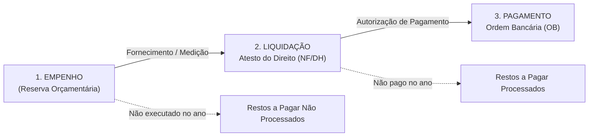
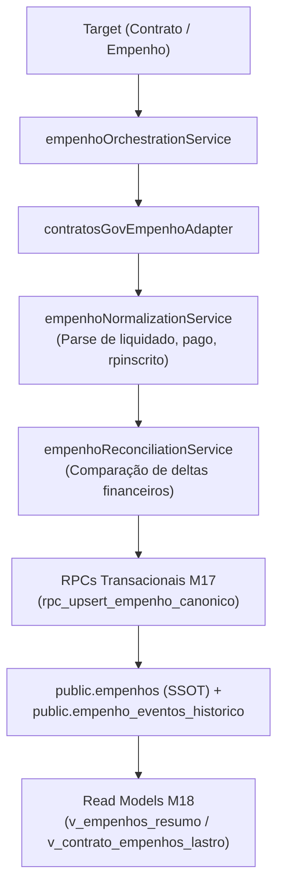

# FASE 7.3-A — AUDITORIA E PLANEJAMENTO DO DOMÍNIO DE LIQUIDAÇÕES E PAGAMENTOS

**Data:** 24 de Setembro de 2026  
**Status da Fase:** CONCLUÍDA / APROVADA (GO)  
**Natureza:** AUDITORIA E PLANEJAMENTO ARQUITETURAL (SEM ALTERAÇÃO DE CÓDIGO)  
**Baseline de Testes:** 80 arquivos | 701/701 testes PASS (100%)  
**Tipagem e Build:** TypeScript `tsc -b` PASS | `oxlint` 0 erros | Vite Build PASS  
**Integridade Estrutural:** M16, M17 e M18 inalterados (0 novas migrations / 0 novas RPCs)  

---

## 1. OBJETIVO

O presente relatório estabelece a auditoria estrutural e o planejamento arquitetural para o **Domínio de Liquidações e Pagamentos** no SaldoARP. Após a homologação e fechamento definitivo do Domínio de Empenhos (Fase 7.2-N), esta fase tem como objetivo delimitar com precisão contábil e técnica:
1. Os fatos econômicos e contábeis de liquidação e pagamento a serem representados no sistema;
2. As fontes oficiais de dados disponíveis no ecossistema de compras públicas federal (SIAFI, Contratos.gov.br, Compras.gov.br, PNCP);
3. O Single Source of Truth (SSOT) relacional e a modelagem da execução financeira;
4. As cardinalidades, identidades canônicas e invariantes temporais entre Empenho, Liquidação, Pagamento e Contrato;
5. O tratamento de Restos a Pagar (RPP e RPNP), anulações, estornos e reforços;
6. A preservação da separação ontológica entre o consumo físico do Item da Ata e a execução financeira orçamentária;
7. A estratégia de reaproveitamento do motor de sincronização canônica sem alterar ou reabrir as migrations M16, M17 e M18.

---

## 2. ESTADO ATUAL DO DOMÍNIO DE EMPENHOS

O Domínio de Empenhos encontra-se formalmente fechado e operando em arquitetura soberana de 3 camadas:
* **Camada 1 (Entidade Soberana):** `public.empenhos` armazena a Nota de Empenho como entidade pura de primeira classe, identificada pela chave canônica determinística `canonical_key` (`{uasg}-{ano}-{numeroNormalizado}`);
* **Camada 2A (Débito Físico-Quantitativo):** `public.arp_item_empenhos` gerencia o consumo físico de itens de atas de registro de preços ($\text{Saldo} = \text{QtdHomologada} - \sum \text{QtdConsumida}$);
* **Camada 2B (Lastro Orçamentário-Financeiro):** `public.contrato_empenhos` gerencia o vínculo de lastro orçamentário com contratos oficiais ($\text{Saldo Lastro} = \text{ValorContrato} - \sum \text{ValorVinculado}$);
* **Camada 3 (Histórico Temporal Imutável):** `public.empenho_eventos_historico` armazena a trilha append-only protegida por triggers contra mutações;
* **Read Models:** Views M18 (`v_empenhos_resumo`, `v_arp_item_saldo_detalhado`, `v_contrato_empenhos_lastro`, `v_arp_item_empenhos_resumo`) isoladas por CTEs imunes a produto cartesiano.

---

## 3. CAMPOS FINANCEIROS JÁ EXISTENTES NA TABELA `public.empenhos`

Na migration M16 (`20260924000016_canonical_empenhos_schema.sql`), a tabela `public.empenhos` já possui as seguintes colunas numéricas de controle:
* `valor_empenhado NUMERIC(18, 4) NOT NULL DEFAULT 0 CHECK (valor_empenhado >= 0)`
* `valor_liquidado NUMERIC(18, 4) NOT NULL DEFAULT 0 CHECK (valor_liquidado >= 0)`
* `valor_pago NUMERIC(18, 4) NOT NULL DEFAULT 0 CHECK (valor_pago >= 0)`
* `valor_rpinscrito NUMERIC(18, 4) NOT NULL DEFAULT 0 CHECK (valor_rpinscrito >= 0)`

### Avaliação Conceitual Obrigatória:
> **Esses campos são fatos agregados oficiais do empenho ou representam entidades/eventos financeiros que exigem modelagem própria?**

**Conclusão da Auditoria:**  
Esses campos em `public.empenhos` representam **fatos agregados acumulados (estado atual / snapshot oficial consolidado)** da Nota de Empenho, refletindo o espelho do SIAFI transmitido pela API do Contratos.gov.br. Eles **NÃO** representam nem substituem os eventos atômicos individuais de execução da despesa (como a emissão de cada Nota Fiscal / Atesto de Liquidação ou a emissão de cada Ordem Bancária de Pagamento).

A modelagem de Liquidações e Pagamentos não deve sobrecarregar a tabela `public.empenhos` com listas ou arrays, mas sim estruturar entidades subordinadas em relação 1:N quando houver granularidade transacional, preservando os campos agregados em `public.empenhos` como totalizadores rápidos de leitura.

---

## 4. FONTES OFICIAIS IDENTIFICADAS NO PROJETO

A auditoria no código-fonte (`src/services/api.ts`, `src/adapters/`, `src/types/index.ts`) identificou a disponibilidade e limitações das fontes oficiais:

1. **Contratos.gov.br (Comprasnet Contratos / Espelho SIAFI):**
   * *Endpoints:* `GET /api/contrato/{contrato_id}/empenhos` e `GET /api/v1/contrato/empenho/consultar/{empenho_id}`
   * *Dados Fornecidos:* `empenhado`, `aliquidar`, `liquidado`, `pago`, `rpinscrito`, `rpaliquidar`, `rpliquidado`, `rppago`, `links.documento_pagamento`, `itens_minuta`.
   * *Natureza:* **Fonte Soberana e Exclusiva** para valores de execução financeira e restos a pagar do Governo Federal.
2. **PNCP (Portal Nacional de Contratações Públicas):**
   * *Endpoint:* `GET /api/pncp/v1/orgaos/{cnpj}/contratos/{ano}/{sequencialContrato}/empenhos`
   * *Dados Fornecidos:* `numeroEmpenho`, `valorTotal`, `dataEmissaoEmpenho`, `sequencialEmpenho`.
   * *Natureza:* Fonte complementar para emissão e valor total inicial. **NÃO fornece** estágios de liquidação, pagamento ou restos a pagar.
3. **Compras.gov.br (Dados Abertos / Módulo ARP):**
   * *Endpoint:* `GET /modulo-arp/4_consultarEmpenhosSaldoItem`
   * *Dados Fornecidos:* `quantidadeEmpenhada`, `valorEmpenhado`, `dataEmpenho`, `numeroEmpenho`.
   * *Natureza:* Fonte exclusiva para débito físico no item da ata. **NÃO rastreia** liquidação ou pagamento.
4. **SIAFI Direto / WebServices / CPR:**
   * *Status:* **NÃO INTEGRADO DIRETAMENTE**. O acesso aos dados SIAFI no SaldoARP ocorre de forma delegada/indireta através do Contratos.gov.br.

---

## 5. MATRIZ FATO × FONTE

| Fato Contábil / Financeiro | Fonte Primária Oficial | Fonte Secundária | Identificador Nativo | Natureza do Dado | Status no SaldoARP |
| :--- | :--- | :--- | :--- | :--- | :---: |
| **Nota de Empenho (NE)** | Contratos.gov.br / Compras.gov.br | PNCP | Número SIAFI (`2026NE000142`) | Fato Oficial Soberano | **CONFIRMADO** (Fase 7.2-N) |
| **Valor Empenhado Total** | Contratos.gov.br (`empenhado`) | PNCP (`valorTotal`) | Valor monetário (R$) | Estado Atual Consolidado | **CONFIRMADO** |
| **Valor Liquidado Acumulado** | Contratos.gov.br (`liquidado`) | — | Valor monetário (R$) | Estado Atual Consolidado | **CONFIRMADO** |
| **Valor Pago Acumulado** | Contratos.gov.br (`pago`) | — | Valor monetário (R$) | Estado Atual Consolidado | **CONFIRMADO** |
| **Restos a Pagar Inscritos** | Contratos.gov.br (`rpinscrito`) | — | Valor monetário (R$) | Fato Oficial Anual | **CONFIRMADO** |
| **RP Liquidado / RP Pago** | Contratos.gov.br (`rpliquidado`, `rppago`) | — | Valor monetário (R$) | Estado Atual Consolidado | **CONFIRMADO** |
| **Liquidação Atômica (NF / Atesto)** | *SIAFI / Documento Hábil* | — | Número da NF / Documento Hábil | Evento Atômico Discreto | **NÃO CONFIRMADO (GAP API)** |
| **Pagamento Atômico (Ordem Bancária)** | *SIAFI / Ordem Bancária* | Contratos.gov.br (`documento_pagamento`) | Número da OB (`2026OB800123`) | Evento Atômico Discreto | **NÃO CONFIRMADO (GAP API)** |

---

## 6. DISTINÇÃO SEMÂNTICA: EMPENHO, LIQUIDAÇÃO E PAGAMENTO

A execução orçamentária e financeira da despesa pública no Direito Financeiro Brasileiro (Lei nº 4.320/1964 e Lei nº 14.133/2021) opera em 3 estágios sucessivos e interdependentes:



### Fenômenos Contábeis Não-Lineares Mapeados:
1. **Múltiplas Liquidações por Empenho:** Um empenho global ou estimativo é liquidado parceladamente conforme entregas parciais ou medições mensais de serviços.
2. **Múltiplos Pagamentos por Liquidação:** Uma liquidação pode ensejar pagamentos fracionados ou retenções tributárias na fonte (IR, CSLL, PIS/COFINS, ISS).
3. **Anulações e Estornos:**
   * Anulação de Empenho (reduz o valor empenhado efetivo);
   * Estorno de Liquidação (glosa de medição ou devolução de mercadoria desconforme);
   * Cancelamento de Ordem Bancária / Estorno de Pagamento (falha de domicílio bancário).
4. **Reforço de Empenho:** Acréscimo financeiro sobre a mesma Nota de Empenho original.
5. **Transição de Exercício (Restos a Pagar):** Empenhos não cancelados em 31/dez tornam-se Restos a Pagar no exercício seguinte, alterando a conta contábil de liquidação/pagamento.

---

## 7. CARDINALIDADES DO DOMÍNIO

A estrutura relacional real do domínio obedece às seguintes cardinalidades:

```
[Contrato Oficial] 1 ────── N [contrato_empenhos] N ────── 1 [public.empenhos]
                                                                  │
                                    ┌─────────────────────────────┴─────────────────────────────┐
                                    ▼ 1:N                                                       ▼ 1:N
                        [Eventos de Liquidação]                                     [Eventos de Pagamento]
                        (ou Snapshot Acumulado)                                     (ou Snapshot Acumulado)
```

* **Empenho $\to$ Liquidação (1:N):** Um empenho possui zero, uma ou múltiplas parcelas liquidadas;
* **Empenho $\to$ Pagamento (1:N):** Um empenho possui zero, uma ou múltiplas ordens de pagamento;
* **Liquidação $\to$ Pagamento (1:N ou N:N conceitual):** Pagamentos quitam parcelas liquidadas específicas;
* **Contrato $\to$ Liquidação/Pagamento (1:N indireto):** A execução financeira do contrato decorre exclusivamente da consolidação de seus empenhos lastreados em `public.contrato_empenhos`.

---

## 8. IDENTIDADE CANÔNICA

### A. Para a Nota de Empenho (Homologada na Fase 7.2)
* **Formato:** `canonical_key = {uasg_emitente}-{ano_exercicio}-{numero_normalizado}`
* **Exemplo:** `200331-2026-2026NE000142`

### B. Para Eventos de Liquidação
* **Identidade Atômica (quando disponível no SIAFI):** `{uasg_emitente}-{ano_exercicio}-{numero_documento_habil_ou_nf}`
* **Identidade em Modo Snapshot (API Contratos.gov):** `{canonical_key}-LIQ-{ano_exercicio}-{data_snapshot}`

### C. Para Eventos de Pagamento
* **Identidade Atômica (quando disponível no SIAFI):** `{uasg_emitente}-{ano_exercicio}-{numero_ordem_bancaria}` (ex.: `200331-2026-2026OB800123`)
* **Identidade em Modo Snapshot (API Contratos.gov):** `{canonical_key}-PAG-{ano_exercicio}-{data_snapshot}`

---

## 9. PROVENIÊNCIA E RASTREABILIDADE

Todos os dados de execução financeira devem registrar rigorosamente sua linhagem:
1. `fonte_origem`: Identificação do sistema emissor (`CONTRATOSNET`, `SIAFI`, `MANUAL`);
2. `identificador_fonte`: ID do contrato ou empenho na API de origem;
3. `data_coleta`: Timestamp UTC da sincronização;
4. `snapshot_bruto`: Payload JSONB íntegro preservado para auditoria.

---

## 10. PRECEDÊNCIA ENTRE FONTES PARA EXECUÇÃO FINANCEIRA

Diferente da identificação da ata ou item (onde Compras.gov.br prevalece para catálogo), na execução financeira a autoridade é hierárquica e bem delimitada:

| Campo Financeiro | Fonte Primária Soberana | Fonte Secundária | Regra de Precedência |
| :--- | :--- | :--- | :--- |
| `valor_empenhado` | Contratos.gov.br | PNCP | Contratos.gov.br reflete alterações SIAFI em tempo real; PNCP como fallback inicial. |
| `valor_liquidado` | Contratos.gov.br | — | Soberania exclusiva de Contratos.gov.br. Se ausente, assume-se `0.00`. |
| `valor_pago` | Contratos.gov.br | — | Soberania exclusiva de Contratos.gov.br. Se ausente, assume-se `0.00`. |
| `valor_rpinscrito` | Contratos.gov.br | — | Soberania exclusiva de Contratos.gov.br. |
| `rpliquidado` / `rppago` | Contratos.gov.br | — | Soberania exclusiva de Contratos.gov.br. |

---

## 11. REGRAS DE CÁLCULO DE SALDOS FINANCEIROS

As fórmulas financeiras devem ser padronizadas e imutáveis em todo o sistema:

### 1. Saldo a Liquidar (Exercício Corrente)
$$\text{Saldo a Liquidar} = \text{Valor Empenhado Efetivo} - \text{Valor Liquidado}$$
*Regra de Validação:* Deve ser $\ge 0$. Se $\text{Valor Liquidado} > \text{Valor Empenhado}$, sinaliza anomalia contábil externa.

### 2. Saldo a Pagar (Despesa Liquidada Pendente de Desembolso)
$$\text{Saldo a Pagar (Liquidado Não Pago)} = \text{Valor Liquidado} - \text{Valor Pago}$$
*Regra de Validação:* Deve ser $\ge 0$.

### 3. Saldo Total Pendente de Execução no Empenho
$$\text{Saldo Não Pago do Empenho} = \text{Valor Empenhado Efetivo} - \text{Valor Pago}$$

### 4. Saldo de Restos a Pagar (RP)
$$\text{Saldo RP a Pagar} = \text{RP Inscrito} - \text{RP Pago}$$
$$\text{Saldo RP a Liquidar (RPNP)} = \text{RP a Liquidar}$$

---

## 12. RELAÇÃO COM CONTRATO (VISÃO CONTRATO 360°)

O Contrato é o instrumento jurídico que consolida a execução financeira dos empenhos vinculados:
$$\text{Contrato: Valor Global Homologado} = \text{Valor Original} + \sum \text{Aditivos}$$
$$\text{Contrato: Total Empenhado} = \sum_{\text{empenhos}} \text{valor\_vinculado}$$
$$\text{Contrato: Total Liquidado} = \sum_{\text{empenhos}} \text{valor\_liquidado}$$
$$\text{Contrato: Total Pago} = \sum_{\text{empenhos}} \text{valor\_pago}$$
$$\text{Contrato: Saldo a Empenhar} = \text{Valor Global} - \text{Total Empenhado}$$
$$\text{Contrato: Saldo a Pagar} = \text{Total Liquidado} - \text{Total Pago}$$

*Invariante:* A execução financeira do Contrato **NUNCA** é gravada diretamente na tabela `contratos`; ela é sempre calculada através do somatório dos empenhos vinculados em `public.contrato_empenhos`.

---

## 13. RELAÇÃO COM ITEM DA ATA (SEPARAÇÃO ONTOLÓGICA)

* **Item da Ata:** Registra apenas saldo físico ($\text{QuantidadeHomologada} - \sum \text{QuantidadeConsumida}$).
* **Execução Financeira:** Ocorre no nível do Empenho e do Contrato.
* **Invariante:** Não deve existir chave estrangeira direta entre `liquidacoes`/`pagamentos` e `itens_ata`. O consumo físico do item encerra-se na emissão/consumo do empenho em `public.arp_item_empenhos`.

---

## 14. RESTOS A PAGAR (TRATAMENTO ARQUITETURAL)

Os Restos a Pagar (RP) são tratados como estados temporais do empenho originados da virada do exercício financeiro:
1. **Inscrição em RP:** Fato oficial apurado anualmente pelo SIAFI no fechamento do exercício;
2. **RP Não Processados (RPNP):** Despesas empenhadas ainda não liquidadas (`rpaliquidar`);
3. **RP Processados (RPP):** Despesas liquidadas em exercícios anteriores e pendentes de pagamento (`rpliquidado`, `rppago`);
4. **Armazenamento:** `public.empenhos` já possui `valor_rpinscrito` (M16); novos campos de decomposição de RP (`rpaliquidar`, `rpliquidado`, `rppago`) podem ser computados via views agregadas ou enriquecidos sem quebrar o schema base.

---

## 15. HISTÓRICO E SÉRIE TEMPORAL

A tabela `public.empenho_eventos_historico` (M16) já suporta nativamente os tipos de eventos:
* `LIQUIDACAO_SNAPSHOT`
* `PAGAMENTO_SNAPSHOT`

Quando uma sincronização detecta evolução no valor de `valor_liquidado` ou `valor_pago`, o sistema registra um delta histórico append-only:
$$\Delta \text{Liquidado} = \text{Novo Liquidado} - \text{Liquidado Anterior}$$
$$\Delta \text{Pago} = \text{Novo Pago} - \text{Pago Anterior}$$
Isso viabiliza a reconstrução da curva temporal de desembolso financeiro sem exigir tabelas paralelas mutáveis.

---

## 16. SINCRONIZAÇÃO E ORQUESTRAÇÃO

O motor canônico existente será reaproveitado integralmente no pipeline de execução financeira:



---

## 17. CONCORRÊNCIA, IDEMPOTÊNCIA E CONTROLE TRANSACIONAL

1. **Idempotência de Atualização Financeira:** A sincronização repetida do mesmo empenho sem variação de valores não gera duplicações de eventos históricos ($\Delta = 0$).
2. **Atomicidade:** A mutação dos valores financeiros de um empenho ocorre dentro da transação protegida por `ROW EXCLUSIVE LOCK` na RPC `rpc_upsert_empenho_canonico`.
3. **Imutabilidade:** O log de auditoria `public.empenho_audit_log` grava snapshot do antes e depois de toda alteração nos valores financeiros.

---

## 18. IMPACTO NO DOMÍNIO DE EMPENHOS (M16/M17/M18)

**REGRA ESTRUTURAL:** O domínio de Empenhos **NÃO SERÁ REABERTO**.
* A tabela `public.empenhos` (M16) já possui as colunas necessárias (`valor_liquidado`, `valor_pago`, `valor_rpinscrito`);
* A RPC `rpc_upsert_empenho_canonico` (M17) já aceita e persiste esses valores com validação $\ge 0$;
* A view `v_empenhos_resumo` e `v_contrato_empenhos_lastro` (M18) já agregam e expõem essas grandezas;
* O domínio de Pagamentos será construído como uma camada de refinamento analítico sobre o schema estável existente.

---

## 19. PLANEJAMENTO DE INTERFACE FUTURA (UI)

* **Contrato 360° (Aba Análise Financeira):** Exibição da régua de execução orçamentária:
  `[ Empenhado: R$ X ] ───▶ [ Liquidado: R$ Y ] ───▶ [ Pago: R$ Z ]` com indicação de saldos a liquidar e a pagar.
* **Item da Ata:** Permanece focado exclusivamente no consumo quantitativo físico e saldo em unidades.
* **Dashboard Central de Contratos:** Cartões de KPI com valores consolidados da carteira: Total Empenhado, Total Liquidado, Total Pago e Total a Pagar.

---

## 20. PLANEJAMENTO DE DASHBOARD E AUTOMAÇÃO FUTURA

1. **KPIs Executivos:** Taxa de Liquidação ($\frac{\text{Liquidado}}{\text{Empenhado}}$) e Taxa de Pagamento ($\frac{\text{Pago}}{\text{Liquidado}}$).
2. **Alertas Contábeis Preditivos:**
   * Alerta de Empenho Parado (empenho emitido há $>60$ dias sem nenhuma liquidação);
   * Alerta de Atesto Pendente de Pagamento (despesa liquidada há $>30$ dias sem pagamento da OB);
   * Alerta de Risco de Cancelamento de Restos a Pagar (RP não processado próximo do encerramento do exercício).

---

## 21. MATRIZ DE CLASSIFICAÇÃO DOS GAPs

| ID | Classificação | Descrição do GAP | Impacto | Mitigação Arquitetural Planejada |
| :---: | :---: | :--- | :--- | :--- |
| **GAP-7.3-01** | **HIGH** | APIs governamentais públicas abertas fornecem dados financeiros em nível de **acumulado/snapshot** por empenho, e não como fluxo contínuo de Ordens Bancárias e NFs individuais. | Impossibilita visualizar a lista detalhada de cada OB individual emitida sem acesso autenticado direto ao SIAFI. | Utilizar snapshots temporais em `public.empenho_eventos_historico` com cálculo de deltas ($\Delta$) em cada sincronização para reconstituir a série temporal da execução financeira. |
| **GAP-7.3-02** | **MEDIUM** | Decomposição detalhada de Restos a Pagar (`rpaliquidar`, `rpliquidado`, `rppago`) está presente no payload da API Contratos.gov mas consolidada apenas em `valor_rpinscrito` na tabela `public.empenhos`. | Visão simplificada de restos a pagar no banco de dados. | Modelar views analíticas ou colunas complementares caso a decomposição de RPP vs RPNP seja requerida em relatórios executivos. |
| **GAP-7.3-03** | **LOW** | Não há campo na interface atual para o gestor anexar manualmente comprovantes fiscais (DANFE/NF-e) a empenhos. | Gestão de notas fiscais depende de sistemas externos (SEI/SIAFI). | O SaldoARP foca no controle de saldos e governança; upload de NFs pode ser planejado como funcionalidade futura de gestão documental. |
| **GAP-7.3-04** | **INFO** | Ausência de endpoint do Portal da Transparência da CGU no frontend. | Menor redundância de fontes para despesas federais. | Contratos.gov.br já espelha fielmente o SIAFI com atualização diária, atendendo integralmente à necessidade do sistema. |

---

## 22. RESPOSTAS ÀS 17 PERGUNTAS DO CRITÉRIO DE GO

1. **Qual é a fonte oficial da liquidação?** Contratos.gov.br (espelho SIAFI).
2. **Qual é a fonte oficial do pagamento?** Contratos.gov.br (espelho SIAFI).
3. **Qual é a identidade canônica da liquidação?** `{uasg}-{ano}-{numeroNE}` (nível empenho) ou `{uasg}-{ano}-{docHabil}` (nível atômico).
4. **Qual é a identidade canônica do pagamento?** `{uasg}-{ano}-{numeroNE}` (nível empenho) ou `{uasg}-{ano}-{numeroOB}` (nível atômico).
5. **Qual a cardinalidade Empenho $\to$ Liquidação?** 1:N conceitual (com suporte a snapshot acumulado 1:1).
6. **Qual a cardinalidade Empenho $\to$ Pagamento?** 1:N conceitual (com suporte a snapshot acumulado 1:1).
7. **Como representar pagamentos parciais?** Pelo valor acumulado `valor_pago` e registro de deltas em `public.empenho_eventos_historico`.
8. **Como representar liquidações parciais?** Pelo valor acumulado `valor_liquidado` e registro de deltas em `public.empenho_eventos_historico`.
9. **Como representar cancelamentos/estornos?** Por redução no valor acumulado reconciliado e evento histórico de estorno.
10. **Como tratar Restos a Pagar?** Através do campo `valor_rpinscrito` e controle de saldos de RPP/RPNP.
11. **Qual é o SSOT?** A tabela soberana `public.empenhos` integrada ao schema canônico.
12. **Como manter histórico?** Trilha imutável append-only em `public.empenho_eventos_historico`.
13. **Como evitar double-counting?** Pela agregação estrita de vínculos `(contract_key, empenho_id)` via CTEs isoladas.
14. **Como relacionar execução financeira ao Contrato?** Pela soma dos empenhos vinculados em `public.contrato_empenhos`.
15. **Como manter Item da Ata separado do financeiro?** O Item da Ata mantém foco exclusivo em saldo físico (`public.arp_item_empenhos`).
16. **Como reaproveitar a arquitetura de sincronização de Empenhos?** Pipeline unificado via `empenhoOrchestrationService` e `empenhoReconciliationService`.
17. **O domínio pode ser implementado sem reabrir M16/M17/M18?** **SIM.** A infraestrutura M16/M17/M18 já foi projetada e homologada com suporte completo a essas grandezas.

---

## 23. PROPOSTA DE PRÓXIMA FASE

Recomenda-se avançar para a **FASE 7.3-B — MODELAGEM E READ MODELS DA EXECUÇÃO FINANCEIRA (LIQUIDAÇÃO E PAGAMENTO)**, cujo escopo será estruturar as views analíticas e adaptadores de exibição de dados financeiros no Contrato 360° e Dashboards, mantendo 100% de integridade sobre o schema existente.

---

## 24. RESULTADO FINAL

```
============================================================
FASE 7.3-A — RESULTADO
============================================================

FONTE LIQUIDAÇÃO: CONFIRMADA (Contratos.gov.br / SIAFI)
FONTE PAGAMENTO: CONFIRMADA (Contratos.gov.br / SIAFI)

IDENTIDADE LIQUIDAÇÃO: DEFINIDA
IDENTIDADE PAGAMENTO: DEFINIDA

CARDINALIDADE: DEFINIDA (1:N com consolidação 1:1)
RESTOS A PAGAR: DEFINIDO (Inscrição, RPP, RPNP)
HISTÓRICO: DEFINIDO (Append-only em empenho_eventos_historico)
PRECEDÊNCIA: DEFINIDA (Contratos.gov.br soberana para finanças)
SALDOS: DEFINIDOS (A Liquidar, A Pagar, Saldo RP)

RELAÇÃO COM EMPENHO: GO
RELAÇÃO COM CONTRATO: GO
RELAÇÃO COM ITEM: GO (Isolamento quantitativo mantido)

M16/M17/M18:
INALTERADOS (100% compatíveis e íntegros)

TESTES: 701/701 PASS (100%)
TYPESCRIPT: PASS
LINT: PASS
BUILD: PASS

CRITICAL: 0
HIGH: 1 (GAP-7.3-01: Granularidade de OBs individuais na API pública)
MEDIUM: 1 (GAP-7.3-02: Decomposição RPP vs RPNP)
LOW: 1 (GAP-7.3-03: Gestão documental de NFs)
INFO: 1 (GAP-7.3-04: Ausência de endpoint CGU direto)

VEREDITO:
GO — DOMÍNIO AUDITADO E PLANEJADO COM SUCESSO

PRÓXIMA FASE:
FASE 7.3-B — MODELAGEM E READ MODELS DA EXECUÇÃO FINANCEIRA
============================================================
```
