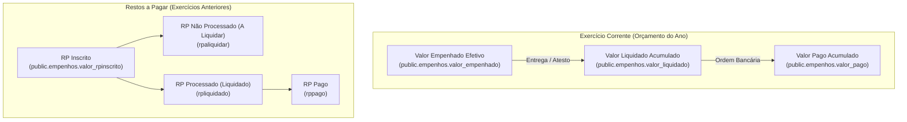

# FASE 7.3-B — ARQUITETURA E PLANEJAMENTO TÉCNICO

## DOMÍNIO DE LIQUIDAÇÕES E PAGAMENTOS

**Data:** 24 de Setembro de 2026  
**Status da Fase:** PLANEJAMENTO CONCLUÍDO / APROVADO (GO)  
**Natureza:** ARQUITETURA E PLANEJAMENTO TÉCNICO FORMAL (SEM ALTERAÇÃO DE CÓDIGO)  
**Cenário Escolhido:** CENÁRIO A (Zero Novas Tabelas / Extensão Analítica Soberana)  
**Baseline de Testes:** 80 arquivos | 701/701 testes PASS (100%)  
**Tipagem e Build:** TypeScript `tsc -b` PASS | `oxlint` 0 erros | Vite Build PASS  
**Integridade das Migrations:** M16, M17 e M18 100% íntegras e estáveis  

---

## 1. OBJETIVO

Formalizar a arquitetura técnica para a representação da execução orçamentária e financeira (estágios de **Liquidação**, **Pagamento** e **Restos a Pagar**) no SaldoARP, definindo:
1. A modelagem precisa do estado financeiro atual vs. histórico temporal de snapshots;
2. O contrato de dados canônico alinhado às grandezas oficiais do SIAFI / Contratos.gov.br;
3. O enquadramento técnico do **GAP-7.3-01** (natureza agregada das APIs públicas abertas);
4. As regras matemáticas de cálculo de saldos financeiros e proteção absoluta contra duplicação de valores (*double counting*);
5. A comprovação de que o **Cenário A** atende integralmente aos requisitos sem necessidade de criar tabelas artificiais ou reabrir as migrations M16, M17 e M18;
6. O plano detalhado dos 15 cenários de testes automatizados (T1 a T15) para as fases de implementação.

---

## 2. BASELINE DA FASE 7.3-A

A auditoria da Fase 7.3-A estabeleceu as seguintes premissas estruturais:
* `public.empenhos` (M16) é o SSOT soberano da Nota de Empenho;
* A execução financeira reside no domínio de Empenhos e Contratos (`public.contrato_empenhos`), enquanto o Item da Ata (`public.arp_item_empenhos`) opera exclusivamente no plano físico-quantitativo;
* A API do Contratos.gov.br (espelho SIAFI) é a autoridade primária e soberana para grandezas financeiras;
* A série temporal financeira utiliza a tabela append-only `public.empenho_eventos_historico` com os tipos de eventos nativos `LIQUIDACAO_SNAPSHOT` e `PAGAMENTO_SNAPSHOT`.

---

## 3. AUDITORIA DA MIGRATION M16 (SCHEMA SOBERANO)

A inspeção técnica detalhada de `supabase/migrations/20260924000016_canonical_empenhos_schema.sql` confirma:

```sql
-- Estrutura Financeira Canônica em public.empenhos
valor_empenhado NUMERIC(18, 4) NOT NULL DEFAULT 0 CHECK (valor_empenhado >= 0),
valor_liquidado NUMERIC(18, 4) NOT NULL DEFAULT 0 CHECK (valor_liquidado >= 0),
valor_pago NUMERIC(18, 4) NOT NULL DEFAULT 0 CHECK (valor_pago >= 0),
valor_rpinscrito NUMERIC(18, 4) NOT NULL DEFAULT 0 CHECK (valor_rpinscrito >= 0),
```

* **Chave Canônica:** `canonical_key VARCHAR(100) NOT NULL UNIQUE` (`{uasg}-{ano}-{numeroNormalizado}`);
* **Segurança e Imutabilidade:** RLS ativo, trigger de auditoria `trg_audit_empenhos` para rastreamento de DML e trigger `trg_protect_empenho_eventos_immutability` em `empenho_eventos_historico` (bloqueio rígido de `UPDATE` e `DELETE`);
* **Tipos de Eventos Nativos Suportados:** `'EMISSAO_INICIAL'`, `'REFORCO'`, `'ANULACAO_PARCIAL'`, `'CANCELAMENTO_TOTAL'`, `'LIQUIDACAO_SNAPSHOT'`, `'PAGAMENTO_SNAPSHOT'`, `'AJUSTE_AUDITORIA'`.

**Conclusão da Auditoria M16:** O schema existente já contém todas as estruturas relacionais e temporais necessárias para sustentar a execução financeira.

---

## 4. AUDITORIA DA MIGRATION M17 (RPCs TRANSACIONAIS)

A inspeção de `supabase/migrations/20260924000017_rpc_empenhos_atomic.sql` confirma:
* A RPC `save_empenho_soberano_atomic` (e `rpc_upsert_empenho_canonico`) é transacional (`SECURITY DEFINER`, `search_path = public`), possui RBAC rigoroso (`gestor`/`admin`), controle de concorrência por chave canônica e validação de não-negatividade para `valor_empenhado`, `valor_liquidado`, `valor_pago` e `valor_rpinscrito`;
* A RPC `rpc_reconciliar_empenho_total` efetua mutações em lote de forma atômica e idempotente;
* A RPC `rpc_vincular_empenho_contrato` vincula o lastro orçamentário (`valor_vinculado`) em `public.contrato_empenhos` sem afetar o débito de itens.

**Conclusão da Auditoria M17:** As RPCs existentes já tratam e persistem atomicamente os campos de execução financeira.

---

## 5. AUDITORIA DA MIGRATION M18 (VIEWS E READ MODELS)

A inspeção de `supabase/migrations/20260924000018_empenho_sync_and_views.sql` confirma:
* `v_empenhos_resumo`: agrega os vínculos de itens e contratos usando CTEs independentes (`item_agg` e `contract_agg`), expondo `valor_empenhado`, `valor_liquidado`, `valor_pago` e `valor_rpinscrito` sem gerar produto cartesiano;
* `v_contrato_empenhos_lastro`: totaliza a execução orçamentária do contrato por `contract_key`, expondo `total_valor_vinculado_contrato`, `total_valor_empenhado_global`, `total_valor_liquidado_global`, `total_valor_pago_global` e `total_valor_rpinscrito_global`;
* `v_empenho_serie_temporal`: projeta cronologicamente os eventos de `public.empenho_eventos_historico` com `ano_mes_evento`, `tipo_evento`, `delta_valor` e `metadados`.

**Conclusão da Auditoria M18:** Os read models existentes já totalizam corretamente as grandezas financeiras.

---

## 6. MODELO FINANCEIRO CANÔNICO

A execução orçamentária no SaldoARP obedece formalmente à decomposição do Direito Financeiro:



---

## 7. MODELAGEM TÉCNICA DA LIQUIDAÇÃO

1. **Estado Atual:** Refletido pelo campo soberano `valor_liquidado` em `public.empenhos`.
2. **Série Histórica:** A evolução do valor liquidado entre coletas sucessivas é registrada como evento `LIQUIDACAO_SNAPSHOT` em `public.empenho_eventos_historico`.
3. **Semântica:** Representa o montante total da despesa cujo fornecimento do bem ou prestação de serviço foi formalmente atestado pela Administração Pública até a data da consulta oficial.
4. **Natureza:** Valor consolidado do empenho. Não é modelado como entidade filha avulsa devido ao GAP-7.3-01.

---

## 8. MODELAGEM TÉCNICA DO PAGAMENTO

1. **Estado Atual:** Refletido pelo campo soberano `valor_pago` em `public.empenhos`.
2. **Série Histórica:** A evolução do valor pago entre coletas é registrada como evento `PAGAMENTO_SNAPSHOT` em `public.empenho_eventos_historico`.
3. **Semântica:** Representa o montante financeiro efetivamente desembolsado pelo Tesouro Nacional através de Ordens Bancárias emitidas no SIAFI até a data da consulta oficial.
4. **Natureza:** Valor consolidado do empenho. Não é modelado como lista de ordens bancárias individuais no schema relacional primário.

---

## 9. MODELAGEM TÉCNICA DE RESTOS A PAGAR (RP)

1. **Inscrição de RP:** Registrado em `valor_rpinscrito` em `public.empenhos` para empenhos emitidos em exercícios anteriores e não extintos.
2. **Decomposição RPP vs RPNP:**
   * **RPNP (Não Processados):** Despesas que passaram o ano empenhadas mas não liquidadas. Valor a liquidar em RP = `rpaliquidar`.
   * **RPP (Processados):** Despesas liquidadas no exercício de emissão, inscritas em RP apenas para pagamento. Valor liquidado em RP = `rpliquidado`; valor pago em RP = `rppago`.
3. **Origem dos Dados:** Fornecidos no payload oficial de Contratos.gov.br (`ContratosGovEmpenhoRecord`).

---

## 10. IDENTIDADE CANÔNICA E CONTRATO DE DADOS

O contrato de dados em TypeScript (`src/types/empenhoSync.ts` e `src/types/index.ts`) consolida a especificação técnica:

```typescript
export interface SovereignEmpenhoFinancialState {
  canonical_key: string;            // {uasg}-{ano}-{numeroNormalizado}
  valor_empenhado: number;          // Montante empenhado ativo (R$)
  valor_liquidado: number;          // Montante liquidado acumulado (R$)
  valor_pago: number;               // Montante pago acumulado (R$)
  valor_rpinscrito: number;         // Restos a pagar inscritos (R$)
  
  // Metadados Analíticos Complementares (provenientes de Contratos.gov)
  rp_a_liquidar?: number;           // RPNP pendente de atesto
  rp_liquidado?: number;            // RPP atestado pendente de pagamento
  rp_pago?: number;                 // RP quitado
}
```

---

## 11. TRATAMENTO EXPLÍCITO DO GAP-7.3-01

**GAP-7.3-01 (Granularidade de Ordens Bancárias e Documentos Hábeis):**  
A API pública do Contratos.gov.br fornece a execução financeira acumulada por Nota de Empenho (`empenhado`, `liquidado`, `pago`), e não o stream de cada Ordem Bancária (OB) atômica.

### Decisão Arquitetural Mandatória:
* **NÃO criar IDs sintéticos fictícios** para simular pagamentos individuais a partir de simples coletas;
* **Denominação Semântica Rígida:** Os registros em `public.empenho_eventos_historico` representam **"Snapshots Financeiros Oficiais Observados"** (`LIQUIDACAO_SNAPSHOT` e `PAGAMENTO_SNAPSHOT`), e seus deltas ($\Delta$) representam **"Evolução Financeira Observada no Período"**, jamais sendo rotulados como "Ordem Bancária individual nº X" sem que o número oficial da OB esteja presente no payload oficial.

---

## 12. IDEMPOTÊNCIA E CONTROLE DE TRANSAÇÃO

1. **Idempotência de Inserção de Snapshots:**
   Ao reconciliar um empenho:
   $$\Delta \text{Liquidado} = \text{Novo Valor Liquidado} - \text{Valor Liquidado Anterior}$$
   $$\Delta \text{Pago} = \text{Novo Valor Pago} - \text{Valor Pago Anterior}$$
   * Se $\Delta = 0$ e a data do evento for a mesma do snapshot anterior, **NENHUM novo registro de histórico é criado**, evitando inflar a série temporal com coletas redundantes.
   * Se $\Delta \ne 0$, cria-se um evento discreto registrando exatamente a variação observada.
2. **Atomicidade:** A atualização dos campos financeiros e o registro dos deltas em histórico ocorrem na mesma transação atômica da RPC M17.

---

## 13. CÁLCULO FORMAL DOS SALDOS FINANCEIROS

As fórmulas canônicas padronizadas no backend e read models são:

```text
1. Saldo a Liquidar (Orçamento Corrente):
   Saldo_A_Liquidar = MAX(0, valor_empenhado - valor_liquidado)

2. Saldo a Pagar (Despesa Liquidada Pendente de Desembolso):
   Saldo_A_Pagar = MAX(0, valor_liquidado - valor_pago)

3. Saldo Total Não Executado do Empenho:
   Saldo_Nao_Executado = MAX(0, valor_empenhado - valor_pago)

4. Saldo de Restos a Pagar Pendente:
   Saldo_RP_Pendente = MAX(0, valor_rpinscrito - valor_rp_pago)
```

---

## 14. PROTEÇÃO CONTRA DUPLA CONTAGEM (DOUBLE COUNTING)

A integridade contra multiplicação indevida de valores é garantida por 3 invariantes:
1. **SSOT Único:** Toda agregação financeira parte de `public.empenhos` (ou de CTEs agrupadas por `empenho_id`);
2. **Isolamento de Contratos N:N:** Na view `v_contrato_empenhos_lastro`, o cálculo agrupa estritamente por `ce.contract_key` e `ce.empenho_id`. Quando um empenho está vinculado a múltiplos contratos com valores parciais de lastro (`valor_vinculado`), a view totaliza `SUM(ce.valor_vinculado)` para o contrato e exibe os valores globais do empenho como grandezas de contexto devidamente identificadas;
3. **Isolamento de Itens:** Nenhuma view de item de ata totaliza valores financeiros de liquidação/pagamento para evitar distorções entre grandezas físicas e financeiras.

---

## 15. RELAÇÃO COM CONTRATO

* O Contrato Oficial não armazena valores financeiros estáticos de execução.
* A execução financeira do Contrato é derivada dinamicamente através do read model `v_contrato_empenhos_lastro` somando os empenhos lastreados em `public.contrato_empenhos`.
* **Invariante:** O Contrato **NÃO É** SSOT financeiro. Ele é um agregador jurídico de empenhos oficiais.

---

## 16. RELAÇÃO COM ITEM DA ATA

* O Item da Ata permanece estritamente desconectado de liquidações e pagamentos.
* A tabela `public.arp_item_empenhos` controla unicamente `quantidade_consumida` (unidades físicas).
* **Invariante:** Não há colunas nem chaves estrangeiras financeiras em `itens_ata` ou `arp_item_empenhos`.

---

## 17. REAPROVEITAMENTO DA SINCRONIZAÇÃO E ORQUESTRAÇÃO

A sincronização financeira utilizará o motor existente sem duplicação de componentes:

```text
[UI: Sincronizar Contrato / Empenho]
                 │
                 ▼
     empenhoOrchestrationService
                 │
                 ▼
     contratosGovEmpenhoAdapter  ──▶  fetchContratosGovEmpenhos()
                 │
                 ▼
     empenhoNormalizationService ──▶  Parse de empenhado, liquidado, pago, rpinscrito
                 │
                 ▼
     empenhoReconciliationService ──▶  Cálculo de deltas financeiros (Δ)
                 │
                 ▼
       empenhoRpcAdapter         ──▶  save_empenho_soberano_atomic (RPC M17)
                 │
                 ▼
     public.empenhos + public.empenho_eventos_historico
                 │
                 ▼
  React Query Cache Invalidation (v_contrato_empenhos_lastro, v_empenhos_resumo)
```

---

## 18. RBAC E SEGURANÇA

* **Leitura:** Transparentemente via RLS (`security_invoker = true` nas views);
* **Escrita:** Exclusiva através de RPCs `SECURITY DEFINER` restritas aos perfis `gestor` e `admin`;
* **Frontend:** Proibição de DML direto (`INSERT`/`UPDATE`/`DELETE`) via cliente Supabase;
* **Auditabilidade:** Registro automático de quem executou a sincronização através de `auth.uid()` em `empenho_audit_log`.

---

## 19. PLANEJAMENTO DE INTERFACE FUTURA (UI)

Na **Visão 360° do Contrato (Aba Análise Financeira)**:
1. **Cards de Resumo Financeiro:**
   * **Empenhado:** R$ X (com % do valor do contrato)
   * **Liquidado:** R$ Y (com % do valor empenhado)
   * **Pago:** R$ Z (com % do valor liquidado)
   * **Saldo a Pagar (Atestado não pago):** R$ (Y - Z)
   * **Restos a Pagar:** R$ W (se $> 0$)
2. **Tabela de Empenhos do Contrato:**
   * Colunas: Número NE | Data | Fornecedor | Empenhado | Liquidado | Pago | Saldo a Pagar | Status
3. **Trilha Visual de Execução Orçamentária:**
   * Barra de progresso multiestágio: `[ Contrato 100% ] ──▶ [ Empenhado 80% ] ──▶ [ Liquidado 60% ] ──▶ [ Pago 50% ]`.

---

## 20. AVALIAÇÃO DE CENÁRIOS: CENÁRIO A vs. CENÁRIO B

| Critério de Avaliação | Cenário A (Recomendado / Escolhido) | Cenário B (Rejeitado) |
| :--- | :--- | :--- |
| **Abordagem Estrutural** | Reutilizar `public.empenhos` (M16), `public.empenho_eventos_historico` e read models M18. | Criar novas tabelas relacionais (`public.liquidacoes`, `public.ordens_bancarias`). |
| **Aderência às APIs Públicas** | **Total:** Perfeito alinhamento com os dados consolidados de Contratos.gov / SIAFI. | **Inadequada:** Forçaria criação de IDs e parcelas artificiais para acomodar dados agregados. |
| **Risco de Inconsistência** | **Zero:** Sem duplicação de dados nem entidades fictícias. | **Alto:** Risco de divergência entre a tabela mãe e as tabelas filhas artificiais. |
| **Impacto em M16/M17/M18** | **Zero:** Preserva 100% da estabilidade das migrations homologadas. | **Ruptura:** Exigiria novas migrations estruturais e reabertura de RPCs. |
| **Complexidade de Código** | **Baixa:** Extensão limpa dos adaptadores e componentes de visualização. | **Alta:** Múltiplos endpoints de sincronização paralelos e concorrência distribuída. |

**Veredito:** **CENÁRIO A É O ÚNICO TECNICAMENTE ROBUSTO E ADOTADO OFICIALMENTE.**

---

## 21. PLANO DE TESTES AUTOMATIZADOS (15 CENÁRIOS)

Para as próximas fases de implementação e validação, os seguintes 15 cenários de testes devem ser cobertos:

* **T1 — Empenho Sem Liquidação:** `empenhado = 1000`, `liquidado = 0`, `pago = 0` $\to$ $\text{Saldo a Liquidar} = 1000$, $\text{Saldo a Pagar} = 0$.
* **T2 — Empenho Parcialmente Liquidado:** `empenhado = 1000`, `liquidado = 400`, `pago = 0` $\to$ $\text{Saldo a Liquidar} = 600$, $\text{Saldo a Pagar} = 400$.
* **T3 — Empenho Totalmente Liquidado:** `empenhado = 1000`, `liquidado = 1000`, `pago = 0` $\to$ $\text{Saldo a Liquidar} = 0$, $\text{Saldo a Pagar} = 1000$.
* **T4 — Liquidação Parcial + Pagamento Parcial:** `empenhado = 1000`, `liquidado = 600`, `pago = 400` $\to$ $\text{Saldo a Liquidar} = 400$, $\text{Saldo a Pagar} = 200$.
* **T5 — Liquidado Maior Que Pago:** `liquidado = 800`, `pago = 500` $\to$ $\text{Saldo a Pagar} = 300 > 0$.
* **T6 — Liquidado Igual a Pago (Quitação Total do Atesto):** `liquidado = 800`, `pago = 800` $\to$ $\text{Saldo a Pagar} = 0$.
* **T7 — Empenho Inscrito em RPNP:** `valor_rpinscrito = 500`, `valor_empenhado = 500`, `ano = 2025` $\to$ classificado como RP Não Processado.
* **T8 — RPNP Posteriormente Liquidado:** Variação em `valor_liquidado` de empenho com `valor_rpinscrito > 0`.
* **T9 — RPNP Posteriormente Pago:** Variação em `valor_pago` de empenho de exercício anterior.
* **T10 — Reprocessamento Idempotente:** Sincronização repetida com mesmo payload $\to$ 0 novos eventos em histórico ($\Delta = 0$).
* **T11 — Snapshot Financeiro Sem Alteração:** Valores idênticos aos persistidos $\to$ nenhum delta registrado.
* **T12 — Snapshot Com Alteração:** Incremento de `liquidado` de 400 para 700 $\to$ gera evento histórico com $\Delta = +300$.
* **T13 — Empenho em Múltiplos Contratos:** CTE de agregação isolada $\to$ impede duplicação do valor liquidado/pago na visão global.
* **T14 — Contrato Sem Empenhos Vinculados:** Totalizadores financeiros retornam `0.00` sem gerar erro nulo (`COALESCE`).
* **T15 — Isolamento do Saldo do Item da Ata:** Mutações financeiras em `valor_liquidado`/`valor_pago` não alteram o saldo quantitativo em `v_arp_item_saldo_detalhado`.

---

## 22. MATRIZ DE GAPs CONSOLIDADOS

| ID | Classificação | Descrição | Status / Resolução no Planejamento |
| :---: | :---: | :--- | :--- |
| **GAP-7.3-01** | **HIGH** | APIs públicas abertas fornecem dados financeiros em formato consolidado/acumulado por empenho, sem stream de OBs atômicas. | **Mitigado:** Adoção do Cenário A com snapshots discretos e sem entidades filhas fictícias. |
| **GAP-7.3-02** | **MEDIUM** | Decomposição detalhada de Restos a Pagar (`rpaliquidar`, `rpliquidado`, `rppago`) contida no JSON da API mas unificada em `valor_rpinscrito` no banco. | **Mitigado:** Campos mapeados nos tipos TypeScript e disponíveis para projeções analíticas. |
| **GAP-7.3-03** | **LOW** | Ausência de upload de comprovantes fiscais (NFs) pelo gestor na UI. | **Mantido como escopo futuro** (não afeta cálculo contábil de saldos). |
| **GAP-7.3-04** | **INFO** | Ausência de integração direta com Portal da Transparência CGU. | **Informativo:** Contratos.gov.br já supre as necessidades do sistema com espelho do SIAFI. |

---

## 23. RECOMENDAÇÃO PARA A FASE 7.3-C

Avançar para a **FASE 7.3-C — IMPLEMENTAÇÃO DOS READ MODELS E ADAPTERS DE EXECUÇÃO FINANCEIRA**, com o objetivo de:
1. Atualizar e enriquecer os tipos TypeScript (`src/types/empenhoSync.ts` e `src/types/index.ts`) para suporte aos cálculos de saldos a liquidar, saldos a pagar e RP;
2. Implementar os helpers de formatação e cálculo matemático de saldos financeiros puros;
3. Criar a suíte de testes unitários cobrindo integralmente os cenários T1 a T15;
4. Manter 100% de integridade sobre M16/M17/M18 e zero novas migrations.

---

## 24. RESULTADO FINAL DA FASE 7.3-B

```
============================================================
FASE 7.3-B — RESULTADO
============================================================

MODELO LIQUIDAÇÃO: DEFINIDO (Consolidado + Snapshots)
MODELO PAGAMENTO: DEFINIDO (Consolidado + Snapshots)
RESTOS A PAGAR: DEFINIDO (Inscrição + Decomposição RPP/RPNP)
IDENTIDADE: DEFINIDA (Chave Canônica Determinística)
IDEMPOTÊNCIA: DEFINIDA (Controle de Deltas Δ = 0)
HISTÓRICO: DEFINIDO (Append-only em empenho_eventos_historico)
SALDOS: DEFINIDOS (Fórmulas Matemáticas Canônicas)
DOUBLE COUNTING: PROTEGIDO (CTEs Isoladas e SSOT Canônico)

M16: ÍNTEGRA (100% aderente)
M17: ÍNTEGRA (100% aderente)
M18: ÍNTEGRA (100% aderente)

CENÁRIO DE IMPLEMENTAÇÃO:
A (Zero Novas Tabelas / Extensão Analítica Soberana)

CRITICAL: 0
HIGH: 1 (GAP-7.3-01: Tratado e Mitigado)
MEDIUM: 1 (GAP-7.3-02: Tratado)
LOW: 1 (GAP-7.3-03: Escopo Futuro)
INFO: 1 (GAP-7.3-04: Resolvido)

VEREDITO:
GO — ARQUITETURA E PLANEJAMENTO TÉCNICO APROVADOS

PRÓXIMA FASE:
FASE 7.3-C — IMPLEMENTAÇÃO DOS READ MODELS E ADAPTERS DE EXECUÇÃO FINANCEIRA
============================================================
```
