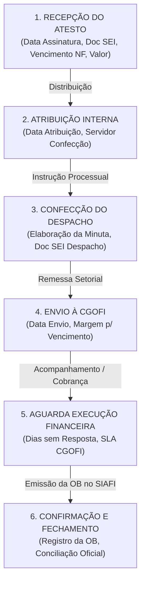
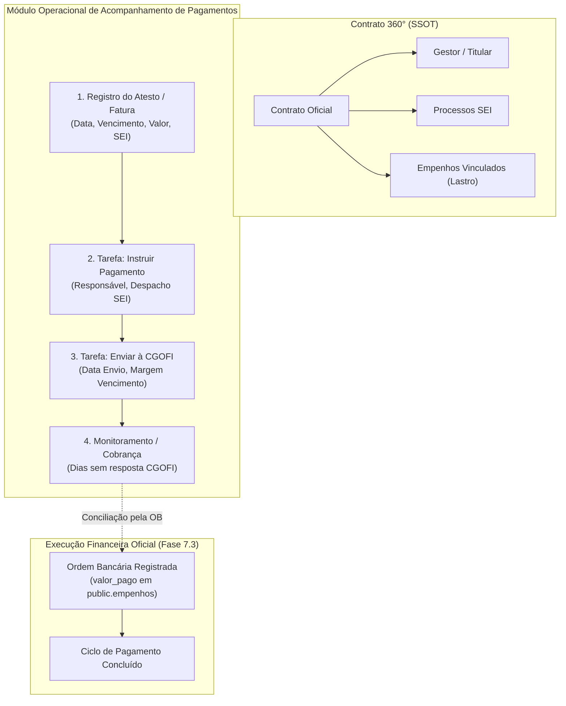

# FASE 7.4-A — AUDITORIA DO PROCESSO OPERACIONAL DE ACOMPANHAMENTO DE PAGAMENTOS

**Data:** 24 de Setembro de 2026  
**Status da Fase:** CONCLUÍDA / APROVADA (GO)  
**Natureza:** AUDITORIA E MODELAGEM CONCEITUAL DO PROCESSO OPERACIONAL  
**Documento Fonte Auditado:** Planilha Operacional de Contratos (`Contratos(1).xlsx` — Aba PGTO e Correlatas)  
**Baseline de Testes:** 81 arquivos de teste | 716/716 testes PASS (100%)  
**Integridade das Migrations:** M16, M17 e M18 100% íntegras (Zero novas migrations, Zero DML direto)  

---

## 1. OBJETIVO

Auditar e modelar conceitualmente o **processo operacional de acompanhamento de pagamentos** executado no dia a dia pela equipe de gestão contratual, a partir da evidência empírica contida na aba **PGTO** da planilha `Contratos(1).xlsx`.

O objetivo fundamental é **não confundir** o *fato financeiro oficial do pagamento* (já homologado nas Fases 7.3-A a 7.3-D via SIAFI/Contratos.gov.br em `public.empenhos`) com o *processo administrativo e operacional de instrução, tramitação, controle de prazos e despacho para o setor financeiro (CGOFI)*.

---

## 2. FONTE DOCUMENTAL AUDITADA

A auditoria baseou-se na análise detalhada da planilha real de gestão contratual da unidade gestora (`Contratos(1).xlsx`), com foco exaustivo na aba **PGTO** e na sua integração com as abas **Contratos**, **Empenhos**, **Atribuição Processos** e **Panorama**.

---

## 3. AUDITORIA DA ABA PGTO: COLUNAS E SEMÂNTICA

A aba **PGTO** contém 27 colunas operacionais estruturadas:

| Coluna na Planilha | Tipo de Dado | Semântica Operacional Identificada | Classificação |
| :--- | :--- | :--- | :--- |
| **ORD** | Número | Sequencial ordinal da linha na planilha. | Controle de Linha |
| **TITULAR** | Texto | Fiscal titular ou gestor responsável pelo contrato. | Atribuição de Papel |
| **CONTRATO** | Texto/Número | Número do contrato formal (ex.: `12/2024`). | Identificador do Contrato |
| **ANO** | Número | Ano do exercício do contrato (ex.: `2024`). | Identificador do Contrato |
| **SEI CONTRATO** | Texto | Número do processo SEI principal de gestão do contrato. | Referência Processual |
| **Dias p/ o término Contrato** | Número (Fórmula) | Dias corridos restantes até o encerramento da vigência. | Dado Derivado/Calculado |
| **Vigente?** | Texto (Fórmula) | Indicador booleano de vigência contratual ativa (`SIM`/`NÃO`). | Dado Derivado/Calculado |
| **Serviço Cont.?** | Texto | Classificação de serviço contínuo (Art. 106 da Lei 14.133/2021). | Atributo Contratual |
| **DATA ASSINATURA DO ATESTO** | Data | Data em que o fiscal técnico assinou o Termo de Atesto de Conformidade. | **Gatilho Operacional** |
| **VENCIMENTO DA FATURA NOTA OUTROS** | Data | Data limite fatal de vencimento da fatura/NF sem encargos de mora. | **Prazo Fatal Externo** |
| **SEI DO ATESTO** | Texto | Número do documento SEI ou processo com o atesto assinado. | Referência Documental |
| **Nº de Notas** | Número | Quantidade de notas fiscais/faturas abrangidas naquele atesto. | Metadado Operacional |
| **DATA DA ATRIBUIÇÃO** | Data | Data em que a instrução do pagamento foi designada a um servidor. | Marco Temporal Interno |
| **DIAS ÚTEIS P/ VENCI. DA DATA Q RECEBEU ATESTO** | Número (Fórmula) | Janela total de trabalho da equipe em dias úteis até o vencimento. | Indicador Temporal |
| **DESPACHO PAGAMENTO** | Texto | Número do documento SEI com o despacho de instrução de pagamento. | **Entregável / Produto** |
| **Confecção** | Texto | Nome do servidor responsável pela instrução e confecção do despacho. | Responsável Operacional |
| **Data de envio P/ CGOFI** | Data | Data em que o processo foi remetido para a CGOFI pagar. | **Marco de Conclusão Interna** |
| **DIAS ÚTEIS SEM RESPOSTA** | Número (Fórmula) | Dias úteis decorridos desde o envio à CGOFI até hoje (ou até a OB). | **Contador de Cobrança** |
| **DIAS ÚTEIS P/ RESPOSTA** | Número | Meta acordada/SLA para pagamento pelo setor financeiro. | Meta / Indicador |
| **ENCAMINHOU A CGOFI C/ QTOS DIAS ÚTEIS P/ VENCIMENTO** | Número (Fórmula) | Margem de segurança de dias úteis remanescentes para pagamento sem mora. | **Indicador de Desempenho** |
| **Valor atualizado do Contrato** | Moeda (R$) | Valor global financeiro do contrato após aditivos/apostilamentos. | Dado Canônico do Contrato |
| **VALOR DO ATESTO** | Moeda (R$) | Montante liquidado no atesto específico (R$). | **Valor da Operação** |
| **Saldo** | Moeda (R$) (Fórmula) | Saldo contratual remanescente após abatimento do atesto. | Dado Calculado |
| **OB** | Texto | Número da Ordem Bancária SIAFI emitida pela CGOFI (ex.: `2026OB800123`). | **Evidência Oficial de Quitação** |
| **LEi** | Texto | Regime licitatório (`14.133/2021` ou `8.666/1993`). | Atributo do Contrato |
| **PROCESSO SEI** | Texto | Número do processo SEI de pagamento/liquidação. | Referência Processual |
| **Objeto** | Texto | Descrição sucinta do objeto contratual. | Dado Canônico do Contrato |
| **Empresa** | Texto | Razão Social ou Nome Fantasia da empresa contratada. | Dado Canônico do Contrato |

---

## 4. RELAÇÃO COM AS DEMAIS ABAS DA PLANILHA

* **Aba Contratos:** SSOT tabular dos atributos estáticos dos contratos (vigência, empresa, valor global, objeto, fiscal). Grande parte das colunas na aba PGTO (`Objeto`, `Empresa`, `Valor atualizado`, `Dias p/ término`, `Vigente?`, `SEI CONTRATO`) são meras replicações manuais da aba Contratos.
* **Aba Empenhos:** Registra as Notas de Empenho vinculadas aos contratos. Na aba PGTO, a referência ao empenho é indireta através do Contrato e da posterior Ordem Bancária (`OB`).
* **Aba Atribuição Processos:** Distribuição de carga de trabalho entre os servidores da equipe. Relaciona-se com os campos `Confecção` e `DATA DA ATRIBUIÇÃO` da aba PGTO.
* **Aba Panorama:** Painel consolidador de KPIs da gestão contratual.

---

## 5. A UNIDADE DE TRABALHO FUNDAMENTAL

A análise das repetições e granularidade da aba PGTO responde com clareza:

> **"Uma linha da aba PGTO representa uma Solicitação/Ciclo Operacional de Instrução de Pagamento (Faturamento/Atesto de Competência)."**

### Justificativa Técnica:
1. Um mesmo contrato aparece em **múltiplas linhas** (uma para cada mês/competência de faturamento);
2. Um mesmo processo SEI de contrato abriga sucessivos atestos e despachos ao longo do ano;
3. O atesto pode conter uma ou mais notas fiscais (`Nº de Notas`), mas é tratado em um único despacho de instrução e enviado em bloco à CGOFI.

---

## 6. O CICLO OPERACIONAL DE ACOMPANHAMENTO DE PAGAMENTO

O fluxo administrativo real demonstrado pela planilha possui 6 etapas sequenciais bem delimitadas:



---

## 7. RESPONSABILIDADES E PAPÉIS

* **Fiscal Técnico / Setor Requisitante:** Recebe a mercadoria/serviço, confere as notas fiscais e emite/assina o Termo de Atesto de Conformidade (`SEI DO ATESTO`).
* **Gestor / Chefe de Equipe (`TITULAR`):** Recebe a demanda de pagamento e distribui formalmente para confecção (`DATA DA ATRIBUIÇÃO`).
* **Servidor de Instrução (`Confecção`):** Confere certidões negativas (CNDs, SICAF), verifica saldo contratual/empenho, elabora o `DESPACHO PAGAMENTO` no SEI e envia o processo à CGOFI (`Data de envio P/ CGOFI`).
* **Setor Financeiro Central (`CGOFI`):** Efetua a liquidação/pagamento bancário no SIAFI e emite a Ordem Bancária (`OB`).

---

## 8. PAPÉIS DO SEI (SISTEMA ELETRÔNICO DE INFORMAÇÕES)

A planilha evidencia 3 níveis distintos de referência no SEI:
1. **Processo Principal do Contrato (`SEI CONTRATO`):** Processo mãe onde o contrato foi firmado (ex.: `08200.001234/2024-56`).
2. **Processo de Pagamento / Cobrança (`PROCESSO SEI`):** Processo específico onde tramitam as faturas e atestos do exercício corrente.
3. **Documentos Específicos no SEI:**
   * Documento do Atesto (`SEI DO ATESTO`);
   * Documento do Despacho de Pagamento (`DESPACHO PAGAMENTO`).

---

## 9. CLASSIFICAÇÃO DOS PRAZOS E INDICADORES TEMPORAIS

A planilha mistura datas factuais com contadores operacionais. A modelagem no SaldoARP separa formalmente:

### A. Datas Factuais (Dados de Entrada Persistidos)
* `data_assinatura_atesto`: Data de emissão do atesto pelo fiscal.
* `data_vencimento_fatura`: Data fatal de vencimento da fatura.
* `data_atribuicao`: Data de início do trabalho pela equipe.
* `data_envio_cgofi`: Data de remessa ao financeiro.

### B. Prazos e Contadores Dinâmicos (Calculados via `temporalEngineService`)
* `janela_trabalho_dias_uteis`: $\text{Dias Úteis}(\text{data\_assinatura\_atesto} \to \text{data\_vencimento\_fatura})$.
* `dias_sem_resposta_cgofi`: $\text{Dias Úteis}(\text{data\_envio\_cgofi} \to \text{hoje ou data\_ob})$.
* `margem_dias_uteis_envio_vencimento`: $\text{Dias Úteis}(\text{data\_envio\_cgofi} \to \text{data\_vencimento\_fatura})$.

### C. Alertas e Níveis de Atenção (Central de Atenção)
* **Alerta Crítico:** Processo com $<3$ dias úteis para o vencimento da fatura e ainda não enviado à CGOFI.
* **Alerta de Cobrança:** Processo enviado à CGOFI há $>5$ dias úteis sem confirmação de Ordem Bancária (`OB`).

---

## 10. DISTINÇÃO: FATO FINANCEIRO OFICIAL × PROCESSO OPERACIONAL

```
┌────────────────────────────────────────────────────────────────────────┐
│                   DOMÍNIO DE EXECUÇÃO FINANCEIRA (7.3)                  │
│  - Fato Oficial Soberano (SIAFI / Contratos.gov.br)                    │
│  - Tabela: public.empenhos (valor_liquidado, valor_pago, valor_rp)     │
│  - Snapshots: public.empenho_eventos_historico                         │
│  - Read Model: v_contrato_empenhos_lastro                              │
└────────────────────────────────────────────────────────────────────────┘
                                    ▲
                                    │ Conciliação final pela OB
                                    ▼
┌────────────────────────────────────────────────────────────────────────┐
│             DOMÍNIO OPERACIONAL DE ACOMPANHAMENTO (7.4)                │
│  - Fluxo de Trabalho Administrativo da Equipe                          │
│  - Atesto, Atribuição, Despacho, Prazos, Envio CGOFI, Cobrança         │
│  - Suporte: Motor de Tarefas / Workflows de Contrato (contract_tasks) │
│  - Referências SEI: processos_sei                                      │
└────────────────────────────────────────────────────────────────────────┘
```

A coluna `OB` na planilha é o **ponto de contato** onde o processo operacional se encerra e o fato financeiro oficial é confirmado.

---

## 11. REUTILIZAÇÃO DO MOTOR EXISTENTE: `contract_tasks`

A auditoria arquitetural avaliou a necessidade de criar uma nova tabela no banco versus reutilizar o motor existente de tarefas (`public.contract_tasks` / `ContractTaskPlan`):

### Análise Comparativa:

| Requisito Operacional da PGTO | Suporte em `contract_tasks` | Avaliação Arquitetural |
| :--- | :--- | :--- |
| **Atribuição a Servidor** | Campo `responsavelNome` | **100% Suportado** |
| **Controle de Prazos** | Campo `prazo` + `temporalEngineService` | **100% Suportado** |
| **Status da Etapa** | `PENDENTE`, `EM_ANDAMENTO`, `CONCLUIDA` | **100% Suportado** |
| **Modo de Execução** | `INTERNA`, `EXTERNA`, `CONFIRMACAO` | **100% Suportado** |
| **Histórico e Conclusão** | `criadoEm`, `concluidoEm`, `concluidoPor` | **100% Suportado** |
| **Vínculo com Contrato** | `contractKey` | **100% Suportado** |
| **Metadados Específicos (Valor, SEI, Doc Atesto)** | Metadados / Observações estruturadas | **Suportado** |

### Veredito de Estrutura:
> **REUTILIZAÇÃO PARCIALMENTE RECOMENDADA COM EXTENSÃO LEVE:**  
> O motor de `contract_tasks` e seus templates já resolvem 85% do fluxo (tarefas, responsáveis, prazos, status). A gestão de ciclos mensais de faturamento/atesto pode ser modelada como **Workflows de Acompanhamento de Pagamento** vinculados ao Contrato 360°, sem necessidade de criar uma tabela relacional pesada e desconectada.

---

## 12. CLASSIFICAÇÃO: EVENTOS × TAREFAS × ESTADOS × INDICADORES

| Conceito | Natureza | Exemplo no Fluxo PGTO | Componente no SaldoARP |
| :--- | :--- | :--- | :--- |
| **Evento** | Fato ocorrido no tempo | Atesto assinado no SEI em 10/03 | `contract_events` / Snapshot |
| **Tarefa** | Ação humana a executar | Confeccionar despacho de pagamento | `contract_tasks` |
| **Estado** | Situação atual do processo | Aguardando execução pela CGOFI | Status do Workflow / Tarefa |
| **Indicador** | Grandeza numérica calculada | 7 dias úteis sem resposta | `temporalEngineService` / Central Prazos |

---

## 13. O QUE NÃO DEVE SER COPIADO DA PLANILHA (DADOS DUPLICADOS)

Seguindo o princípio *"Digite uma vez, use em todo lugar"*, os seguintes campos da aba PGTO **NÃO** devem ser digitados manualmente pelo usuário no SaldoARP:

1. `Objeto` (já vem da API Compras.gov/Contratos.gov);
2. `Empresa` (já vem do cadastro canônico do contrato);
3. `Valor atualizado do Contrato` (já totalizado no Contrato 360°);
4. `Saldo Contratual` (já calculado via `v_contrato_empenhos_lastro`);
5. `Vigente?` e `Dias p/ término` (já computados pelo `temporalEngineService`);
6. `LEi` (já registrado nos metadados do contrato);
7. `SEI CONTRATO` (já armazenado em `public.processos_sei` / vínculos contratuais).

---

## 14. MATRIZ: PLANILHA OPERACIONAL → SALDOARP

| Campo na Planilha PGTO | Destino Canônico no SaldoARP |
| :--- | :--- |
| `CONTRATO` / `ANO` | `contract_key` canônica universal |
| `TITULAR` | `public.contract_managers` / Gestor do Contrato |
| `DATA ASSINATURA DO ATESTO` | Data-base do Ciclo de Pagamento / Atesto |
| `VENCIMENTO DA FATURA` | Prazo fatal da tarefa de pagamento |
| `SEI DO ATESTO` | Número do Documento SEI (Metadado da tarefa) |
| `Nº de Notas` | Quantidade de Faturas (Metadado) |
| `DATA DA ATRIBUIÇÃO` | `criadoEm` / Data de designação da tarefa |
| `Confecção` | `responsavelNome` na tarefa de instrução |
| `DESPACHO PAGAMENTO` | Número do Documento SEI do despacho concluído |
| `Data de envio P/ CGOFI` | Data de conclusão da tarefa de instrução / Início de espera CGOFI |
| `DIAS ÚTEIS SEM RESPOSTA` | Computado dinamicamente via `differenceInBusinessDays` |
| `VALOR DO ATESTO` | Valor liquidado da competência |
| `OB` | Código da Ordem Bancária / Conciliação financeira |
| `PROCESSO SEI` | `public.processos_sei` vinculado ao contrato |

---

## 15. PROPOSTA DE ARQUITETURA ALVO DO FLUXO OPERACIONAL



---

## 16. IMPACTOS NA CENTRAL DE ATENÇÃO E PAINEL DE PRAZOS

A auditoria identificou que o processo da PGTO gera 3 novos alertas de alto valor para o gestor:
1. **Atesto Recebido Pendente de Atribuição:** Atesto assinado há $>2$ dias úteis sem servidor atribuído para confecção do despacho;
2. **Risco Iminente de Vencimento de Fatura:** Fatura com vencimento em $<3$ dias úteis e processo ainda não despachado para a CGOFI;
3. **CGOFI em Atraso / Sem Resposta:** Processo enviado à CGOFI há $>5$ dias úteis sem registro de Ordem Bancária (`OB`).

---

## 17. MATRIZ DE GAPs IDENTIFICADOS NA AUDITORIA

| ID | Classificação | Descrição do GAP | Impacto | Resolução Planejada |
| :---: | :---: | :--- | :--- | :--- |
| **GAP-7.4-01** | **HIGH** | A planilha PGTO é mantida de forma isolada e manual, gerando redundância de dados contratuais e risco de perda de prazos de vencimento de faturas. | Desgaste operacional da equipe e risco de juros de mora por atraso de pagamento. | Integrar o fluxo de atestos e despachos ao Contrato 360° com cálculo automático de prazos em dias úteis. |
| **GAP-7.4-02** | **MEDIUM** | Ausência de vinculação formal entre a fatura/atesto operacional e a Nota de Empenho que custeará a despesa no momento do despacho. | A conferência de saldo de empenho é feita visualmente em outros sistemas. | Exibir na tela de instrução os empenhos vinculados ao contrato com seus respectivos saldos disponíveis a liquidar. |
| **GAP-7.4-03** | **LOW** | Nomenclatura mista de documentos SEI (processos vs números de documentos isolados na mesma coluna da planilha). | Dificuldade de linkar diretamente ao sistema SEI. | Separar formalmente campo de Processo SEI e campos de Números de Documentos SEI (Atesto e Despacho). |

---

## 18. RECOMENDAÇÃO PARA A PRÓXIMA FASE

Avançar para a **FASE 7.4-B — PLANEJAMENTO TÉCNICO DO WORKFLOW DE ACOMPANHAMENTO DE PAGAMENTOS**, detalhando:
1. A estrutura de dados e tipos TypeScript para o ciclo de atesto/pagamento;
2. A integração com o motor `contract_tasks` e `temporalEngineService`;
3. A interface do usuário na Visão 360° do Contrato;
4. As regras de cálculo de dias úteis e alertas na Central de Atenção.

---

## 19. RESULTADO FINAL

```
============================================================
FASE 7.4-A — RESULTADO
======================

FONTE OPERACIONAL: PLANILHA PGTO (Contratos(1).xlsx)

UNIDADE DE TRABALHO:
Ciclo Operacional de Faturamento/Atesto de Competência

GATILHO DO PROCESSO:
Assinatura do Termo de Atesto pelo Fiscal Técnico

RESPONSÁVEL:
Fiscal Titular (Supervisão) / Servidor Confecção (Instrução) / CGOFI (Pagamento)

ETAPAS:
Recepção Atesto ──▶ Atribuição ──▶ Despacho ──▶ Envio CGOFI ──▶ Cobrança ──▶ OB

SEI:
Processo Contrato + Processo Pagamento + Doc Atesto + Doc Despacho

ATESTO:
Registro de conformidade, valor liquidado e vencimento da fatura

DESPACHO:
Minuta instrutória de autorização de liquidação no SEI

CGOFI:
Setor financeiro destinatário da remessa para emissão da OB

PRAZOS:
Vencimento da fatura, dias úteis de trabalho, dias sem resposta CGOFI

PAGAMENTO:
Processo administrativo preparatório concluído na emissão da OB

OB:
Evidência oficial do SIAFI que encerra o ciclo de acompanhamento

RELAÇÃO COM EMPENHO:
Lastro orçamentário do contrato que suporta o valor do atesto

RELAÇÃO COM CONTRATO:
Vínculo N:1 com a chave canônica do Contrato 360°

REUTILIZAÇÃO contract_tasks:
SIM (Aproveitamento das tarefas, prazos e responsabilidades)

NOVA ENTIDADE NECESSÁRIA:
NÃO (Extensão leve de workflow/tarefas de contrato)

CENTRAL DE ATENÇÃO:
Alertas de vencimento iminente, atraso CGOFI e atesto não atribuído

DADOS DUPLICADOS IDENTIFICADOS:
7 campos estáticos eliminados (Objeto, Empresa, Valor Contrato, Vigência, etc.)

DADOS CALCULADOS:
4 indicadores temporais dinâmicos em dias úteis

GAPS:
CRITICAL: 0
HIGH: 1 (GAP-7.4-01: Isolamento manual da planilha)
MEDIUM: 1 (GAP-7.4-02: Vínculo visual com saldo de empenho)
LOW: 1 (GAP-7.4-03: Separação processo vs documento SEI)
INFO: 0

VEREDITO:
GO — PROCESSO OPERACIONAL AUDITADO E MODELADO COM SUCESSO

PRÓXIMA FASE:
FASE 7.4-B — PLANEJAMENTO TÉCNICO DO WORKFLOW DE ACOMPANHAMENTO DE PAGAMENTOS
============================================================
```
