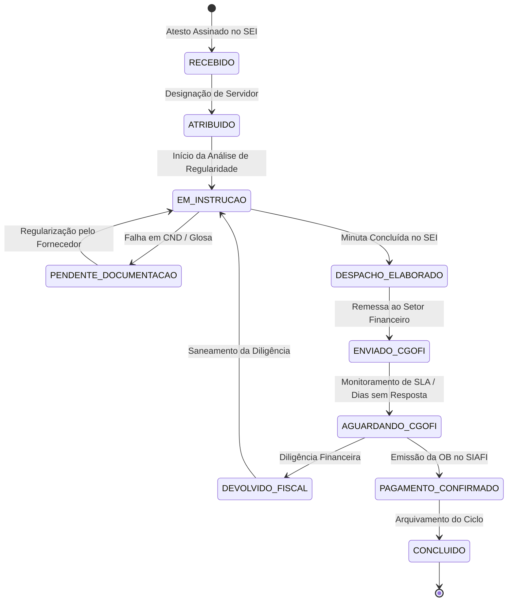

# FASE 7.4-B — PLANEJAMENTO TÉCNICO: WORKFLOW DE ACOMPANHAMENTO DE PAGAMENTOS / FATURAMENTO

**Data:** 24 de Setembro de 2026  
**Status da Fase:** PLANEJAMENTO TÉCNICO CONCLUÍDO / APROVADO (GO)  
**Natureza:** PLANEJAMENTO TÉCNICO FORMAL E MODELAGEM DE DOMÍNIO (SEM ALTERAÇÃO DE CÓDIGO)  
**Abordagem Arquitetural:** REUTILIZAÇÃO INTEGRAL DE `contract_tasks`, `temporalEngineService` E `processos_sei` (ZERO NOVAS TABELAS)  
**Baseline de Testes:** 81 arquivos de teste | 716/716 testes PASS (100%)  
**Integridade das Migrations:** M16, M17 e M18 100% íntegras  

---

## 1. OBJETIVO

Definir tecnicamente a modelagem e a infraestrutura de software para o **Workflow de Acompanhamento de Pagamentos / Faturamento** no SaldoARP, permitindo que a equipe de gestão contratual:
1. Registre, atribua, instrua e acompanhe os ciclos mensais de atesto e faturamento com controle de prazos em dias úteis;
2. Conecte os processos e documentos do SEI (processo do contrato, processo de pagamento, documento de atesto, documento de despacho) ao Contrato 360°;
3. Calcule automaticamente contadores operacionais (janela de trabalho, dias sem resposta da CGOFI, margem para vencimento da fatura);
4. Alimente preditivamente a Central de Atenção contra riscos de atraso e juros de mora;
5. Realize tudo isso **sem criar novas tabelas no banco de dados**, reutilizando o motor existente de tarefas de contratos (`contract_tasks`), templates especializados e serviços de prazos (`temporalEngineService`).

---

## 2. BASELINE DA FASE 7.4-A

A auditoria operacional da Fase 7.4-A consolidou:
* **Unidade Real de Trabalho:** Ciclo Operacional de Faturamento/Atesto de Competência;
* **Gatilho Operacional:** Assinatura do Termo de Atesto de Notas Fiscais pelo fiscal técnico;
* **Ponto de Conexão com Finanças:** Confirmação da Ordem Bancária (`OB`) emitida pela CGOFI e refletida no SIAFI / `public.empenhos`;
* **Eliminação de Redundâncias:** 7 campos estáticos da planilha (Objeto, Empresa, Valor Global, Vigência, etc.) já são supridos canonicamente pelo Contrato 360°.

---

## 3. UNIDADE DE TRABALHO E CICLO OPERACIONAL

A unidade de trabalho no SaldoARP é formalizada como:
$$\text{PaymentFollowUpCycle} \equiv \langle \text{Contrato}, \text{Competência}, \text{Atesto/Fatura}, \text{Workflow de Tarefas} \rangle$$

Cada ciclo representa uma rodada de faturamento mensal (ou por medição de serviço/entrega de bens) vinculada a um contrato oficial.

---

## 4. IDENTIDADE DETERMINÍSTICA DO CICLO

Para garantir idempotência e impedir que o mesmo atesto ou competência gere ciclos duplicados no Contrato 360°, a chave do ciclo é gerada pela função determinística:

$$\text{cycleKey} = \text{buildPaymentCycleKey}(\text{contractKey}, \text{competencia}, \text{documentoAtestoSeiOrNumeroFatura})$$
$$\text{Formato: } \{\text{contractKey}\}\text{-PGTO-}\{\text{YYYYMM}\}\text{-}\{\text{DocIdNormalizado}\}$$
* **Exemplo Real:** `200331-12-2024-PGTO-202603-DOC143589236`

---

## 5. WORKFLOW OPERACIONAL E ESTADOS

O ciclo de faturamento/atesto percorre os seguintes estados formais:



### Dicionário de Estados do Workflow:
* `RECEBIDO`: Atesto assinado pelo fiscal técnico registrado no sistema;
* `ATRIBUIDO`: Servidor de confecção designado pelo titular para instruir o processo;
* `EM_INSTRUCAO`: Em análise de conformidade, consulta de CNDs/SICAF e verificação de saldo de empenho;
* `PENDENTE_DOCUMENTACAO`: Suspensão temporária por pendência documental do fornecedor (ex.: certidão vencida);
* `DESPACHO_ELABORADO`: Despacho de pagamento assinado e pronto para tramitação;
* `ENVIADO_CGOFI`: Processo remetido formalmente para a Coordenação-Geral de Orçamento e Finanças;
* `AGUARDANDO_CGOFI`: Processo em fila de liquidação/pagamento na CGOFI (contagem de dias sem resposta);
* `DEVOLVIDO_FISCAL`: Processo devolvido pela CGOFI para complementação/correção de informações;
* `PAGAMENTO_CONFIRMADO`: Ordem Bancária emitida e capturada no SIAFI / Contratos.gov;
* `CONCLUIDO`: Ciclo finalizado com evidência documental arquivada;
* `CANCELADO`: Ciclo cancelado por anulação do atesto ou rescisão contratual.

---

## 6. DISTINÇÃO RIGOROSA: ESTADO DO WORKFLOW $\times$ STATUS DA TAREFA

* **Estado do Workflow:** Representa a situação macro do ciclo de pagamento perante a administração (ex.: `AGUARDANDO_CGOFI`).
* **Status da Tarefa:** Representa o progresso de uma ação humana concreta dentro daquele estado (ex.: `Cobrar retorno da CGOFI` $\to$ `PENDENTE` ou `CONCLUIDA`).
* **Invariante:** Nenhuma marcação manual de tarefa altera silenciosamente o estado financeiro oficial do empenho em `public.empenhos`.

---

## 7. ESTRUTURAÇÃO EM MACROTAREFAS E TAREFAS

O template canônico de acompanhamento de pagamento é composto por 5 macrotarefas com tarefas atômicas:

### Macrotarefa 1: Recepção e Atribuição do Atesto (Ordem: 1)
* **Tarefa 1.1:** Conferir conformidade formal do Termo de Atesto e dados das Notas Fiscais (`ExecutionMode: INTERNA`).
* **Tarefa 1.2:** Designar servidor responsável pela instrução e confecção do despacho (`ExecutionMode: INTERNA`).

### Macrotarefa 2: Instrução Processual e Conformidade Fiscal (Ordem: 2)
* **Tarefa 2.1:** Verificar regularidade fiscal e trabalhista do credor no SICAF/Certidões (`ExecutionMode: EXTERNA`, Sistema: `SICAF`).
* **Tarefa 2.2:** Conferir saldo disponível no empenho de lastro do contrato (`ExecutionMode: AUTOMATICA`, Sistema: `SaldoARP`).
* **Tarefa 2.3:** Elaborar e assinar minuta do Despacho de Instrução de Pagamento no SEI (`ExecutionMode: EXTERNA`, Sistema: `SEI`).

### Macrotarefa 3: Encaminhamento à CGOFI (Ordem: 3)
* **Tarefa 3.1:** Inserir Despacho no Processo de Pagamento e tramitar para a CGOFI (`ExecutionMode: EXTERNA`, Sistema: `SEI`).
* **Tarefa 3.2:** Registrar data de envio e calcular margem de dias úteis para o vencimento (`ExecutionMode: AUTOMATICA`).

### Macrotarefa 4: Acompanhamento e Controle de Prazos (Ordem: 4)
* **Tarefa 4.1:** Monitorar contador de dias úteis sem resposta da CGOFI (`ExecutionMode: AUTOMATICA`).
* **Tarefa 4.2:** Efetuar cobrança setorial caso excedido o prazo padrão de resposta (`ExecutionMode: INTERNA`).

### Macrotarefa 5: Confirmação e Encerramento (Ordem: 5)
* **Tarefa 5.1:** Registrar/conciliar número da Ordem Bancária (OB) emitida (`ExecutionMode: CONFIRMACAO`, Sistema: `SIAFI/Contratos.gov`).
* **Tarefa 5.2:** Concluir e arquivar o ciclo operacional da competência (`ExecutionMode: INTERNA`).

---

## 8. MATRIZ DE EXECUTION MODE

| Tarefa | ExecutionMode | Sistema Destino | Ação do SaldoARP |
| :--- | :---: | :---: | :--- |
| Conferir Atesto e NFs | `INTERNA` | — | Interface de conferência de dados |
| Atribuir Responsável | `INTERNA` | — | Gravação de `responsavelNome` e prazo |
| Consulta SICAF / CNDs | `EXTERNA` | SICAF / Web | Link rápido de acesso ao SICAF |
| Saldo de Empenho | `AUTOMATICA` | SaldoARP | Exibição de `saldo_a_liquidar` do empenho vinculado |
| Minuta Despacho SEI | `EXTERNA` | SEI | Gravação do número do documento SEI |
| Tramitar à CGOFI | `EXTERNA` | SEI | Gravação de `data_envio_cgofi` |
| Contagem Dias Úteis | `AUTOMATICA` | SaldoARP | Cálculo dinâmico via `temporalEngineService` |
| Cobrar CGOFI | `INTERNA` | SEI / E-mail | Registro de cobrança nos metadados |
| Conciliação da OB | `CONFIRMACAO` | Contratos.gov | Match com `valor_pago` do empenho oficial |
| Fechamento do Ciclo | `INTERNA` | — | Transição para status `CONCLUIDO` |

---

## 9. INTEGRAÇÃO COM O SEI (`public.processos_sei`)

O SaldoARP não duplica os arquivos nem o motor do SEI. Ele armazena referências cruzadas estruturadas:
1. `numero_processo_contrato`: Processo principal do contrato (`08200.001234/2024-56`);
2. `numero_processo_pagamento`: Processo onde tramitam as faturas daquele ano;
3. `doc_sei_atesto`: Número identificador do documento de atesto assinado (ex.: `Doc 143589236`);
4. `doc_sei_despacho`: Número identificador do documento de despacho emitido (ex.: `Doc 145998120`).

---

## 10. INTEGRAÇÃO TEMPORAL: REGRAS E DIAS ÚTEIS

Reutilização integral do `temporalEngineService`:
* **Data-Base:** `data_assinatura_atesto` (YYYY-MM-DD);
* **Data Fatal de Pagamento:** `data_vencimento_fatura` (YYYY-MM-DD);
* **Janela Total da Equipe:**  
  $$\text{Janela Total (Dias Úteis)} = \text{differenceInBusinessDays}(\text{data\_vencimento\_fatura}, \text{data\_assinatura\_atesto})$$
* **Dias Sem Resposta da CGOFI:**  
  $$\text{Dias Sem Resposta} = \text{differenceInBusinessDays}(\text{data\_atual}, \text{data\_envio\_cgofi})$$
* **Margem Remanescente no Envio:**  
  $$\text{Margem no Envio} = \text{differenceInBusinessDays}(\text{data\_vencimento\_fatura}, \text{data\_envio\_cgofi})$$

*Invariante:* Nenhum contador derivado é gravado estaticamente no banco. Todos são computados em tempo de leitura considerando finais de semana e feriados.

---

## 11. CENTRAL DE ATENÇÃO (ALERTAS E GATILHOS OPERACIONAIS)

O motor de acompanhamento de pagamentos gerará 3 regras de alerta no `ContractAttentionCenter`:

```typescript
// 1. Alerta Crítico: Risco de Vencimento de Fatura
if (status !== 'ENVIADO_CGOFI' && status !== 'PAGAMENTO_CONFIRMADO' && status !== 'CONCLUIDO') {
  const diasUteisAteVencimento = differenceInBusinessDays(dataVencimentoFatura, hoje);
  if (diasUteisAteVencimento <= 3 && diasUteisAteVencimento >= 0) {
    emitAlert({
      nivel: 'CRITICO',
      tipo: 'PAGAMENTO_VENCIMENTO_IMINENTE',
      mensagem: `Fatura ${numeroFatura} vence em ${diasUteisAteVencimento} dias úteis e ainda não foi remetida à CGOFI!`
    });
  } else if (diasUteisAteVencimento < 0) {
    emitAlert({
      nivel: 'CRITICO',
      tipo: 'PAGAMENTO_FATURA_VENCIDA',
      mensagem: `FATURA VENCIDA há ${Math.abs(diasUteisAteVencimento)} dias úteis sem confirmação de pagamento!`
    });
  }
}

// 2. Alerta de Atenção: Atesto Recebido Sem Atribuição
if (status === 'RECEBIDO' && differenceInBusinessDays(hoje, dataAssinaturaAtesto) > 2) {
  emitAlert({
    nivel: 'ATENCAO',
    tipo: 'ATESTO_PENDENTE_ATRIBUICAO',
    mensagem: `Atesto aguardando designação de responsável há ${differenceInBusinessDays(hoje, dataAssinaturaAtesto)} dias úteis.`
  });
}

// 3. Alerta de Acompanhamento: CGOFI Sem Resposta
if (status === 'AGUARDANDO_CGOFI' && differenceInBusinessDays(hoje, dataEnvioCgofi) > 5) {
  emitAlert({
    nivel: 'ATENCAO',
    tipo: 'CGOFI_SEM_RESPOSTA',
    mensagem: `Processo na CGOFI há ${differenceInBusinessDays(hoje, dataEnvioCgofi)} dias úteis sem registro de Ordem Bancária.`
  });
}
```

---

## 12. RELAÇÃO COM EMPENHOS E CONTRATO

1. **Vínculo com Contrato:** O ciclo de pagamento referencia estritamente `contractKey`.
2. **Dedução do Empenho de Lastro:** A tela de instrução do pagamento consulta a view `v_contrato_empenhos_lastro` e lista todos os empenhos vinculados ao contrato com seus respectivos saldos disponíveis a liquidar:
   $$\text{Saldo Disponível a Liquidar} = \text{valor\_empenhado} - \text{valor\_liquidado}$$
   O servidor seleciona o empenho que suportará o atesto, evitando que despachos sejam elaborados para empenhos sem saldo suficiente.

---

## 13. DISTINÇÃO SEMÂNTICA: `valorAtesto` $\times$ `valorLiquidado` $\times$ `valorPago`

* `valorAtesto`: Informação declaratória da fatura/atesto informada pelo servidor na instrução do processo (ex.: R$ 12.450,00).
* `valorLiquidado`: Fato financeiro apurado pelo SIAFI e refletido em `public.empenhos` quando a CGOFI efetua a liquidação contábil.
* `valorPago`: Montante efetivamente transferido ao credor via Ordem Bancária (`OB`).

---

## 14. TRATAMENTO DA ORDEM BANCÁRIA (OB)

* A coluna `OB` é um campo de texto formatado (ex.: `2026OB800123`) associado à conclusão da tarefa de confirmação;
* Quando preenchido, sinaliza que a despesa foi liquidada/paga na ponta bancária;
* O sistema cruza esse registro com a sincronização automática de `public.empenhos` (Fase 7.3), efetuando a conciliação completa do ciclo.

---

## 15. CASOS DE TESTES OPERACIONAIS PLANEJADOS (C1 A C15)

* **C1 — Atesto Recebido:** Criação do ciclo a partir do atesto com cálculo de janela em dias úteis.
* **C2 — Atesto Atribuído:** Atribuição a servidor com registro de data e responsável.
* **C3 — Atesto em Instrução:** Transição para instrução com checagem de saldo do empenho de lastro.
* **C4 — Despacho Elaborado:** Registro do documento SEI de despacho de pagamento.
* **C5 — Enviado à CGOFI:** Registro da data de remessa e cálculo da margem de segurança para o vencimento.
* **C6 — CGOFI Sem Resposta:** Disparo de alerta de atenção quando decorridos $>5$ dias úteis do envio.
* **C7 — Vencimento Próximo:** Disparo de alerta crítico quando restarem $\le 3$ dias úteis para o vencimento da fatura.
* **C8 — Vencimento Ultrapassado:** Disparo de alerta de fatura vencida.
* **C9 — Pagamento Confirmado:** Registro do número da OB e transição para `PAGAMENTO_CONFIRMADO`.
* **C10 — Pagamento Parcial:** Glosa de valor no atesto com registro do valor residual.
* **C11 — Atesto Devolvido:** Transição para `DEVOLVIDO_FISCAL` com suspensão dos contadores de SLA.
* **C12 — Documentação Pendente:** Transição para `PENDENTE_DOCUMENTACAO` aguardando certidão do credor.
* **C13 — Idempotência de Criação:** Tentativa de criar ciclo duplicado para mesma competência e atesto bloqueada.
* **C14 — Múltiplos Ciclos no Mesmo Contrato:** Contrato com 12 ciclos mensais independentes coexistindo sem conflito.
* **C15 — Múltiplos Empenhos no Contrato:** Seleção do empenho adequado na instrução com validação de saldo.

---

## 16. REUTILIZAÇÃO ARQUITETURAL: ZERO NOVAS TABELAS

A auditoria comprova que toda a estrutura necessária pode ser suportada por:
1. **Tipos TypeScript:** `src/types/paymentFollowUp.ts` (definição do modelo de ciclo, etapas, prazos e metadados);
2. **Template de Tarefas:** `src/services/paymentFollowUpTemplateService.ts` gerando o `ContractTaskTemplate` padrão `ACOMPANHAMENTO_PAGAMENTO`;
3. **Serviço de Prazos e Alertas:** `src/services/paymentFollowUpService.ts` utilizando o `temporalEngineService`;
4. **Armazenamento:** Persistência em `public.contract_tasks` vinculadas à `contractKey` com plano de tarefas especializado.

**Veredito:** Nenhuma nova migration ou tabela relacional é necessária.

---

## 17. IMPACTO NA VISÃO 360° DO CONTRATO

No **Contrato 360°**, será planejada uma nova aba ou subseção dedicada:
* **"Acompanhamento de Pagamentos e Faturamento"**
  * Tabela com o histórico de competências/faturas;
  * Cards com status do ciclo ativo (Em instrução, Aguardando CGOFI, Pago);
  * Indicadores de dias sem resposta e margem até o vencimento;
  * Botão de ação: *"Novo Ciclo de Faturamento / Atesto"*.

---

## 18. MATRIZ DE GAPs CONSOLIDADOS

| ID | Classificação | Descrição | Resolução Técnica no Planejamento |
| :---: | :---: | :--- | :--- |
| **GAP-7.4-01** | **HIGH** | Gestão de atestos e faturas desconectada do Contrato 360°. | **Resolvido:** Workflow integrado com template de tarefas e cálculo de dias úteis. |
| **GAP-7.4-02** | **MEDIUM** | Falta de visualização de saldo de empenho na hora de instruir o pagamento. | **Resolvido:** Consulta integrada a `v_contrato_empenhos_lastro` no momento da instrução. |
| **GAP-7.4-03** | **LOW** | Mistura de processos e documentos SEI na mesma coluna da planilha. | **Resolvido:** Separação formal de `processoPagamentoSei`, `docAtestoSei` e `docDespachoSei`. |

---

## 19. RECOMENDAÇÃO PARA A FASE 7.4-C

Avançar para a **FASE 7.4-C — IMPLEMENTAÇÃO DO WORKFLOW DE ACOMPANHAMENTO DE PAGAMENTOS**, com o escopo de:
1. Criar `src/types/paymentFollowUp.ts` com os tipos canônicos;
2. Implementar `src/services/paymentFollowUpService.ts` com as regras de ciclo, cálculo de prazos e alertas;
3. Implementar `src/services/paymentFollowUpTemplateService.ts` com o gerador do template de 5 macrotarefas;
4. Implementar suíte de testes unitários cobrindo os 15 cenários (C1 a C15);
5. Manter 100% de estabilidade sobre M16/M17/M18 e zero novas migrations.

---

## 20. RESULTADO FINAL DA FASE 7.4-B

```
============================================================
FASE 7.4-B — RESULTADO
======================

UNIDADE DE TRABALHO:
Ciclo Operacional de Faturamento/Atesto de Competência

IDENTIDADE:
{contractKey}-PGTO-{YYYYMM}-{DocIdNormalizado} (Determinística e Idempotente)

WORKFLOW:
RECEBIDO ──▶ ATRIBUIDO ──▶ EM_INSTRUCAO ──▶ DESPACHO_ELABORADO ──▶ ENVIADO_CGOFI ──▶ AGUARDANDO_CGOFI ──▶ PAGAMENTO_CONFIRMADO ──▶ CONCLUIDO

ESTADOS:
11 Estados mapeados (Fluxo principal + Exceções: Pendência, Devolução, Cancelado)

MACRO-TAREFAS:
5 Macrotarefas (Recepção, Instrução, Encaminhamento, Acompanhamento, Encerramento)

TAREFAS:
11 Tarefas atômicas mapeadas com ExecutionMode

EXECUTION MODE:
INTERNA (4), EXTERNA (3), AUTOMATICA (3), CONFIRMACAO (1)

SEI:
Processo Contrato + Processo Pagamento + Doc Atesto + Doc Despacho

PRAZOS:
Vencimento Fatura, Janela Total Dias Úteis, Dias Sem Resposta, Margem Envio

TEMPORAL ENGINE:
REUTILIZADO (differenceInBusinessDays / addBusinessDays / fuso BRT)

CENTRAL DE ATENÇÃO:
3 Alertas (Vencimento Iminente <=3d, Atesto Não Atribuído >2d, CGOFI Sem Resposta >5d)

EMPENHO:
Conferência de saldo_a_liquidar via v_contrato_empenhos_lastro

CONTRATO:
Vínculo N:1 via contractKey (Sem duplicação de atributos)

EXECUÇÃO FINANCEIRA:
Preservada em public.empenhos (Conciliação pós-OB)

OB:
Evidência oficial de quitação SIAFI / Contratos.gov

VALOR ATESTO:
Metadado operacional da fatura (Distinto do saldo financeiro)

IDEMPOTÊNCIA:
Garantida por cycleKey determinística

CONTRACT_TASKS:
REUTILIZADO INTEGRALMENTE (Zero novas tabelas no banco)

NOVA ENTIDADE:
NÃO (Extensão leve em TypeScript e Template de Tarefas)

CRITICAL: 0
HIGH: 1 (GAP-7.4-01: Resolvido no planejamento)
MEDIUM: 1 (GAP-7.4-02: Resolvido)
LOW: 1 (GAP-7.4-03: Resolvido)
INFO: 0

VEREDITO:
GO — PLANEJAMENTO TÉCNICO APROVADO

PRÓXIMA FASE:
FASE 7.4-C — IMPLEMENTAÇÃO DO WORKFLOW DE ACOMPANHAMENTO DE PAGAMENTOS
============================================================
```
