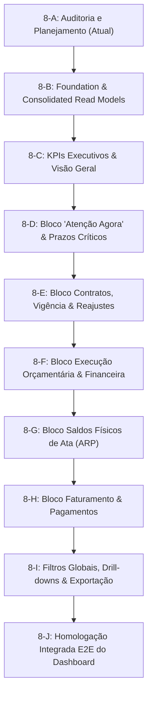

# FASE 8-A — AUDITORIA E PLANEJAMENTO TÉCNICO DO DASHBOARD GERENCIAL

## STATUS: CONCLUÍDO COM SUCESSO (VEREDITO: GO)
**Data:** 24 de Setembro de 2026  
**Fase:** 8-A — Auditoria e Planejamento Técnico  
**Baseline de Testes:** 793 / 793 testes PASS (89 suites de teste)  
**TypeScript (tsc):** PASS (0 erros)  
**ESLint:** PASS (0 erros/avisos)  
**Build:** PASS  
**Estrutura de Banco:** 0 novas tabelas | 0 migrations | 0 RPCs | 0 views novas nesta fase  
**Implementação:** 0 linhas de código de funcionalidade (Auditoria e Planejamento puros)  

---

## 1. OBJETIVO DA FASE 8-A

Definir de forma analítica, rigorosa e estruturada a arquitetura técnica, o mapa de Single Source of Truth (SSOT), o catálogo de indicadores, as regras de agregação e o roadmap de implementação para o **Dashboard Gerencial do SaldoARP (Fase 8)**.

### Princípio Fundamental de Arquitetura:
> **O Dashboard Gerencial é uma camada de leitura, agregação determinística e decisão estratégica — JAMAIS uma nova fonte de dados.**  
> O Dashboard consulta exclusivamente os serviços, views e SSOTs já existentes e homologados, preservando integralmente o isolamento contábil e a separação estrita entre:
> 1. **Quantidade Física de Ata (ARP)** $\neq$
> 2. **Valor Contratual e Aditamentos** $\neq$
> 3. **Execução Financeira Oficial (Empenho/Liquidação/Pagamento)** $\neq$
> 4. **Acompanhamento e Fluxo Operacional (Tarefas/Workflows/Prazos)**.

---

## 2. BASELINE TÉCNICO DE ENTRADA

A auditoria parte de um ecossistema robusto e 100% testado:
- **Fase 1 a 3:** Sincronização oficial, central de prazos e motor temporal (`temporalEngineService`).
- **Fase 4:** Ciclo de vida contratual, eventos formais (`contractEventService`) e prorrogações (`contractProrrogationService`).
- **Fase 5 e 6:** Gestão de departamentos, processos SEI (`seiService`) e RBAC com autoridades seguras.
- **Fase 7.1 a 7.3:** SSOT de empenhos (`public.empenhos`), vinculações N:N (`public.contrato_empenhos`, `public.arp_item_empenhos`) e motor de execução financeira (`financialExecutionService`).
- **Fase 7.4:** Workflow operacional de acompanhamento de pagamentos (`paymentFollowUpService`).
- **Fase 7.5:** Read Model de evolução de valor (`contractValueEvolutionService`), radar preditivo de reajustes (`contractReajusteRadarService`) e guarda assistida de prorrogação.

---

## 3. INVENTÁRIO TÉCNICO DOS DOMÍNIOS EXISTENTES

| Domínio | Entidades e Tabelas | Serviços Existentes | Views no Banco / Read Models | Invariantes e Regras de Negócio |
| :--- | :--- | :--- | :--- | :--- |
| **1. ARP / Itens** | `public.atas_registro_preco`, `public.itens_ata`, `public.arp_item_empenhos` | `balanceService.ts`, `arpContractLinkService.ts`, `ataEventService.ts` | `public.v_arp_item_saldo_detalhado` | Saldo físico = $\text{QtdHomologada} - \sum \text{QtdConsumida}$. Empenhos debitam quantidade física. Não incorpora acréscimos contratuais (Art. 125 Lei 14.133/21). |
| **2. Contratos** | `public.contratos_consolidados`, `public.contract_events` | `contractService.ts`, `contractManagementService.ts`, `contractEventService.ts` | `ContractDashboardRecord`, `ContractEventsTimeline` | Chave canônica `contractKey`. Distinção entre vigência, valor original, valor vigente e extinção (encerramento/rescisão). |
| **3. Prorrogação** | `public.contract_tasks`, `public.contract_task_plans` | `contractProrrogationService.ts` | `ProrrogationReadinessChecklist`, `ProrrogationDeadlinesPlan` | Template `tpl-prorrogacao-padrao-14133`. Avaliação assistida de prontidão (6 critérios da Lei 14.133 + guarda de reajuste). Não-bloqueante. |
| **4. Reajuste / Repactuação** | `public.contract_events` | `contractValueEvolutionService.ts`, `contractReajusteRadarService.ts` | `ContractValueEvolutionReadModel`, `ReajusteRadarAlert` | Evolução: $\text{Vigente} = \text{Original} + \sum \Delta$. Radar: janela de 60 dias, interregno anual de 12 meses pós-reajuste (Art. 135 Lei 14.133/21). |
| **5. Empenhos Soberanos** | `public.empenhos`, `public.empenho_eventos_historico` | `empenhoSyncService.ts`, `empenhoOrchestrationService.ts` | `public.v_empenhos_resumo`, `public.v_empenho_serie_temporal` | SSOT oficial financeiro de empenhos federais. Vínculos pré-agrupados para prevenção estrita de double counting. |
| **6. Execução Financeira** | `public.contrato_empenhos`, `public.empenhos` | `financialExecutionService.ts` | `public.v_contrato_empenhos_lastro`, `ContractFinancialExecutionSummary` | $\text{Saldo a Liquidar} = \text{Emp} - \text{Liq}$; $\text{Saldo a Pagar} = \text{Liq} - \text{Pag}$; $\text{Saldo Não Executado} = \text{Emp} - \text{Pag}$; Restos a Pagar RPP / RPNP. |
| **7. Acompanhamento de Pagamento** | `public.contract_tasks` | `paymentFollowUpService.ts`, `paymentFollowUpTemplateService.ts` | `PaymentFollowUpCycle`, `PaymentCyclePrazos` | Workflow de 7 etapas (`tpl-faturamento`). Prazos em dias úteis com normalização `America/Sao_Paulo`. Atesto $\rightarrow$ CGOFI $\rightarrow$ OB. |
| **8. Central de Atenção / Prazos** | `public.contract_tasks`, `public.contract_task_plans` | `centralPrazosService.ts`, `temporalEngineService.ts` | `CentralPrazosKPIs`, `CentralPrazosItem` | Classificação temporal (`NORMAL`, `ATENCAO`, `CRITICO`, `VENCIDO`). Deduplicação determinística via chaves canônicas de gatilho e tarefa. |
| **9. Processos SEI** | `public.processos_sei`, `public.contract_processos_sei` | `seiService.ts` | `ProcessoSeiRecord` | Rastreabilidade administrativa de autos, despachos e pareceres vinculados aos contratos. |

---

## 4. MAPA CANÔNICO DE SSOTs (Single Source of Truth)

```text
┌─────────────────────────────────────────────────────────────────────────────────────────┐
│                                 MAPA DE SSOTs DO SISTEMA                                │
├───────────────────────────────┬───────────────────────────────┬─────────────────────────┤
│ CONCEITO GERENCIAL            │ FONTE CANÔNICA SOBERANA       │ CAMADA DE READ MODEL    │
├───────────────────────────────┼───────────────────────────────┼─────────────────────────┤
│ Saldo Físico de Itens de ARP  │ public.itens_ata +            │ View SQL                │
│                               │ public.arp_item_empenhos      │ v_arp_item_saldo_detal. │
├───────────────────────────────┼───────────────────────────────┼─────────────────────────┤
│ Valores Financeiros Oficiais  │ public.empenhos               │ View SQL                │
│ (Empenhado, Liquidado, Pago)  │                               │ v_empenhos_resumo       │
├───────────────────────────────┼───────────────────────────────┼─────────────────────────┤
│ Lastro Contrato <-> Empenho   │ public.contrato_empenhos      │ View SQL                │
│                               │                               │ v_contrato_empenhos_las.│
├───────────────────────────────┼───────────────────────────────┼─────────────────────────┤
│ Evolução do Valor Contratual  │ public.contratos_consolidados │ Read Model TypeScript   │
│ (Original, Deltas, Vigente)   │ + public.contract_events      │ contractValueEvolution. │
├───────────────────────────────┼───────────────────────────────┼─────────────────────────┤
│ Radar Preditivo de Reajuste   │ Datas Contrato / Eventos      │ Read Model TypeScript   │
│                               │                               │ contractReajusteRadar.  │
├───────────────────────────────┼───────────────────────────────┼─────────────────────────┤
│ Ciclos de Pagamento / Atesto  │ public.contract_tasks         │ Read Model TypeScript   │
│ (Etapas e Prazos Úteis)       │ (Template tpl-faturamento)    │ paymentFollowUpService  │
├───────────────────────────────┼───────────────────────────────┼─────────────────────────┤
│ Prazos e Alertas Operacionais │ temporalEngineService +       │ Read Model TypeScript   │
│                               │ contract_tasks                │ centralPrazosService    │
└───────────────────────────────┴───────────────────────────────┴─────────────────────────┘
```

---

## 5. MATRIZ DE INDICADORES CANDIDATOS

Abaixo, a avaliação minuciosa de cada indicador proposto para o Dashboard:

| Indicador | Pergunta Gerencial | Domínio | Fonte SSOT | Serviço / View | Cálculo / Fórmula | Periodicidade | Dimensão | Filtros | Drill-Down | Status | Prioridade |
| :--- | :--- | :--- | :--- | :--- | :--- | :--- | :--- | :--- | :--- | :--- | :--- |
| **1. Contratos Ativos** | Quantos contratos estão em vigor sob gestão? | Contratos | `contratos_consolidados` | `contractService` | `COUNT(status in ['Vigente', 'A Vencer'])` | Tempo Real | Quantidade | UASG, Unidade, Instrumento | Lista de Contratos | **APROVADO** | Alta |
| **2. Valor Global Vigente** | Qual o montante financeiro total contratado atual? | Contratos | `contratos` + `events` | `contractValueEvolutionService` | $\sum \text{ValorVigente}$ | Tempo Real | Monetário (R\$) | UASG, Unidade, Instrumento | Contract 360° | **APROVADO** | Alta |
| **3. Delta Contratual Acumulado** | Quanto o valor global variou por aditivos e reajustes? | Contratos | `contract_events` | `contractValueEvolutionService` | $\sum \Delta \text{Valor}$ e $\% \text{Variação}$ | Tempo Real | Monetário / % | UASG, Tipo Evento | Timeline 360° | **APROVADO** | Média |
| **4. Contratos Vencendo (30/60/90d)** | Quais contratos expiram no curto e médio prazo? | Prazos | `contratos` | `temporalEngineService` | `diffInDays(dataVigenciaFim) <= 30/60/90` | Tempo Real | Quantidade | UASG, Gestor, Faixa Dias | Central de Prazos | **APROVADO** | Alta |
| **5. Prorrogações em Instrução** | Quantos processos de prorrogação estão tramitando? | Prorrogação | `contract_tasks` | `contractProrrogationService` | `COUNT(status != 'CONCLUIDO')` | Tempo Real | Quantidade | UASG, Gestor, Status WF | Modal Prorrogação | **APROVADO** | Alta |
| **6. Radar de Reajuste Ativo** | Quantos contratos atingem marco anual em até 60 dias? | Reajuste | `contratos` + `events` | `contractReajusteRadarService` | `COUNT(diasRestantes <= 60)` por gravidade | Tempo Real | Quantidade | UASG, Nível Gravidade | Central de Atenção | **APROVADO** | Alta |
| **7. Total Empenhado Global** | Quanto foi formalmente empenhado no exercício? | Finanças | `public.empenhos` | `v_empenhos_resumo` | $\sum \text{valor\_empenhado}$ | Snapshot Oficial | Monetário (R\$) | UASG, Ano, Fornecedor | Painel Empenhos | **APROVADO** | Alta |
| **8. Total Liquidado Global** | Quanto das despesas foi liquidado (atestado)? | Finanças | `public.empenhos` | `v_empenhos_resumo` | $\sum \text{valor\_liquidado}$ | Snapshot Oficial | Monetário (R\$) | UASG, Ano, Fornecedor | Painel Empenhos | **APROVADO** | Alta |
| **9. Total Pago Global** | Quanto já foi efetivamente pago às contratadas? | Finanças | `public.empenhos` | `v_empenhos_resumo` | $\sum \text{valor\_pago}$ | Snapshot Oficial | Monetário (R\$) | UASG, Ano, Fornecedor | Painel Empenhos | **APROVADO** | Alta |
| **10. Saldo Não Executado** | Quanto do recurso empenhado ainda não foi pago? | Finanças | `public.empenhos` | `financialExecutionService` | $\sum (\text{Empenhado} - \text{Pago})$ | Snapshot Oficial | Monetário (R\$) | UASG, Ano | Painel Empenhos | **APROVADO** | Alta |
| **11. Restos a Pagar Pendentes** | Qual o passivo de restos a pagar (RPP + RPNP)? | Finanças | `public.empenhos` | `financialExecutionService` | $\sum (\text{RpInscrito} - \text{RpPago})$ | Snapshot Oficial | Monetário (R\$) | UASG, Tipo RP | Painel Empenhos | **APROVADO** | Média |
| **12. Ciclos de Pagamento em Aberto** | Quantas faturas estão em fluxo operacional? | Pagamentos | `contract_tasks` | `paymentFollowUpService` | `COUNT(status != 'CONCLUIDO')` | Tempo Real | Quantidade | UASG, Competência, Status | Acomp. Pagamentos | **APROVADO** | Alta |
| **13. Pagamentos em Atraso / Críticos** | Quais faturas têm prazo de vencimento $\le 3$ dias úteis? | Pagamentos | `contract_tasks` | `paymentFollowUpService` | `COUNT(statusPrazo in ['CRITICO', 'VENCIDO'])` | Tempo Real | Quantidade | UASG, Fornecedor | Acomp. Pagamentos | **APROVADO** | Alta |
| **14. Gargalo de Resposta CGOFI** | Quais processos aguardam OB da CGOFI há $> 5$ dias úteis? | Pagamentos | `contract_tasks` | `paymentFollowUpService` | `COUNT(diasSemRespostaCgofi > 5)` | Tempo Real | Quantidade | UASG, Processo SEI | Acomp. Pagamentos | **APROVADO** | Alta |
| **15. Atas com Saldo Crítico** | Quantos itens de ARP têm consumo $\ge 85\%$ do total? | ARP | `itens_ata` + `arp_item_emp` | `v_arp_item_saldo_detalhado` | `COUNT(percentual_consumido >= 85)` | Tempo Real | Quantidade | UASG, Ata, Fornecedor | ItemBalances | **APROVADO** | Média |
| **16. Tarefas Vencidas no Sistema** | Quantas tarefas operacionais ultrapassaram o prazo? | Tarefas | `contract_tasks` | `centralPrazosService` | `COUNT(status = 'PENDENTE' and diff < 0)` | Tempo Real | Quantidade | UASG, Responsável | Central de Prazos | **APROVADO** | Alta |
| **17. Burn Rate Financeiro Mensal** | Qual a média histórica de consumo de empenhos por mês? | Finanças | `empenho_eventos_historico` | `v_empenho_serie_temporal` | Agrupamento por `ano_mes_evento` | Série Temporal | Monetário / Mês | UASG, Contrato | Série Histórica | **APROVADO (8-F)** | Média |
| **18. Tempo Médio Pagamento CGOFI** | Média histórica de dias úteis entre envio e emissão de OB | Pagamentos | `contract_tasks` | `paymentFollowUpService` | Média de `(dataOb - dataEnvioCgofi)` | Histórico | Dias Úteis | UASG, Ano | Relatório Pagto | **APROVADO (8-H)** | Baixa |
| **19. "Previsão Jurídica de Reajuste"** | Probabilidade de deferimento de pleito de reajuste | Jurídico | N/A | N/A | Subjetivo / Sem dado oficial | N/A | N/A | N/A | N/A | **REJEITADO** | N/A |
| **20. "Saldo Financeiro de Ata"** | Multiplicação cega de Saldo Físico por Valor Unitário | ARP | N/A | N/A | Mistura física $\times$ financeira | N/A | N/A | N/A | N/A | **REJEITADO** | N/A |

---

## 6. INDICADORES APROVADOS vs REJEITADOS

### Indicadores Aprovados (18 Indicadores Canônicos):
- **Contratos e Prazos (6):** Contratos Ativos, Valor Global Vigente, Delta Acumulado, Contratos Vencendo (30/60/90d), Prorrogações em Curso, Radar de Reajuste Anual.
- **Execução Financeira Oficial (5):** Total Empenhado, Total Liquidado, Total Pago, Saldo Não Executado, Restos a Pagar Pendentes.
- **Acompanhamento de Pagamentos (3):** Ciclos em Aberto, Pagamentos Críticos/Vencidos, Gargalo CGOFI (> 5 dias).
- **Operação e Governança (4):** Tarefas Vencidas, Atas com Saldo Crítico ($\ge 85\%$), Burn Rate Mensal, Tempo Médio de Resposta CGOFI.

### Indicadores Rejeitados (Com Justificativa Técnica):
1. **"Saldo Financeiro de Ata":** REJEITADO. A Ata de Registro de Preços gera direito de preferência e limite quantitativo físico, não compromisso orçamentário. O lastro financeiro nasce exclusivamente na emissão de empenhos.
2. **"Previsão Jurídica Automatizada de Reajuste/Preclusão":** REJEITADO. O sistema opera como radar assistivo. Decisões de mérito jurídico competem ao gestor e pareceristas da CONJUR/AGU.
3. **"Média de Valores em Empenhos com Double Counting":** REJEITADO. Qualquer soma direta de empenhos sem pré-agrupamento por `canonical_key` é estritamente proibida pelas diretrizes M16/M18.

---

## 7. VISÃO EXECUTIVA E RESPOSTAS ÀS PERGUNTAS DO GESTOR

O Dashboard Gerencial responderá de forma imediata na primeira dobra (viewport inicial) às 8 perguntas vitais da administração:

```text
┌────────────────────────────────────────────────────────────────────────────────────────┐
│                        RESPOSTAS EXECUTIVAS IMEDIATAS (PRIMEIRA DOBRA)                 │
├───────────────────────────────────────────────────────┬────────────────────────────────┤
│ PERGUNTA DO GESTOR                                    │ RESPOSTA NO DASHBOARD          │
├───────────────────────────────────────────────────────┼────────────────────────────────┤
│ 1. Quantos contratos estão ativos?                    │ Card: "XX Contratos Ativos"    │
│ 2. Qual o valor global vigente sob gestão?            │ Card: "R$ X.XXX.XXX,XX" (+Δ%)  │
│ 3. Quais contratos expiram nos próximos 30/60/90 dias?│ Card / Alerta de Vigência      │
│ 4. Qual o volume financeiro empenhado, liquidado/pago?│ Barra de Execução Financeira   │
│ 5. Há faturas atestadas em risco de atraso?           │ Card: "X Pagamentos Críticos"  │
│ 6. Quais contratos estão em janela de reajuste?       │ Card: "X Radars de Reajuste"   │
│ 7. Quais prorrogações exigem ação imediata?           │ Lista resumida "Atenção Agora" │
│ 8. Existem itens de ARP prestes a esgotar?            │ Alerta: "X Itens Consumo ≥85%" │
└───────────────────────────────────────────────────────┴────────────────────────────────┘
```

---

## 8. PROPOSTA DE ESTRUTURA VISUAL DO DASHBOARD (Layout Conceitual)

```text
┌───────────────────────────────────────────────────────────────────────────────────────────┐
│ HEADER: DASHBOARD GERENCIAL — SALDOARP                                [Filtros Globais ▾] │
├───────────────────────────────────────────────────────────────────────────────────────────┤
│ 1. BARRA DE KPIs EXECUTIVOS (High-Level Metrics)                                          │
│ ┌───────────────────┬───────────────────┬───────────────────┬───────────────────┐        │
│ │ Contratos Ativos  │ Valor Vigente     │ Execução Fin.     │ Pagamentos Abertos│        │
│ │ 48 Contratos      │ R$ 142.580.000,00 │ 68,4% Pago        │ 12 Ciclos (3 Crit)│        │
│ └───────────────────┴───────────────────┴───────────────────┴───────────────────┘        │
├───────────────────────────────────────────────────────────────────────────────────────────┤
│ 2. SEÇÃO "ATENÇÃO AGORA" (Ações e Prazos Críticos Consolidados)                           │
│ ┌───────────────────────────────────────────────────────────────────────────────────────┐ │
│ │ 🔴 2 Faturas Vencendo em < 3 dias úteis (TechCorp / Objeto TI)          [Ver Ciclo ➔] │ │
│ │ 🟠 3 Contratos em Janela de Reajuste/Repactuação (Marco 12 meses)      [Ver Radar ➔] │ │
│ │ 🟡 4 Prorrogações com Parecer Jurídico Pendente (< 60 dias vigência)   [Ver Status ➔]│ │
│ │ 🟣 1 Item de ARP com 92% consumido (Ata 05/2025 - Item 03)             [Ver Saldo ➔] │ │
│ └───────────────────────────────────────────────────────────────────────────────────────┘ │
├─────────────────────────────────────────────┬─────────────────────────────────────────────┤
│ 3. VIGÊNCIA E CICLOS CONTRATUAIS            │ 4. EXECUÇÃO ORÇAMENTÁRIA E FINANCEIRA       │
│ • Gráfico/Grid de Vencimento (30/60/90d)    │ • Total Empenhado:  R$ 98.400.000,00        │
│ • Prorrogações em curso (Fases do WF)       │ • Total Liquidado:  R$ 72.100.000,00        │
│ • Radars de Reajuste por severidade         │ • Total Pago:       R$ 67.300.000,00        │
│ • Variação de Valor (Deltas Acumulados)     │ • Saldo Não Exec.:  R$ 31.100.000,00        │
│                                             │ • Restos a Pagar:   R$  4.800.000,00        │
├─────────────────────────────────────────────┼─────────────────────────────────────────────┤
│ 5. ACOMPANHAMENTO DE FATURAMENTO / PAGAMENTO│ 6. SALDO FÍSICO DE ATAS (ARP)               │
│ • Ciclos por Etapa (Atesto / CGOFI / OB)    │ • Top 5 Itens Mais Consumidos               │
│ • Tempo Médio de Resposta da CGOFI          │ • Itens com Consumo ≥ 85%                   │
│ • Indicador de Eficiência no Pagamento      │ • Distribuição por Unidade Gerenciadora     │
└─────────────────────────────────────────────┴─────────────────────────────────────────────┘
```

---

## 9. MATRIZ DE FILTROS E DRILL-DOWNS

### Filtros Globais Suportados:
1. **Unidade Gestora / UASG:** Filtro por UASG emitente (ex: `200331 - SENASP`).
2. **Exercício Financeiro / Ano:** Filtro por ano corrente ou histórico (ex: `2026`).
3. **Departamento / Setor Interno:** Filtro por área demandante.
4. **Tipo de Instrumento:** Termo de Contrato, Termo Aditivo, Nota de Empenho Substitutiva.
5. **Fornecedor / Credor:** Razão Social ou CNPJ.
6. **Gestor Responsável:** Filtro por servidor designado.

### Roteamento e Drill-Downs Diretos:
- Clicar em **Contrato / Valor Vigente** $\rightarrow$ Navega para **Contract 360°** (`/contracts/:key`).
- Clicar em **Janela de Reajuste** $\rightarrow$ Rola para **Central de Atenção / Timeline** no 360°.
- Clicar em **Ciclo de Pagamento Crítico** $\rightarrow$ Abre **Acompanhamento de Pagamentos** (`paymentFollowUp`).
- Clicar em **Item de Ata Crítico** $\rightarrow$ Navega para **ItemBalances** (`/balances`).
- Clicar em **Empenho / Execução** $\rightarrow$ Abre modal de detalhe do empenho (`EmpenhoDetailModal`).

---

## 10. ANÁLISE DE PERFORMANCE E ARQUITETURA TÉCNICA

### Estratégia de Carga e Prevenção de Gargalos:
1. **Zero N+1 Queries:**
   - O dashboard carregará dados consolidados via React Query com stale time de 5 minutos.
   - Reutilização dos hooks já otimizados: `useContractsDashboard`, `useCentralPrazosData`, `v_empenhos_resumo`, `v_arp_item_saldo_detalhado`.
2. **Cálculos em Memória (Read Models Puros):**
   - Agregações de somatórios, categorização de prazos e radares são executados em funções puras síncronas (`useMemo`).
3. **Consultas Paralelas Não-Bloqueantes:**
   - Contratos, Empenhos e Atas são requisitados em paralelo via `Promise.all` / React Query hooks independentes.

---

## 11. MAPA DE GAPs IDENTIFICADOS

| ID do GAP | Severidade | Descrição do GAP | Impacto no Dashboard | Resolução Proposta |
| :--- | :--- | :--- | :--- | :--- |
| **GAP-8-01** | `LOW` | Histórico mensal de liquidação/pagamento antes de 2026 depende da volumetria em `empenho_eventos_historico`. | Gráfico de Burn Rate histórico limitado aos eventos sincronizados. | Usar `v_empenho_serie_temporal` para os meses disponíveis sem inventar dados retroativos. |
| **GAP-8-02** | `LOW` | Tempo médio de resposta da CGOFI necessita que os ciclos possuam `dataEnvioCgofi` e `dataOrdemBancaria` preenchidos. | Indicador exibirá *"Sem dados suficientes"* se houver menos de 3 ciclos concluídos. | Não forçar cálculo com amostra insuficiente. |
| **GAP-8-03** | `INFO` | Filtro por Departamento depende do preenchimento opcional em `contrato_departamentos`. | Contratos sem departamento agrupam sob *"Não Classificado"*. | Tratamento gracioso no agrupador. |

*Conclusão dos GAPs:* **Nenhum GAP é impeditivo (Zero Blockers / Zero High).** Todos os dados necessários para os 18 indicadores aprovados já possuem SSOT ativa e estável.

---

## 12. ROADMAP DE IMPLEMENTAÇÃO (Fases 8-B até 8-J)

Com base no planejamento, a execução modular recomendada é:



- **8-B — Foundation & Read Models:** Criação dos hooks e agregadores em `src/services/dashboardService.ts` e `src/hooks/useManagementDashboard.ts`.
- **8-C — KPIs Executivos:** Componente de topo com 4 cards estratégicos e percentuais de variação.
- **8-D — Bloco Atenção Agora:** Resumo de alertas de reajuste, vencimento e prazos críticos.
- **8-E — Bloco Contratos & Reajustes:** Gráficos e tabelas de vigência e evolução contratual.
- **8-F — Bloco Execução Financeira:** Painel de empenhado/liquidado/pago e restos a pagar.
- **8-G — Bloco Saldos de ARP:** Top itens críticos de ata ($\ge 85\%$).
- **8-H — Bloco Faturamento e Pagamentos:** Ciclos operacionais, gargalos CGOFI e dias úteis.
- **8-I — Filtros e Drill-downs:** Barra de filtros reativa e roteamento aos 360°/Acompanhamento/Balances.
- **8-J — Homologação E2E:** Bateria de testes de integração do dashboard completo.

---

## 13. CRITÉRIOS DE ACEITE E VEREDITO

### Critérios de Aceite para Início da Fase 8-B:
1. Zero alteração de código ou banco na Fase 8-A $\rightarrow$ **CONFIRMADO (0 alterações)**.
2. Mapa de SSOTs 100% definido sem conflito de fontes $\rightarrow$ **CONFIRMADO**.
3. Separação rigorosa entre saldo de ata, valor contratual e execução financeira $\rightarrow$ **CONFIRMADO**.
4. Definição clara dos 18 indicadores, cálculos, filtros e drill-downs $\rightarrow$ **CONFIRMADO**.
5. Ausência de GAPs bloqueantes $\rightarrow$ **CONFIRMADO (0 Blockers)**.

---

## 14. VEREDITO FINAL

```text
======================================================================
FASE 8-A — AUDITORIA E PLANEJAMENTO TÉCNICO DO DASHBOARD GERENCIAL
======================================================================
Indicadores Aprovados: 18 indicadores essenciais
Indicadores Rejeitados: 3 métricas inconsistentes ou confusas
Fontes SSOT: 100% mapeadas e auditadas
GAPs Bloqueantes: 0 (Nenhum)
Código Alterado / Novas Tabelas: 0 / 0
======================================================================
VEREDITO: GO (Aprovado com Louvor para Início da FASE 8-B)
======================================================================
```
