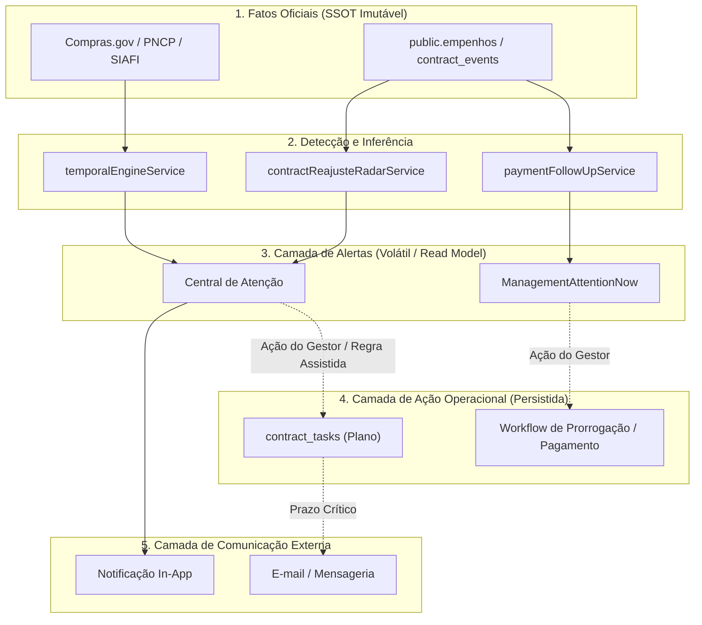

# RELATÓRIO DE AUDITORIA E PLANEJAMENTO — FASE 9-A: AUTOMAÇÃO E NOTIFICAÇÕES

## STATUS: GO — FASE 9-A AUDITORIA CONCLUÍDA

---

## 1. BASELINE DE QUALIDADE E INTEGRIDADE

A auditoria da Fase 9-A foi executada sobre a base estável homologada na Fase 8-J:

* **Testes Automatizados**: **868/868 PASS** (99 suítes de teste)
* **TypeScript (`tsc -b`)**: **PASS** (0 erros)
* **Linter (`oxlint` / `eslint`)**: **PASS** (0 erros)
* **Build de Produção (`vite build`)**: **PASS**
* **Alterações de Banco de Dados**: **0 migrations, 0 tabelas novas, 0 RPCs novas, 0 views novas**
* **Alterações Funcionais / Código de Negócio**: **0 alterações (Fase 100% de Auditoria e Planejamento)**

---

## 2. INVENTÁRIO ARQUITETURAL

O sistema SaldoARP possui maturidade técnica e componentes canônicos estabelecidos nas Fases 1 a 8 que devem ser obrigatoriamente preservados e reutilizados no subsistema de automação:

### 2.1. Motor Temporal e Prazos
- **`temporalEngineService.ts`**: SSOT de normalização de datas para o fuso `America/Sao_Paulo`, cálculo de dias corridos e úteis (`differenceInBusinessDays`, `addBusinessDays`), estados temporais (`FUTURO`, `VENCE_EM_BREVE`, `VENCE_HOJE`, `ATRASADO`, `CONCLUIDO`) e níveis de atenção (`NORMAL`, `ATENCAO`, `CRITICO`).
- **`centralPrazosService.ts`**: Unifica prazos contratuais de vigência, tarefas de planos e prazos de faturamento.

### 2.2. Sistema de Tarefas (`contract_tasks`)
- **Schema**: `contract_task_templates`, `contract_task_template_macrotasks`, `contract_task_template_tasks`, `contract_task_plans`, `contract_task_macrotasks`, `contract_tasks`.
- **Semântica Operacional**: Suporta `executionMode` (`INTERNO`, `LINK_EXTERNO`, `ASSISTIDA`, `CONFIRMACAO_MANUAL`), estados (`PENDENTE`, `EM_ANDAMENTO`, `CONCLUIDA`, `NAO_APLICAVEL`), campos de auditoria (`concluido_em`, `concluido_por`, `prazo`).

### 2.3. Workflows Especializados
- **Prorrogação (`contractProrrogationService.ts`)**: Cronograma com marcos $(-180\text{d}, -120\text{d}, 10\text{d úteis}, -90\text{d}, -60\text{d}, -15\text{d})$, checklist de prontidão legal e transição determinística.
- **Reajuste / Repactuação (`contractReajusteRadarService.ts`)**: Radar preditivo em janela de 60 dias do interregno legal (Art. 135 da Lei 14.133/2021).
- **Acompanhamento de Pagamento (`paymentFollowUpService.ts`)**: Ciclos de faturamento (`RECEBIDO` $\to$ `ATRIBUIDO` $\to$ `EM_INSTRUCAO` $\to$ `DESPACHO_ELABORADO` $\to$ `ENVIADO_CGOFI` $\to$ `PAGAMENTO_CONFIRMADO` $\to$ `CONCLUIDO`).
- **Alterações e Aditivos (`contractAmendmentWorkflowService.ts`)** e **Encerramento (`contractClosureWorkflowService.ts`)**.

### 2.4. Eventos e Histórico
- **Eventos Contratuais (`contractEventService.ts` / `public.contract_events`)**: Apostilamentos, termos aditivos, reajustes, repactuações, acréscimos e supressões.
- **Histórico Contábil de Empenhos (`public.empenho_eventos_historico`)**: Snapshots cronológicos de liquidação e pagamento.

### 2.5. Central de Atenção e Dashboard Gerencial
- **`ContractAttentionCenter.tsx`** e **`ManagementAttentionNow.tsx`**: Componentes executivos e operacionais de exibição priorizada de alertas em tempo real.
- **`dashboardService.ts` / `ManagementDashboardReadModel`**: Read model puro e determinístico consolidando indicadores e fatias filtradas.

---

## 3. GATILHOS REAIS IDENTIFICADOS

| Domínio | Gatilho Operacional / Fato | Condição de Detecção | Severidade | Ação Esperada |
| :--- | :--- | :--- | :--- | :--- |
| **Contratos** | **Janela de Prorrogação Aberta** | Vigência restando $\le 180$ dias e prorrogação legalmente permitida | ALTA | Sugerir abertura de workflow / plano de prorrogação |
| **Contratos** | **Vigência Iminente** | Vigência restando $\le 60$ dias ou $\le 30$ dias | CRÍTICA | Alerta na Central de Atenção |
| **Reajuste** | **Janela de Reajuste / Radar Ativo** | Aniversário da proposta/reajuste anterior em janela $\le 60$ dias | MÉDIA | Alerta do Radar de Reajuste |
| **Pagamentos** | **Atesto Recebido Sem Atribuição** | Ciclo em `RECEBIDO` sem responsável atribuído por $> 2$ dias úteis | ALTA | Alerta de atribuição pendente |
| **Pagamentos** | **Margem Estreita para Envio CGOFI** | Margem de envio à CGOFI $\le 2$ dias úteis | ALTA | Alerta de risco de perda de prazo |
| **Pagamentos** | **CGOFI Sem Resposta / SLA Ultrapassado** | Ciclo em `ENVIADO_CGOFI`/`AGUARDANDO_CGOFI` sem OB por $> 5$ dias úteis | CRÍTICA | Alerta de atraso CGOFI |
| **Pagamentos** | **Fatura Vencida Sem Liquidação** | Data de vencimento da fatura ultrapassada | CRÍTICA | Alerta de fatura vencida |
| **ARP** | **Saldo Físico em Nível Crítico** | Percentual consumido do item $\ge 85\%$ ou saldo disponível $\le 15\%$ | CRÍTICA | Alerta de item de ata esgotando |
| **ARP** | **Saldo Físico Próximo do Limite** | Percentual consumido entre $70\%$ e $84.99\%$ | MÉDIA | Alerta de acompanhamento de consumo |
| **Tarefas** | **Tarefa com Prazo Iminente** | Prazo da tarefa $\le 3$ dias úteis | MÉDIA | Destaque na lista de tarefas do gestor |
| **Tarefas** | **Tarefa Atrasada** | Prazo da tarefa expirado e status $\neq \text{'CONCLUIDA'}$ | ALTA | Alerta na Central de Atenção |
| **Empenhos** | **Nova NE Sincronizada** | Ingestão oficial de novo empenho no banco | INFO | Notificação contextual na UI / timeline |

---

## 4. AUDITORIA DE CANAIS DE NOTIFICAÇÃO

| Canal | Status no Projeto | Análise e Avaliação Arquitetural |
| :--- | :--- | :--- |
| **Central de Atenção (In-App)** | **EXISTENTE & ADEQUADO** | Totalmente funcional, determinístico e reativo. Serve como canal primário interno para fiscais, gestores e coordenadores. |
| **Toast / Banners Contextuais** | **EXISTENTE & ADEQUADO** | Suportado na UI para confirmações imediatas de ações do usuário. |
| **Notificações Internas (Sino / Inbox)** | **PARCIALMENTE EXISTENTE** | A Central de Atenção e o Dashboard já realizam a agregação. Falta modelo de "marcar como lida / dispensada" individualmente por usuário. |
| **E-mail Institucional** | **INEXISTENTE (GAP TÉCNICO)** | Não há provedor (SMTP/Resend/SendGrid) nem fila de envio configurada no repositório. Necessário template padronizado para alertas críticos. |
| **WhatsApp / Mensageria** | **INEXISTENTE (GAP ARQUITETURAL)** | Não há client da Evolution API ou provedor de mensageria instanciado. O canal deve ser estritamente administrativo (alertas críticos opt-in para fiscais), sem misturar com SAC ou cidadão. |
| **Web Push Notifications** | **INEXISTENTE (GAP SECUNDÁRIO)** | Sem Service Worker de Push configurado. Baixa prioridade comparada aos canais de e-mail e in-app. |

---

## 5. AUDITORIA DE SCHEDULER E EXECUÇÃO PERIÓDICA

| Mecanismo | Status no Projeto | Avaliação e Diretriz Arquitetural |
| :--- | :--- | :--- |
| **Projeção On-Demand / Read Model** | **EXISTENTE & HOMOLOGADO** | Toda a avaliação temporal (prazos, vencimentos, radar, atenção) é calculada puramente em memória ao carregar telas ou o dashboard. **Não gera overhead de banco.** |
| **Edge Functions (Supabase)** | **INEXISTENTE (GAP)** | Não há diretório `supabase/functions`. Seria o local adequado para rotinas assíncronas diárias (ex: consolidação matinal de e-mails). |
| **pg_cron** | **NÃO CONFIGURADO (GAP)** | Extensão não ativada nas migrations. Recomendado manter regras de negócio na camada TypeScript / Edge Functions para reusar o `temporalEngineService`. |
| **Polling no Frontend** | **EXISTENTE (TanStack Query)** | O React Query faz polling/refetch em foco e cache de 2 minutos. Adequado para a experiência interativa da UI. |

---

## 6. AUDITORIA DE RESPONSABILIDADES E RBAC

O SaldoARP possui os seguintes papéis e atribuições:
- **Papéis RBAC (`src/types/user.ts` / `roleService.ts`)**: `admin`, `gestor`, `fiscal`, `coordenador`, `consulta`.
- **Gestores e Fiscais de Contrato**: Mapeados em `public.contract_managers` e no campo `responsavel_nome` de `public.contract_tasks`.
- **Responsável da Instrução**: Registrado no ciclo de pagamento (`paymentFollowUpService`).

**GAP Identificado**:
Em contratos onde ainda não há `gestor_nome` ou `responsavel_nome` explicitamente cadastrado, a notificação deve recair sobre o **Coordenador-Geral** ou **Setor Gestor da UASG**, evitando que alertas fiquem órfãos.

---

## 7. AUDITORIA DE IDEMPOTÊNCIA E IDENTIDADE CANÔNICA

Para evitar spam, loops e duplicidade, a automação deve basear-se estritamente nas chaves determinísticas existentes:

| Entidade | Chave Canônica Determinística Existente | Regra de Idempotência |
| :--- | :--- | :--- |
| **Contrato** | `contract_key = {uasg}-{numero}-{ano}` | 1 alerta de vigência por faixa (30D, 60D, VENCIDO) |
| **Ciclo de Pagamento** | `cycleKey = {contractKey}-PGTO-{YYYYMM}-{DocId}` | 1 notificação por transição de estado ou atraso diário |
| **Radar de Reajuste** | `radarKey = RADAR-REAJUSTE-{contractKey}-{anoRef}` | 1 alerta ativo por ciclo anual de reajuste |
| **Item de ARP** | `itemKey = ITEM::{uasg}::{numeroAta}::{numeroItem}` | 1 alerta de saldo crítico por nível atingido |
| **Tarefa** | `taskId = UUID / chave do plano` | 1 notificação de vencimento por tarefa |

---

## 8. REGRA INVIOLÁVEL: "ALERTA $\neq$ TAREFA $\neq$ NOTIFICAÇÃO" E "FATO $\neq$ AÇÃO"



1. **Alerta $\neq$ Tarefa**: Um alerta é um indicador de estado que surge e some conforme os dados; uma tarefa é uma obrigação persistida com responsável e prazo.
2. **Tarefa $\neq$ Notificação**: Criar uma tarefa não dispara e-mail indiscriminadamente; apenas transições de atribuição ou prazos críticos geram notificação.
3. **Fato $\neq$ Ação**: Confirmações de pagamento ou atestos operacionais não alteram o saldo financeiro oficial sem ingestão de Ordens Bancárias oficiais do SIAFI.

---

## 9. MATRIZ DE AUTOMAÇÃO PROPOSTA

| Gatilho | Fonte Canônica | Tipo | Alerta | Tarefa | Notificação | Canal Preferencial | Destinatário | Prioridade |
| :--- | :--- | :--- | :---: | :---: | :---: | :--- | :--- | :--- |
| **Vigência $\le 60\text{d}$** | `contratos` / `temporalEngine` | Alerta | SIM | Opcional | SIM | In-App + E-mail | Gestor / Fiscal | **ESSENCIAL** |
| **Janela de Prorrogação** | `contractProrrogationService` | Workflow | SIM | SIM | SIM | In-App | Gestor | **ESSENCIAL** |
| **Radar de Reajuste Ativo** | `contractReajusteRadarService` | Alerta | SIM | NÃO | NÃO | In-App (Radar) | Gestor | **ÚTIL** |
| **Fatura Atrasada CGOFI** | `paymentFollowUpService` | Alerta | SIM | SIM | SIM | In-App + E-mail | Responsável / CGOFI | **ESSENCIAL** |
| **Saldo ARP Crítico ($\ge 85\%$)** | `v_arp_item_saldo_detalhado` | Alerta | SIM | NÃO | NÃO | In-App (Farol) | Gestor da Ata | **ESSENCIAL** |
| **Nova NE Sincronizada** | `public.empenhos` | Fato | NÃO | NÃO | SIM | In-App (Timeline) | Gestor | **ÚTIL** |
| **Tarefa com Prazo Vencido** | `public.contract_tasks` | Tarefa | SIM | N/A | SIM | In-App | Responsável | **ESSENCIAL** |
| **Mensagem de WhatsApp** | Mensageria externa | Notificação | NÃO | NÃO | Opcional | WhatsApp | Fiscal (Opt-in) | **FUTURA** |

---

## 10. PRIORIZAÇÃO TÉCNICA E OPERACIONAL

- **ESSENCIAL (Fase 9-B / 9-C)**:
  - Centralização dos gatilhos de eventos e regras de emissão em serviço puro unificado (`notificationDispatcherService` / `automationRuleEngine`).
  - Read model unificado de notificações internas In-App integrado à Central de Atenção e Dashboard.
  - Idempotência rigorosa baseada nas chaves canônicas existentes.
- **ÚTIL (Fase 9-D)**:
  - Serviço de e-mail transacional padronizado com templates de alerta crítico e sumário diário/semanal.
  - Mecanismo de dispensa/leitura de notificações na UI.
- **FUTURA (Fase 9-E / pós-9)**:
  - Notificações WhatsApp administrativas opt-in com controle de consentimento e fallback para e-mail.
  - Web Push Notifications.
- **NÃO RECOMENDADA**:
  - Chatbot conversacional misturado a notificações administrativas.
  - Geração automática irrestrita de tarefas sem validação assistida do gestor.

---

## 11. ANÁLISE DE RISCOS E MITIGAÇÕES

| Risco Identificado | Impacto | Mitigação Arquitetural |
| :--- | :--- | :--- |
| **Fadiga de Alertas (Alert Fatigue / Spam)** | ALTO | Limitar notificações externas apenas a eventos `CRÍTICA`; agrupar eventos diários em sumário único. |
| **Duplicação de Notificações / Loops** | ALTO | Chaves determinísticas de idempotência com controle de envio por dia/ciclo. |
| **Notificação de Destinatário Incorreto** | MÉDIO | Fallback determinístico: `Responsável da Tarefa` $\to$ `Gestor do Contrato` $\to$ `Coordenador-Geral`. |
| **Automação de Decisão Administrativa** | CRÍTICO | Automações devem ser exclusivamente **assistidas** e nunca tomar decisões discricionárias de prorrogação ou reajuste sem assinatura humana. |
| **Impacto no Desempenho do Banco** | BAIXO | Manter cálculos temporais on-demand na camada de aplicação e utilizar índices já existentes (`idx_contract_tasks_status`, `idx_emp_evt_hist_data_evento`). |

---

## 12. GAPS TÉCNICOS MAPEADOS

1. **GAP 1 (Serviço de Despacho de Notificações)**: Não existe atualmente um serviço orquestrador de notificações (`notificationDispatcherService`) que receba eventos do sistema e direcione aos canais corretos.
2. **GAP 2 (Provedor de E-mail / Transacional)**: Ausência de adapter de envio de e-mail e templates HTML/texto institucionais.
3. **GAP 3 (Persistência de Leitura/Dispensa de Notificações)**: Ausência de tabela leve ou storage para registrar se um usuário específico já dispensou/leu um alerta in-app.
4. **GAP 4 (Provedor WhatsApp)**: Ausência de adapter isolado para mensageria WhatsApp administrativa.

---

## 13. ARQUITETURA PROPOSTA PARA A FASE 9

```text
       [ SSOTs Canônicos / Eventos ]
 (Contratos, Empenhos, Itens, Prazos, Pagamentos)
                      │
                      ▼
        [ automationRuleEngine.ts ]
  (Avalia gatilhos puros reutilizando temporalEngine)
                      │
                      ▼
     [ notificationDispatcherService.ts ]
        (Garante idempotência determinística)
                      │
        ┌─────────────┴─────────────┐
        ▼                           ▼
[ In-App Attention ]       [ Notification Adapters ]
(Central de Atenção /     (EmailAdapter, WebhookAdapter)
   Dashboard UI)
```

---

## 14. ROADMAP PROPOSTO (FASE 9-B EM DIANTE)

* **Fase 9-B — Foundation & Regras de Automação**:
  - Criação de tipos (`AutomationEvent`, `NotificationPayload`, `NotificationChannel`).
  - Implementação de `automationRuleEngine.ts` com funções puras de detecção determinística.
  - Tabela de rastreabilidade/idempotência de notificações (se estritamente necessária) ou armazenamento leve.
* **Fase 9-C — Central de Notificações In-App**:
  - Componente de Notificações / Inbox integrado à Central de Atenção e navegação do sistema.
  - Suporte a filtros por severidade, contrato e módulo.
* **Fase 9-D — Adapters de Notificação Externa (E-mail)**:
  - Adapter modular de e-mail e templates institucionais.
* **Fase 9-E — Homologação Integrada de Automação & Notificações**:
  - Testes E2E e validação de não-duplicação e preservação de SSOTs.

---

## 15. CRITÉRIO DE SAÍDA E VEREDITO

Todos os requisitos da Fase 9-A foram plenamente atendidos:
- Arquitetura integralmente auditada;
- Todos os gatilhos, canais e schedulers mapeados;
- Responsabilidades, idempotência e riscos formalmente documentados;
- 0 alterações em banco de dados;
- 0 alterações funcionais;
- 100% dos testes e verificações em estado PASS.

**STATUS: GO — FASE 9-A AUDITORIA CONCLUÍDA**
