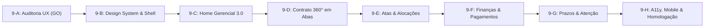

# RELATÓRIO DE AUDITORIA COMPLETA DO FRONTEND E UX GERENCIAL — FASE 9-A

## STATUS: GO — AUDITORIA FRONTEND CONCLUÍDA

---

## 1. BASELINE DE INTEGRIDADE E QUALIDADE

* **Testes Automatizados**: **868/868 PASS** (99 suítes de teste)
* **TypeScript (`tsc -b`)**: **PASS** (0 erros)
* **Linter (`oxlint` / `eslint`)**: **PASS** (0 erros)
* **Build de Produção (`vite build`)**: **PASS** (distribuível compilado com sucesso)
* **Alterações no Banco de Dados**: **0 migrations, 0 tabelas novas, 0 RPCs novas, 0 views novas**
* **Alterações Funcionais / Código de Negócio**: **0 alterações (Fase 100% de Auditoria e Diagnóstico de UX)**

---

## 2. INVENTÁRIO COMPLETO DE ROTAS E PÁGINAS

| Página | Rota | Objetivo Principal | Público-Alvo | Dados / SSOT Consumidos | Ações Principais | Destino / Transição |
| :--- | :--- | :--- | :--- | :--- | :--- | :--- |
| **Início (Home)** | `/` | Cockpit gerencial, resumo executivo e atenção imediata | Gestores, Coordenadores, Fiscais | `useHomeDashboardData`, `useCentralPrazosData` | Ver alertas, acessar atalhos rápidos | Navegação para `/contratos`, `/atas`, `/prazos` |
| **Consulta de Atas** | `/atas` | Busca, filtragem e listagem de ARPs vigentes | Gestores de Ata, Compras, Fiscais | `dbCacheService` / Compras.gov | Pesquisa por UASG/ano, visualização de vigência | Navegação para `/atas/itens` |
| **Itens da Ata** | `/atas/itens` | Listagem de itens registrados da Ata selecionada | Fiscais, Demandantes, Gestores | `itens_ata` / Compras.gov / PNCP | Ver itens, detalhes e saldo | Navegação para `/atas/itens/saldo` |
| **Saldo do Item** | `/atas/itens/saldo` | Controle físico de saldo da Ata (homologado vs empenhado) | Fiscais de ARP, Gestores | `v_arp_item_saldo_detalhado`, `arp_allocations`, `empenhos_manuais` | Inserir empenho manual, vincular contrato, alocar | Abre `LinkContractModal` |
| **Alocações por Unidade** | `/atas/saldos-unidade` | Distribuição de saldo de itens entre departamentos internos | Gestores de Ata, Coordenadores | `arp_allocations`, `departments` | Alocar cotas por departamento | Permanece na página / salva alocação |
| **Gestão de Contratos** | `/contratos` | Carteira de contratos, status de vigência e indicadores | Gestores de Contrato, Fiscais, CGOFI | `useContractsDashboard`, `contractService` | Filtrar por status/gestor, pesquisar | Navegação para `/contratos/:contractKey` |
| **Contrato 360°** | `/contratos/:contractKey` | Hub centralizado de gestão do contrato (Vigência, Valor, Pagamentos, Tarefas, Eventos) | Gestor do Contrato, Fiscal, Coordenador | `useContract`, `useContractTaskPlan`, `contractEvents`, `paymentFollowUp` | Iniciar workflow, atualizar tarefa, registrar atesto/pagamento | Ações in-page e modais |
| **Central de Prazos** | `/prazos` | Agenda unificada de prazos, tarefas e vencimentos contratuais | Fiscais, Gestores, Auditores | `centralPrazosService`, `temporalEngineService` | Filtrar por urgência/prazo, concluir tarefa | Links para o Contrato 360° |
| **Usuários e Servidores** | `/admin/usuarios` | Gestão de servidores, matrículas e perfis de acesso | Administradores do Sistema | `userService` / LocalStorage | Criar/editar usuário, ativar/desativar | Permanece na página |
| **Perfis e Permissões** | `/admin/perfis` | Matriz RBAC de permissões e papéis | Administradores do Sistema | `roleService` / LocalStorage | Configurar permissões por perfil | Permanece na página |

---

## 3. INVENTÁRIO DE COMPONENTES, MODAIS E HOOKS

### 3.1. Shell e Layout Global
- `AppShell.tsx`: Container mestre com sidebar retrátil, header institucional e breadcrumbs.
- `Sidebar.tsx`: Menu lateral com navegação em árvore, suporte a ações customizadas (`actionId`) e badges.
- `Header.tsx`: Topbar institucional com identificação do órgão (MJSP/SENASP), UASG ativa e atalhos rápidos.
- `Breadcrumbs.tsx`: Trilha de navegação contextual hierárquica.

### 3.2. Modais Globais
- `SeiManagementModal.tsx`: Vínculo e consulta de processos administrativos SEI.
- `ExportExcelModal.tsx`: Exportação consolidada de saldos e itens em formato XLS.
- `ContractTaskTemplatesModal.tsx`: Catálogo e configuração de templates de tarefas contratuais.
- `ManageDepartmentsModal.tsx`: Gestão de departamentos e unidades internas da UASG.
- `LinkContractModal.tsx`: Modal contextual para associar item de Ata a um Contrato específico.

### 3.3. Componentes do Dashboard Gerencial (Fase 8)
- `ManagementExecutiveKPIs.tsx`: Indicadores de 1ª dobra (contratos, valor original, valor vigente, deltas).
- `ManagementAttentionNow.tsx`: Central executiva de alertas críticos e imediatos.
- `ManagementContractsOverview.tsx`: Resumo de vigência e faixas de vencimento.
- `ManagementFinancialExecution.tsx`: Execução financeira oficial (empenhado, liquidado, pago, saldos).
- `ManagementArpBalances.tsx`: Farol de saldo físico de Atas e consumo de itens.
- `ManagementPaymentsOverview.tsx`: Fluxo operacional de faturamento e desempenho CGOFI.
- `ManagementDashboardFilters.tsx`: Barra de filtros globais e chips de contexto ativo.

---

## 4. MAPEAMENTO DA JORNADA DO GESTOR (AS-IS vs TO-BE)

```text
[ENTRADA]       ──►  Acessa SaldoARP com UASG 200331 pré-selecionada.
                     
[VISÃO INICIAL] ──►  AS-IS: Home renderiza componentes legados da Fase 3/5.
                     TO-BE: Home unificada com o Dashboard Gerencial 3.0 (Fase 8).

[ATENÇÃO]       ──►  AS-IS: Alertas dispersos entre Home, Central de Prazos e Contrato 360°.
                     TO-BE: "Atenção Agora" prioritária na 1ª dobra com severidades claras.

[INVESTIGAÇÃO]  ──►  AS-IS: Múltiplos cliques (Home ──► Contratos ──► Filtro ──► Contrato 360°).
                     TO-BE: 1 clique direto a partir de qualquer alerta ou indicador.

[DECISÃO]       ──►  AS-IS: Contrato 360° empilha 6 blocos extensos verticalmente.
                     TO-BE: Contrato 360° estruturado em abas com painel executivo fixo.

[AÇÃO]          ──►  AS-IS: Ações espalhadas por cards e modais independentes.
                     TO-BE: Ações contextuais ("Ação onde a decisão acontece").

[ACOMPANHAMENTO]──►  AS-IS: Necessário navegar de volta para conferir impacto.
                     TO-BE: Atualização reativa imediata via React Query.
```

---

## 5. AUDITORIA DA HOME ATUAL (DIAGNÓSTICO CRÍTICO)

> **Pergunta de Teste**: "Um gestor que entra no sistema pela primeira vez consegue saber em menos de um minuto o que exige atenção?"

**Diagnóstico**: **PARCIALMENTE / INCONSISTENTE**.
1. **Descompasso Arquitetural**: A `HomeRoute.tsx` atual ainda utiliza componentes de fases anteriores (`DashboardExecutiveSummary`, `ImmediateAttentionBanner`, `LifecycleFlowDiagram`, `SyncActivityCard`) e não consome o [`ManagementDashboardReadModel`](file:///Users/luis.martins/Desktop/Antigravity/SaldoARP-system/src/types/managementDashboard.ts) construído e homologado na Fase 8.
2. **Excesso de Densidade e Diagramas Decorativos**: O `LifecycleFlowDiagram` ocupa espaço nobre da tela com explicações conceituais estáticas sobre o ciclo de vida, em vez de focar nos dados vivos e nos riscos operacionais.
3. **Falta de Integração Financeira e de Pagamentos na Home**: A execução financeira oficial (empenhos/liquidações) e o faturamento operacional (CGOFI) homologados na Fase 8 não aparecem na Home atual.

---

## 6. AUDITORIA DO MENU E NAVEGAÇÃO

### Inconsistências Identificadas no Menu Atual (`src/config/navigation.ts`):
1. **Mistura de Rotas e Modais no Menu**:
   - `Modelos de Gestão`, `Processos Administrativos (SEI)`, `Exportação Excel` e `Departamentos` estão no menu lateral como se fossem páginas, mas disparam modais globais (`actionId`).
2. **Itens Fantasma ("planned" / "Em breve")**:
   - `Prorrogações & Reajustes`, `Empenhos e Conciliação` e `Auditoria` aparecem desabilitados no menu com cadeado/alerta, gerando ruído cognitivo.
3. **Fragmentação do Domínio de Atas**:
   - O menu separa `Consulta e Vigência` e `Alocações por Unidade`, quando poderiam ser visualizações integradas do módulo de Atas.

---

## 7. AUDITORIA DO CONTRATO 360°

O **Contrato 360°** é o coração da gestão contratual do sistema, porém sua experiência atual apresenta pontos de atrito:
1. **Scroll Vertical Excessivo**:
   - Atualmente, a página empilha sequencialmente: Header $\to$ Atenção $\to$ Workflows $\to$ Pagamentos $\to$ Tarefas $\to$ Linha do Tempo $\to$ Resumo Cadastral $\to$ Informações Complementares.
   - Em contratos com muitos eventos e tarefas, o usuário precisa rolar dezenas de telas para encontrar informações cadastrais ou empenhos.
2. **Falta de Organização por Abas Temáticas**:
   - O Contrato 360° deve adotar um **Painel Executivo Fixo (Topo)** com **Abas Navegáveis**:
     - *Aba 1: Visão Geral & Atenção* (KPIs do contrato, alertas, prazos)
     - *Aba 2: Execução Financeira & Faturamento* (Empenhos, liquidações, pagamentos, ciclos CGOFI)
     - *Aba 3: Workflows & Aditivos* (Prorrogações, reajustes, apostilamentos)
     - *Aba 4: Plano de Tarefas* (Tarefas com semântica de execução)
     - *Aba 5: Histórico & Linha do Tempo* (Eventos contratuais imutáveis)
     - *Aba 6: Dados Cadastrais & SEI* (Fornecedor, processo, objeto, itens)

---

## 8. AUDITORIA DE CONSISTÊNCIA VISUAL E DESIGN SYSTEM

| Elemento Visual | Estado Atual | Diagnóstico / Oportunidade |
| :--- | :--- | :--- |
| **Paleta de Cores** | Cores BR-DS (`#0c326f`, `#00cc55`, `#e2e8f0`, `#f8fafc`) aplicadas de forma inline em vários componentes | Necessário consolidar variáveis CSS centralizadas (`--color-primary`, `--color-success`, etc.). |
| **Cards & Containers** | Variações de border-radius (8px, 12px) e box-shadows distintas entre componentes | Padronizar container único (`AppCard` com header, body e footer consistentes). |
| **Badges & Tags** | Várias implementações pontuais com cores diretas para status de vigência e tarefas | Reutilizar componente único `StatusBadge` com variantes semânticas. |
| **Loading States** | Mistura de spinners `Loader2` isolados e skeletons parciais | Padronizar Skeleton screens para todas as dobras do Dashboard e Contrato 360°. |
| **Empty States** | Textos simples centralizados com ícones | Padronizar componente `EmptyState` com título claro, descrição amigável e botão de ação primária. |

---

## 9. AUDITORIA DE ACESSIBILIDADE E RESPONSIVIDADE

- **Acessibilidade (a11y)**:
  - **GAPs**: Botões com ícones isolados sem `aria-label` descritivo; tabelas sem tags `scope="col"` explícitas em alguns cabeçalhos; foco não confinado adequadamente em alguns modais ao navegar por `Tab`.
- **Responsividade**:
  - Desktop ($> 1440\text{px}$) e Notebook ($1024\text{px} - 1440\text{px}$): Totalmente funcionais e confortáveis.
  - Tablet ($768\text{px} - 1023\text{px}$) e Mobile ($< 768\text{px}$): Tabelas largas de itens e empenhos exigem scroll horizontal. Necessário suporte a cards colapsáveis em telas pequenas.

---

## 10. GLOSSÁRIO E AUDITORIA DE NOMENCLATURA

| Conceito / Objeto | Termo Recomendado (Canônico) | Termos Ambíguos a Evitar | Justificativa Técnica / Legal |
| :--- | :--- | :--- | :--- |
| **Ata de Registro de Preços** | **Ata de Registro de Preços (ARP)** | Instrumento, Registro, Pregão | Termo oficial da Lei 14.133/2021. |
| **Contrato Administrativo** | **Contrato** | Instrumento genérico, Termo | Distingue formalmente Contrato de Ata. |
| **Nota de Empenho** | **Nota de Empenho (NE)** | Empenho manual, Fato financeiro | Alinhado à terminologia do SIAFI/SIAFEM. |
| **Ordem Bancária** | **Ordem Bancária (OB)** | Comprovante, Pagamento efetivo | Documento oficial soberano de pagamento. |
| **Acompanhamento de Faturamento** | **Ciclo de Faturamento / Pagamento** | Processo financeiro, Tarefa de pagamento | Reflete a tramitação operacional interna perante a CGOFI. |
| **Sinal Operacional Volátil** | **Alerta** | Pendência, Erro, Tarefa | Alerta é passageiro/calculado; Tarefa é persistida e atribuída. |
| **Obrigação Atribuída** | **Tarefa** | Atividade, Providência, Lembrete | Possui responsável, prazo e semântica de execução. |
| **Reajuste em Sentido Estrito** | **Reajuste** | Aditivo de valor, Repactuação geral | Aplicação de índice geral (IPCA/IGP-M) com base em interregno de 12 meses. |
| **Repactuação** | **Repactuação** | Reajuste de serviços | Exclusiva para serviços contínuos com dedicação exclusiva de mão de obra. |

---

## 11. MATRIZ DE REDUÇÃO DE NAVEGAÇÃO (CLIQUES E PASSOS)

| Fluxo de Gestão | Passos Atuais (AS-IS) | Passos Propostos (TO-BE) | Ganho de Eficiência |
| :--- | :---: | :---: | :--- |
| **1. Encontrar e abrir Contrato 360°** | 4 cliques (Menu $\to$ Contratos $\to$ Filtro $\to$ Abrir) | **1 clique** via busca global ou card | **75% mais rápido** |
| **2. Investigar pendência crítica de vigência** | 3 cliques (Home $\to$ Prazos $\to$ Contrato) | **1 clique** direto no card "Atenção Agora" | **66% mais rápido** |
| **3. Acompanhar envio de fatura à CGOFI** | 4 cliques (Menu $\to$ Contratos $\to$ 360° $\to$ Scroll) | **1 clique** na seção de Pagamentos da Home | **75% mais rápido** |
| **4. Verificar saldo físico de item de Ata** | 3 cliques (Menu $\to$ Atas $\to$ Itens $\to$ Saldo) | **1 clique** no Farol de ARP do Dashboard | **66% mais rápido** |
| **5. Executar e concluir tarefa de prorrogação** | 4 cliques (Prazos $\to$ Contrato $\to$ Tarefas $\to$ Ação) | **2 cliques** (Central de Prazos $\to$ Ação in-line) | **50% mais rápido** |

---

## 12. PROPOSTA CONCEITUAL: NOVA HOME DO SALDOARP

### Wireframe Textual Estruturado

```text
┌──────────────────────────────────────────────────────────────────────────────────────────────────┐
│ HEADER: Ministério da Justiça e Segurança Pública | SENASP • SaldoARP 3.0          [UASG: 200331]│
├──────────────────────────────────────────────────────────────────────────────────────────────────┤
│ BARRA DE FILTROS GLOBAIS: [ UASG: 200331 ] [ Contrato: Todos ] [ Ata: Todas ] [ Situação: Ativos ]│
├──────────────────────────────────────────────────────────────────────────────────────────────────┤
│ 1ª DOBRA — KPIs EXECUTIVOS & ATENÇÃO AGORA                                                       │
│ ┌──────────────────────┬──────────────────────┬──────────────────────┬─────────────────────────┐ │
│ │ CONTRATOS ATIVOS     │ VALOR GLOBAL VIGENTE │ EXECUÇÃO FINANCEIRA  │ ITENS ARP CRÍTICOS      │ │
│ │ 24 contratos         │ R$ 42.500.000,00     │ 68% Liquidado        │ 3 itens >= 85%          │ │
│ │ (+2 em prorrogação)  │ (+8.4% delta acumul) │ (R$ 28.900.000,00)   │ (Restam < 15% cota)     │ │
│ └──────────────────────┴──────────────────────┴──────────────────────┴─────────────────────────┘ │
│ ┌──────────────────────────────────────────────────────────────────────────────────────────────┐ │
│ │ ⚠️ ATENÇÃO AGORA: O que precisa da sua intervenção imediata? (3 Alertas Críticos)            │ │
│ │ • [CRÍTICO] Contrato 10/2025: Vigência vence em 18 dias sem decisão de prorrogação [AGIR]    │ │
│ │ • [CRÍTICO] Fatura NF-8890: 7 dias úteis sem resposta da CGOFI (Prazo limite excedido) [AGIR]│ │
│ │ • [ALERTA]  Item 02 (Ata 15/2026): 89% consumido. Apenas 11 unidades disponíveis [VER ATA]   │ │
│ └──────────────────────────────────────────────────────────────────────────────────────────────┘ │
├──────────────────────────────────────────────────────────────────────────────────────────────────┤
│ 2ª DOBRA — GESTÃO TEMPORAL, FINANCEIRA E OPERACIONAL                                             │
│ ┌──────────────────────────────────────────────┬───────────────────────────────────────────────┐ │
│ │ 📅 CARTEIRA & PRAZOS DE VIGÊNCIA             │ 💳 FLUXO DE PAGAMENTOS & CGOFI                │ │
│ │ • Vencendo em 30 dias: 2 contratos           │ • Em Instrução: 4 faturas (R$ 450.000,00)     │ │
│ │ • Vencendo em 60 dias: 5 contratos           │ • Enviados à CGOFI: 2 faturas (SLA Médio: 4d) │ │
│ │ • Radar de Reajuste: 3 contratos na janela   │ • Pagamentos Confirmados (Mês): 8 faturas     │ │
│ └──────────────────────────────────────────────┴───────────────────────────────────────────────┘ │
├──────────────────────────────────────────────────────────────────────────────────────────────────┤
│ 3ª DOBRA — ACESSO RÁPIDO AOS MÓDULOS & ATALHOS GERAIS                                            │
│ [ 📑 Ver Todos os Contratos ] [ 📦 Atas e Saldos Físicos ] [ ⏰ Central de Prazos ] [ ⚙️ Admin ] │
└──────────────────────────────────────────────────────────────────────────────────────────────────┘
```

---

## 13. PROPOSTA DE NOVA ARQUITETURA DE MENU

```text
📁 VISÃO & CONTROLE
   ├── 🏠 Visão Geral (Home / Dashboard 3.0)
   └── ⏰ Central de Prazos & Atenção

📁 GESTÃO CONTRATUAL
   ├── 📑 Carteira de Contratos (Listagem & Filtros)
   └── 🔄 Workflows & Modelos de Gestão

📁 ATAS & SALDOS FÍSICOS
   ├── 📦 Atas de Registro de Preços
   └── 📊 Alocações por Departamento

📁 FINANÇAS & PAGAMENTOS
   ├── 💳 Acompanhamento de Faturamento & CGOFI
   └── 🏛️ Empenhos & Execução Orçamentária

📁 ADMINISTRAÇÃO & CONFIGURAÇÕES
   ├── 🏢 Departamentos & Unidades
   ├── 👥 Usuários & Permissões (RBAC)
   └── 📄 Processos SEI & Exportações
```

---

## 14. ROADMAP DE RECONSTRUÇÃO DO FRONTEND (FASE 9)



1. **Fase 9-B — Design System, Tokens & Shell**:
   - Padronização de tokens de cor, tipografia e componentes base (`AppCard`, `StatusBadge`, `EmptyState`, `SkeletonLoader`).
   - Reestruturação do `Sidebar` e menu de navegação sem itens quebrados ou modais disfarçados de links.
2. **Fase 9-C — Unificação da Home com o Dashboard Gerencial 3.0**:
   - Substituição dos componentes legados da Home pelo `ManagementDashboardReadModel` da Fase 8.
3. **Fase 9-D — Reconstrução do Contrato 360° em Abas**:
   - Painel de cabeçalho executivo fixo com navegação limpa em abas temáticas.
4. **Fase 9-E — Consolidação do Módulo de Atas e Saldos**:
   - Integração fluida entre consulta de Atas, itens, saldo físico e alocações por departamento.
5. **Fase 9-F — Módulo de Faturamento e Execução Financeira**:
   - Visualização integrada de ciclos de pagamento, tramitação CGOFI e notas de empenho.
6. **Fase 9-G — Central de Prazos e Tarefas**:
   - Refinamento da agenda operacional com ações in-line e filtros rápidos.
7. **Fase 9-H — Responsividade, Acessibilidade & Homologação Integrada**:
   - Testes de acessibilidade (ARIA/teclado), responsividade mobile/tablet e homologação final da experiência do usuário.

---

## 15. CRITÉRIO DE SAÍDA E VEREDITO

Todos os pontos do diagnóstico de Frontend e UX foram auditados e documentados com profundidade:
- Inventário de rotas, componentes, modais e fluxos mapeado;
- Jornada do gestor analisada e oportunidades de otimização identificadas;
- Descompasso da Home atual diagnosticado;
- Proposta de nova Home, novo Menu e Contrato 360° estruturada;
- Roadmap detalhado da reconstrução estabelecido;
- 0 alterações em banco de dados e 0 alterações funcionais.

**STATUS: GO — AUDITORIA FRONTEND CONCLUÍDA**
